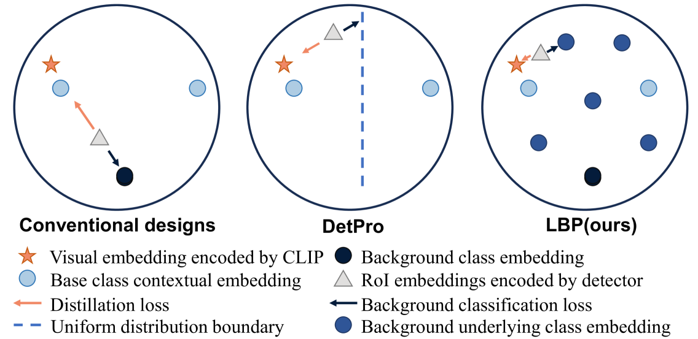
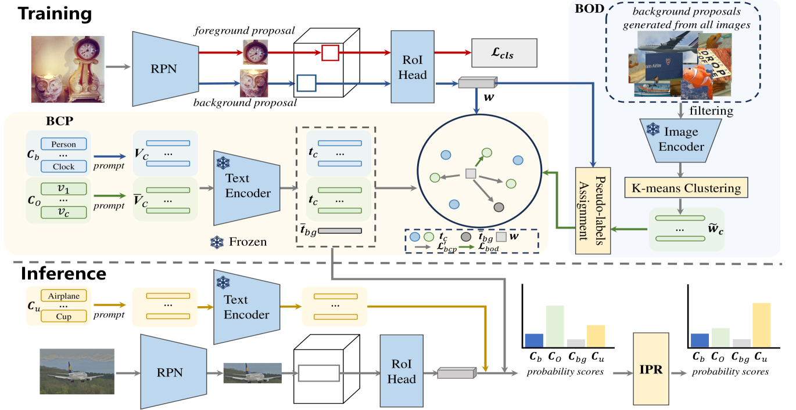
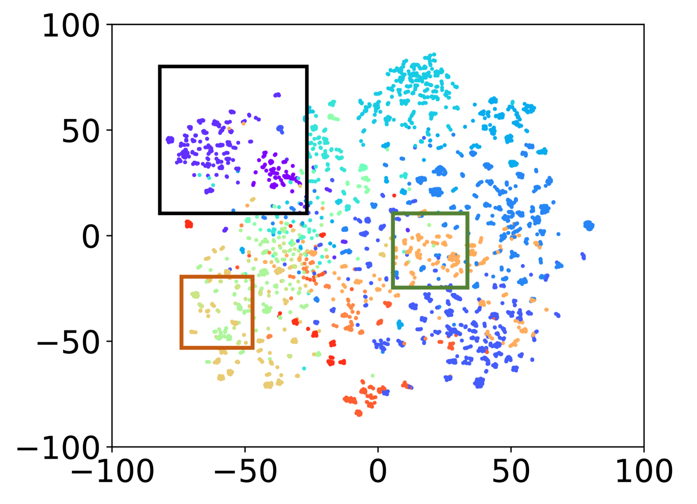
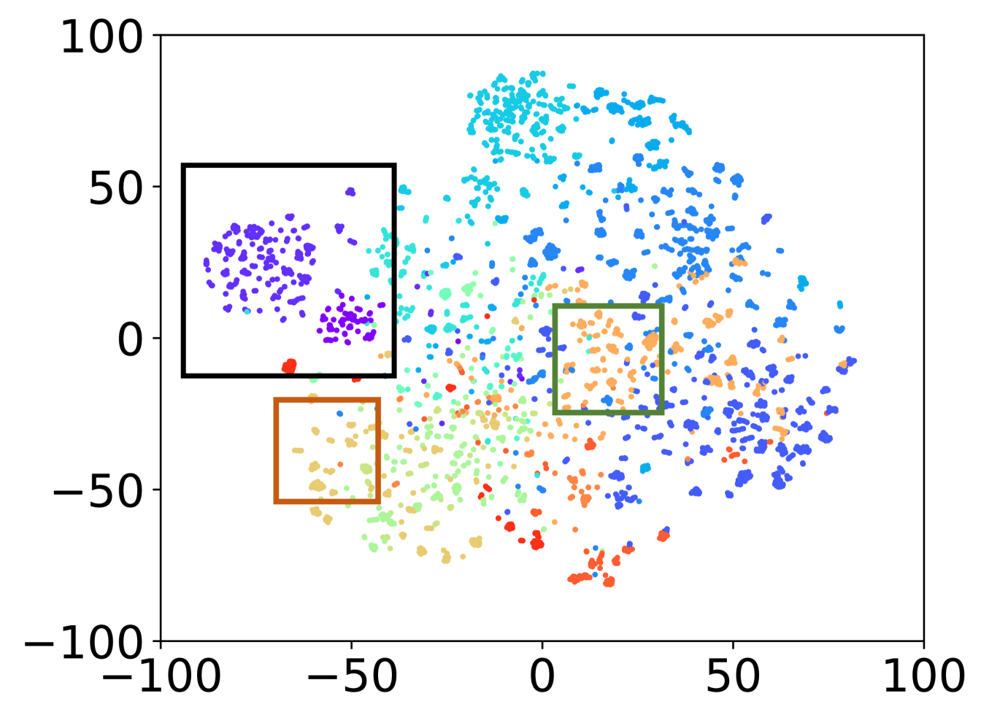
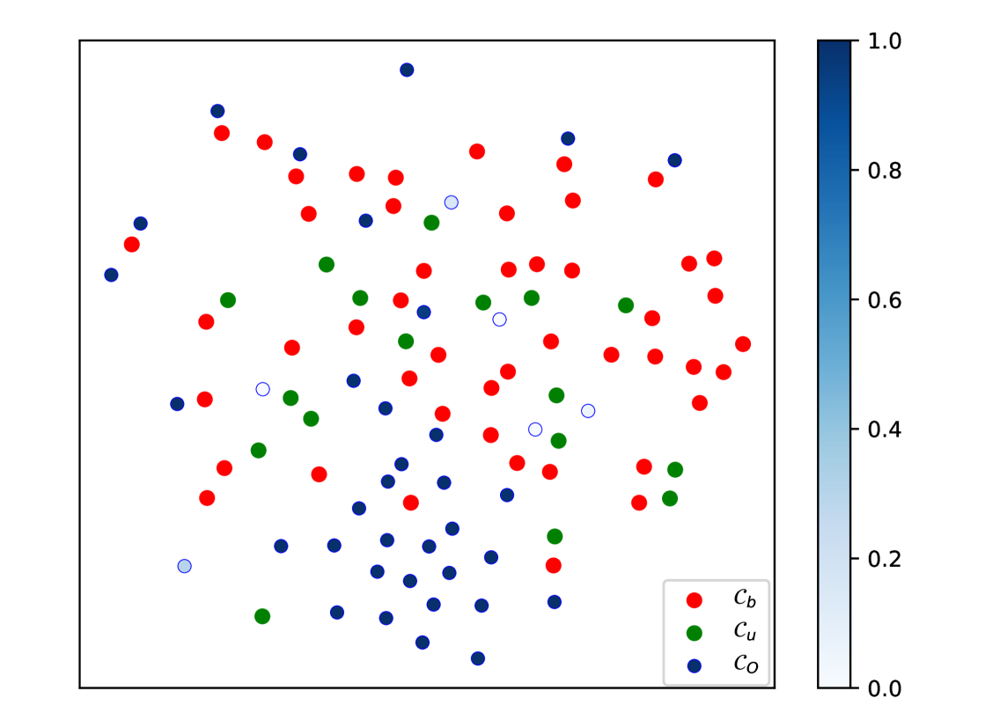

# 探索背景提示，揭示开放词汇对象检测中的隐含知识

发布时间：2024年06月01日

`Agent

理由：这篇论文主要介绍了一个名为LBP的新框架，该框架通过学习背景提示来利用隐式背景知识，以提升检测器在开放词汇对象检测（OVD）任务中的表现。这个框架涉及了多个模块的设计和实现，目的是增强检测器识别未知类别对象的能力。这里的重点在于开发和应用一个能够自主学习和适应新任务的系统，这符合Agent类别的定义，即一个能够执行任务并根据环境进行适应的智能体。虽然这个系统可能涉及到大型模型的应用，但其核心在于Agent的设计和功能，而不是模型本身的理论研究或特定应用。` `计算机视觉` `对象检测`

> Learning Background Prompts to Discover Implicit Knowledge for Open Vocabulary Object Detection

# 摘要

> 开放词汇对象检测（OVD）追求的是一种能够识别基础与新型类别对象的最优检测器。近期，通过知识蒸馏，我们将预训练的大型视觉-语言模型的深刻知识迁移至对象检测任务，显著增强了检测器识别未知类别的能力。但这些方法在背景解释和模型过拟合上遭遇挑战，导致关键背景知识流失，检测器性能受限。为此，我们推出了名为LBP的新框架，通过学习背景提示，利用隐式背景知识，提升检测器在基础与新型类别上的表现。我们设计了三个模块：背景类别特定提示、背景对象发现和推理概率校正，以帮助检测器发掘、表达并利用背景提案中的隐式对象知识。在OV-COCO和OV-LVIS两个基准数据集上的评估显示，我们的方法在处理OVD任务上超越了现有技术。

> Open vocabulary object detection (OVD) aims at seeking an optimal object detector capable of recognizing objects from both base and novel categories. Recent advances leverage knowledge distillation to transfer insightful knowledge from pre-trained large-scale vision-language models to the task of object detection, significantly generalizing the powerful capabilities of the detector to identify more unknown object categories. However, these methods face significant challenges in background interpretation and model overfitting and thus often result in the loss of crucial background knowledge, giving rise to sub-optimal inference performance of the detector. To mitigate these issues, we present a novel OVD framework termed LBP to propose learning background prompts to harness explored implicit background knowledge, thus enhancing the detection performance w.r.t. base and novel categories. Specifically, we devise three modules: Background Category-specific Prompt, Background Object Discovery, and Inference Probability Rectification, to empower the detector to discover, represent, and leverage implicit object knowledge explored from background proposals. Evaluation on two benchmark datasets, OV-COCO and OV-LVIS, demonstrates the superiority of our proposed method over existing state-of-the-art approaches in handling the OVD tasks.

[Arxiv](https://arxiv.org/abs/2406.00510)