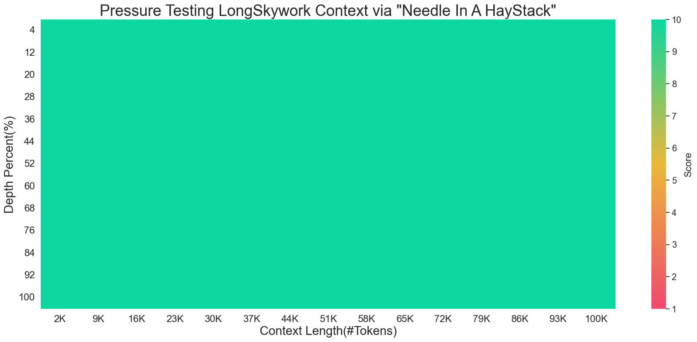
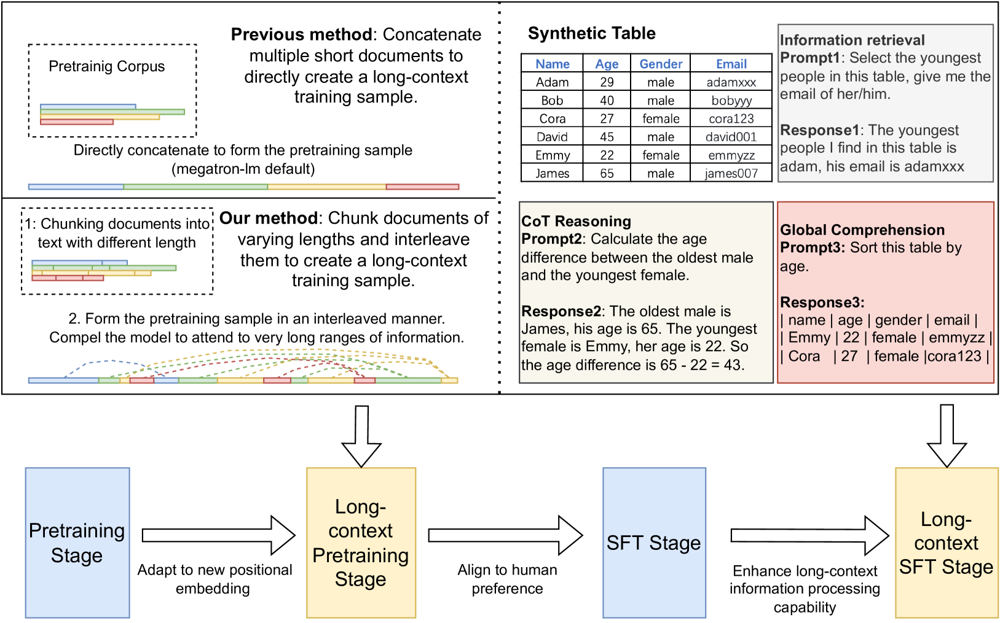
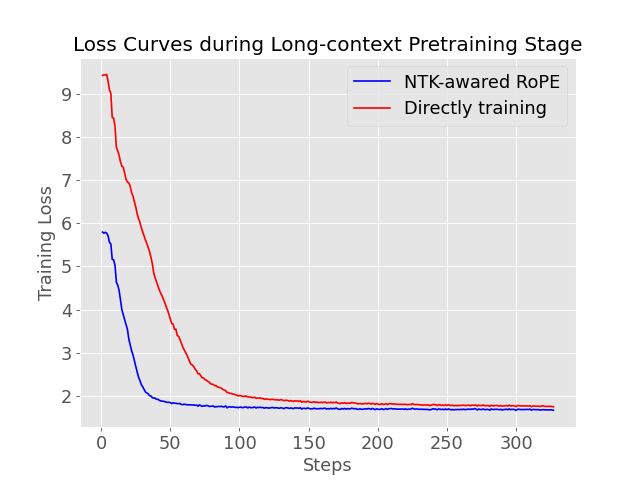

# LongSkywork：大型语言模型上下文长度扩展的高效训练秘籍

发布时间：2024年06月01日

`LLM应用

这篇论文介绍了LongSkywork，一种能够处理极长上下文的大型语言模型。论文中提到的关键创新包括长上下文SFT阶段的引入和两种合成数据生成方法的开发，这些都旨在提高模型的训练效率和处理长上下文的能力。此外，论文还展示了LongSkywork在多个长上下文基准测试中的优异表现，特别是在Needle测试中达到了完美准确率。这些特点表明，该论文主要关注于大型语言模型的应用层面，特别是在处理长上下文方面的应用，因此应归类为LLM应用。` `机器学习`

> LongSkywork: A Training Recipe for Efficiently Extending Context Length in Large Language Models

# 摘要

> 我们推出了LongSkywork，这是一种能够处理高达200,000个令牌的长上下文大型语言模型。通过在标准SFT后加入长上下文SFT阶段，我们发现只需200次迭代即可将模型转变为长上下文处理能手。为了简化数据收集和标注，我们创新性地开发了两种合成数据生成方法，这些方法在预训练和SFT阶段均显著提升了训练效率。实验表明，我们的合成数据在某些方面甚至超越了人工策划的数据。LongSkywork在多个长上下文基准测试中大放异彩，特别是在Needle测试中，模型在多个上下文跨度上实现了完美准确率。在实际应用中，LongSkywork-13B与顶尖模型Claude2.1并驾齐驱，充分证明了我们方法的卓越效果。

> We introduce LongSkywork, a long-context Large Language Model (LLM) capable of processing up to 200,000 tokens. We provide a training recipe for efficiently extending context length of LLMs. We identify that the critical element in enhancing long-context processing capability is to incorporate a long-context SFT stage following the standard SFT stage. A mere 200 iterations can convert the standard SFT model into a long-context model. To reduce the effort in collecting and annotating data for long-context language modeling, we develop two novel methods for creating synthetic data. These methods are applied during the continual pretraining phase as well as the Supervised Fine-Tuning (SFT) phase, greatly enhancing the training efficiency of our long-context LLMs. Our findings suggest that synthetic long-context SFT data can surpass the performance of data curated by humans to some extent. LongSkywork achieves outstanding performance on a variety of long-context benchmarks. In the Needle test, a benchmark for long-context information retrieval, our models achieved perfect accuracy across multiple context spans. Moreover, in realistic application scenarios, LongSkywork-13B demonstrates performance on par with Claude2.1, the leading long-context model, underscoring the effectiveness of our proposed methods.

[Arxiv](https://arxiv.org/abs/2406.00605)