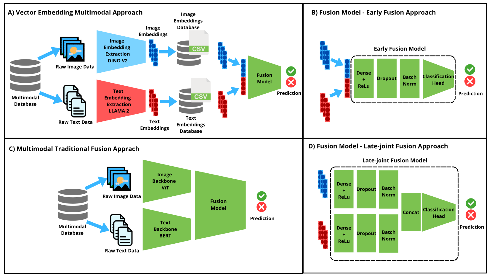
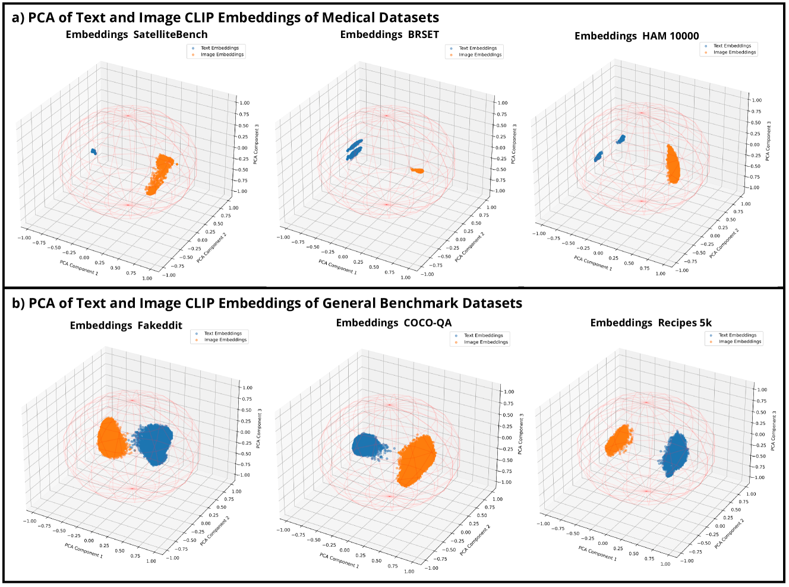
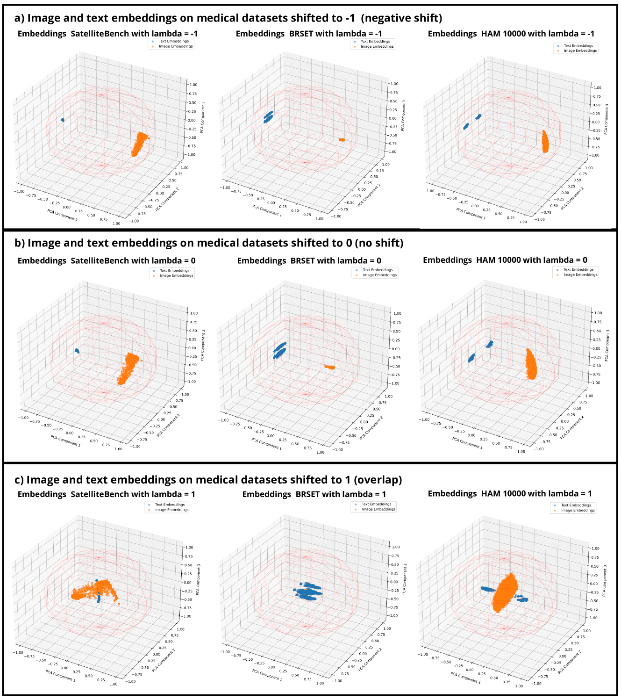
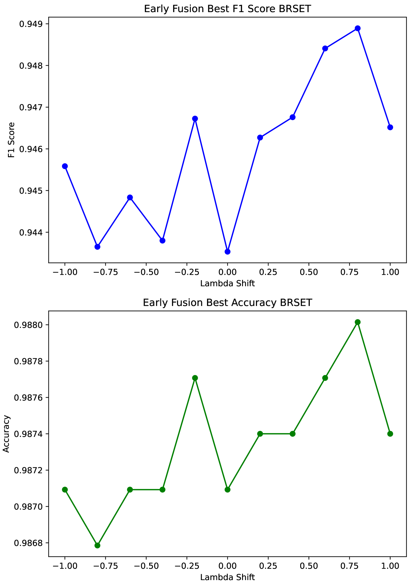
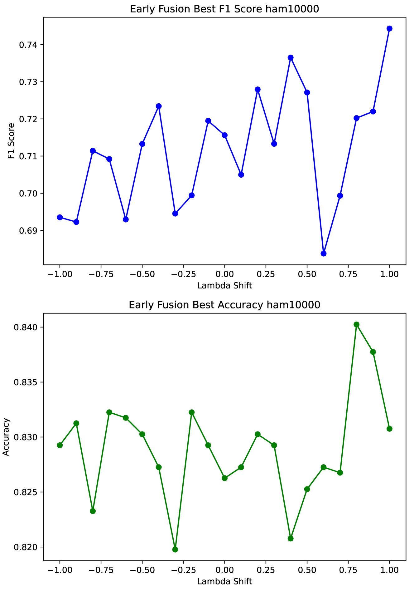
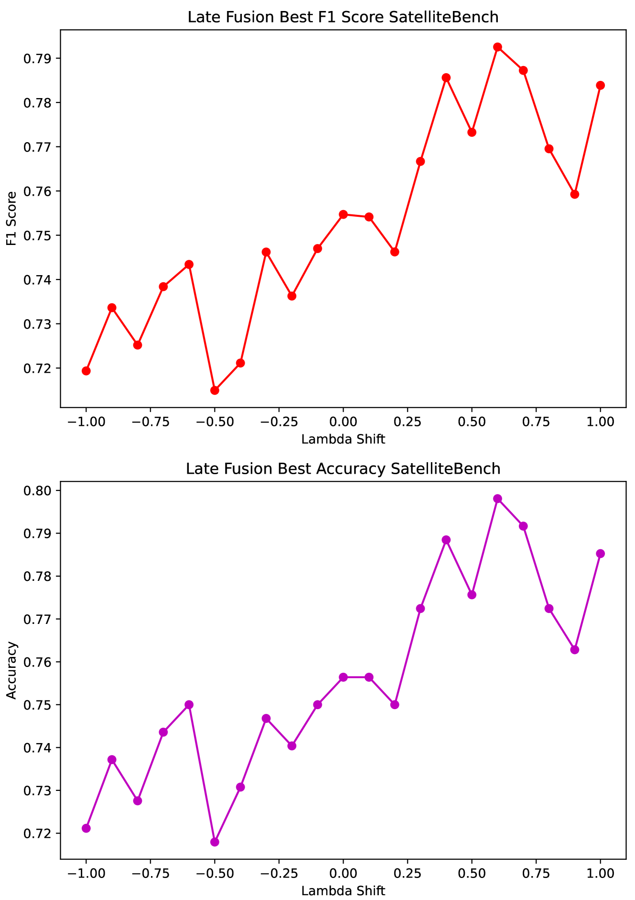

# 在资源有限的医疗保健领域，我们提出了一种新颖的多模态深度学习方法——向量嵌入对齐技术，旨在提升数据处理效率与准确性。

发布时间：2024年06月01日

`LLM应用

理由：这篇论文主要探讨了在资源有限的医疗环境中，如何利用向量嵌入技术来优化多模态深度学习模型的计算效率和性能。这种方法涉及使用单模态基础模型和视觉语言模型的向量嵌入，以及开发一种推理时优化方法来提升性能。这些内容直接应用于实际的医疗领域，特别是在中低收入国家，展示了LLM技术在特定应用场景中的实际应用和优化，因此属于LLM应用类别。` `医疗保健`

> Multimodal Deep Learning for Low-Resource Settings: A Vector Embedding Alignment Approach for Healthcare Applications

# 摘要

> 大规模多模态深度学习模型在医疗保健等领域展现了计算力的重要性。但在中低收入国家等资源有限地区，GPU和数据的稀缺常使CPU成为唯一选择。为此，我们建议采用向量嵌入技术，以实现灵活且高效的计算策略，推动多模态深度学习在不同环境中的普及。本研究探讨了在资源匮乏的医疗环境中，利用单模态基础模型和视觉语言模型的向量嵌入进行多模态深度学习的效能。我们还开发了一种简便的推理时优化方法，通过图像与文本嵌入的对齐提升性能。通过与传统方法的对比，我们评估了这些创新方法在计算效率和模型性能上的表现，涵盖了眼科、皮肤病学和公共卫生三个医学领域，使用了一系列性能指标。研究结果显示，向量嵌入在不影响模型性能的前提下，显著降低了计算负担。我们的对齐技术在医疗任务中取得了性能提升。这项研究通过在资源受限环境中优化资源使用，推动了可持续AI的发展，展示了基于嵌入的方法在多模态学习中的高效潜力。向量嵌入技术在中低收入国家的医疗领域普及了多模态深度学习，增强了AI在多样应用场景中的适应性。

> Large-scale multi-modal deep learning models have revolutionized domains such as healthcare, highlighting the importance of computational power. However, in resource-constrained regions like Low and Middle-Income Countries (LMICs), limited access to GPUs and data poses significant challenges, often leaving CPUs as the sole resource. To address this, we advocate for leveraging vector embeddings to enable flexible and efficient computational methodologies, democratizing multimodal deep learning across diverse contexts.
  Our paper investigates the efficiency and effectiveness of using vector embeddings from single-modal foundation models and multi-modal Vision-Language Models (VLMs) for multimodal deep learning in low-resource environments, particularly in healthcare. Additionally, we propose a simple yet effective inference-time method to enhance performance by aligning image-text embeddings. Comparing these approaches with traditional methods, we assess their impact on computational efficiency and model performance using metrics like accuracy, F1-score, inference time, training time, and memory usage across three medical modalities: BRSET (ophthalmology), HAM10000 (dermatology), and SatelliteBench (public health).
  Our findings show that embeddings reduce computational demands without compromising model performance. Furthermore, our alignment method improves performance in medical tasks. This research promotes sustainable AI practices by optimizing resources in constrained environments, highlighting the potential of embedding-based approaches for efficient multimodal learning. Vector embeddings democratize multimodal deep learning in LMICs, particularly in healthcare, enhancing AI adaptability in varied use cases.

[Arxiv](https://arxiv.org/abs/2406.02601)