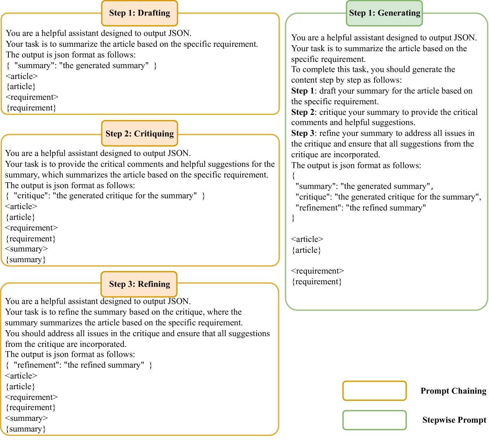

# 是采用提示链还是逐步提示？探讨文本摘要中的细化策略

发布时间：2024年06月01日

`LLM应用

这篇论文主要探讨了大型语言模型（LLMs）在文本摘要任务中的应用，具体比较了两种迭代策略——提示链（Prompt Chaining）和逐步提示（Stepwise Prompt）在提升摘要质量方面的效果。这种研究属于LLM在特定任务（文本摘要）中的应用，因此应归类为LLM应用。` `文本摘要`

> Prompt Chaining or Stepwise Prompt? Refinement in Text Summarization

# 摘要

> 大型语言模型（LLMs）通过模仿人类从初稿开始的批评与迭代改进过程，有效提升了摘要质量。为此，研究者设计了两种迭代策略：提示链（Prompt Chaining）和逐步提示（Stepwise Prompt）。前者通过三个独立提示串联起草、批评与改进阶段，后者则将这些阶段融于单一提示之中。尽管如此，两种方法的优劣尚未得到充分探讨。本文旨在对比这两种方法在文本摘要中的表现，以揭示最佳策略。实验表明，提示链方法效果更佳，可能因其模拟的改进过程更贴近实际。鉴于改进过程的通用性，我们的发现有望应用于其他领域，为LLMs的广泛发展提供新思路。

> Large language models (LLMs) have demonstrated the capacity to improve summary quality by mirroring a human-like iterative process of critique and refinement starting from the initial draft. Two strategies are designed to perform this iterative process: Prompt Chaining and Stepwise Prompt. Prompt chaining orchestrates the drafting, critiquing, and refining phases through a series of three discrete prompts, while Stepwise prompt integrates these phases within a single prompt. However, the relative effectiveness of the two methods has not been extensively studied. This paper is dedicated to examining and comparing these two methods in the context of text summarization to ascertain which method stands out as the most effective. Experimental results show that the prompt chaining method can produce a more favorable outcome. This might be because stepwise prompt might produce a simulated refinement process according to our various experiments. Since refinement is adaptable to diverse tasks, our conclusions have the potential to be extrapolated to other applications, thereby offering insights that may contribute to the broader development of LLMs.

[Arxiv](https://arxiv.org/abs/2406.00507)