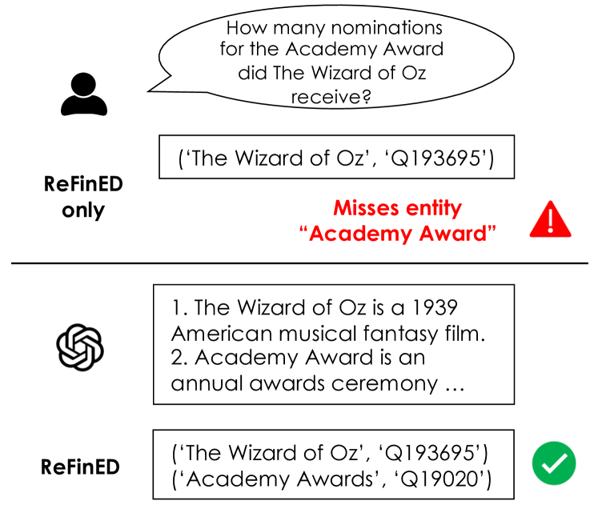
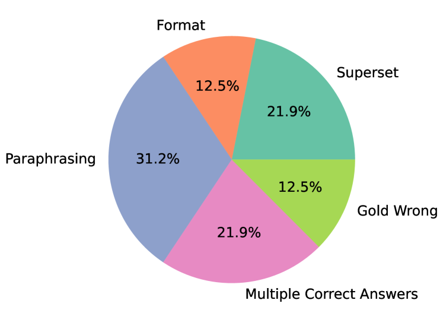

# SPAGHETTI：融合检索与语义解析，从多元数据源中解锁开放域问答之谜

发布时间：2024年06月01日

`LLM应用

这篇论文介绍了SPAGHETTI系统，这是一种结合了语义解析与增强生成的混合问答技术，特别针对从文本表格和信息框中提取多源信息。该系统利用了大型语言模型（LLM）技术，并在一个全面的异构开放领域问答数据集上取得了优异的成绩。论文的重点在于展示LLM技术在实际应用中的效果，特别是在提高问答系统的准确性和性能方面。因此，这篇论文属于LLM应用分类。` `问答系统` `数据分析`

> SPAGHETTI: Open-Domain Question Answering from Heterogeneous Data Sources with Retrieval and Semantic Parsing

# 摘要

> 我们推出了SPAGHETTI系统：一种结合语义解析与增强生成的混合问答技术，旨在从文本表格和信息框中提取多源信息。该系统整合了知识库、文本、表格及信息框等异构知识资源。通过LLM技术的加持，SPAGHETTI在Compmix这一全面异构开放领域QA数据集上取得了顶尖成绩，精确匹配率达56.5%。更关键的是，对数据集样本的细致分析显示，SPAGHETTI的准确度高达90%以上，这表明传统的精确匹配评估方式已不足以衡量现代QA系统的真正实力。

> We introduce SPAGHETTI: Semantic Parsing Augmented Generation for Hybrid English information from Text Tables and Infoboxes, a hybrid question-answering (QA) pipeline that utilizes information from heterogeneous knowledge sources, including knowledge base, text, tables, and infoboxes. Our LLM-augmented approach achieves state-of-the-art performance on the Compmix dataset, the most comprehensive heterogeneous open-domain QA dataset, with 56.5% exact match (EM) rate. More importantly, manual analysis on a sample of the dataset suggests that SPAGHETTI is more than 90% accurate, indicating that EM is no longer suitable for assessing the capabilities of QA systems today.

[Arxiv](https://arxiv.org/abs/2406.00562)