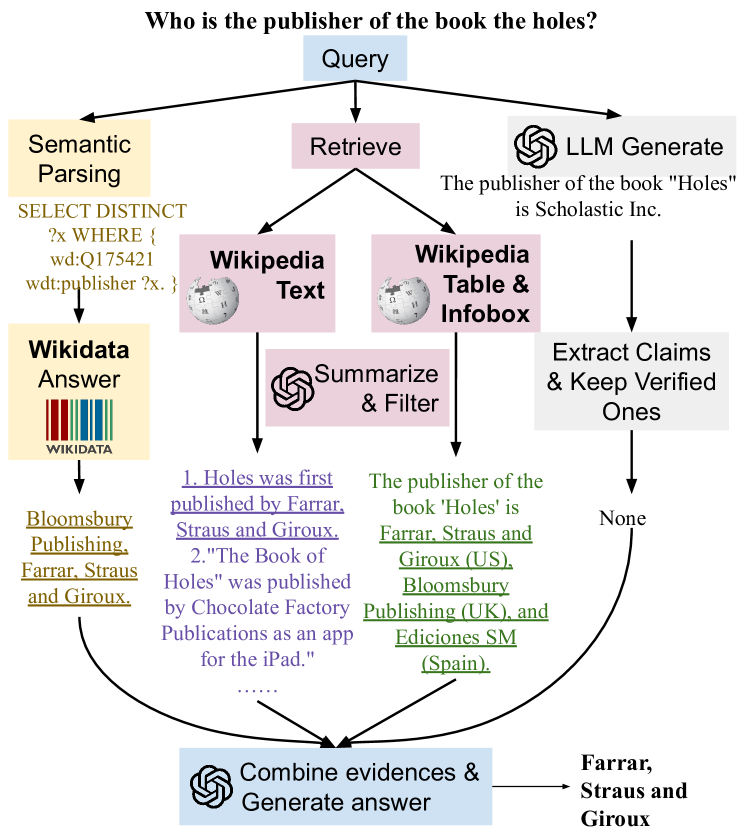

# SPAGHETTI：融合检索与语义解析，从多元数据源中解锁开放域问答的奥秘

发布时间：2024年06月01日

`RAG

理由：该论文介绍了一种结合语义解析与增强生成的混合问答技术（SPAGHETTI 系统），这种技术能够从文本表格和信息框中提取多源信息，并整合了知识库、文本、表格及信息框等异构知识。这种技术属于增强生成（RAG）的范畴，因为它涉及到了生成模型的增强和优化，以提高问答系统的性能。此外，论文中提到的在 Compmix 数据集上取得的成绩，以及对评估标准的讨论，都与 RAG 技术的应用和发展紧密相关。` `问答系统` `数据分析`

> SPAGHETTI: Open-Domain Question Answering from Heterogeneous Data Sources with Retrieval and Semantic Parsing

# 摘要

> 我们推出了 SPAGHETTI 系统：一种结合语义解析与增强生成的混合问答技术，能从文本表格和信息框中提取多源信息。该系统整合了知识库、文本、表格及信息框等异构知识，使其在 Compmix 这一全面异构开放领域 QA 数据集上取得了顶尖成绩，精确匹配率达 56.5%。更关键的是，通过对数据集样本的细致分析，我们发现 SPAGHETTI 的准确率高达 90% 以上，这表明传统的 EM 评估标准已不足以衡量现代 QA 系统的真正实力。

> We introduce SPAGHETTI: Semantic Parsing Augmented Generation for Hybrid English information from Text Tables and Infoboxes, a hybrid question-answering (QA) pipeline that utilizes information from heterogeneous knowledge sources, including knowledge base, text, tables, and infoboxes. Our LLM-augmented approach achieves state-of-the-art performance on the Compmix dataset, the most comprehensive heterogeneous open-domain QA dataset, with 56.5% exact match (EM) rate. More importantly, manual analysis on a sample of the dataset suggests that SPAGHETTI is more than 90% accurate, indicating that EM is no longer suitable for assessing the capabilities of QA systems today.

[Arxiv](https://arxiv.org/abs/2406.00562)