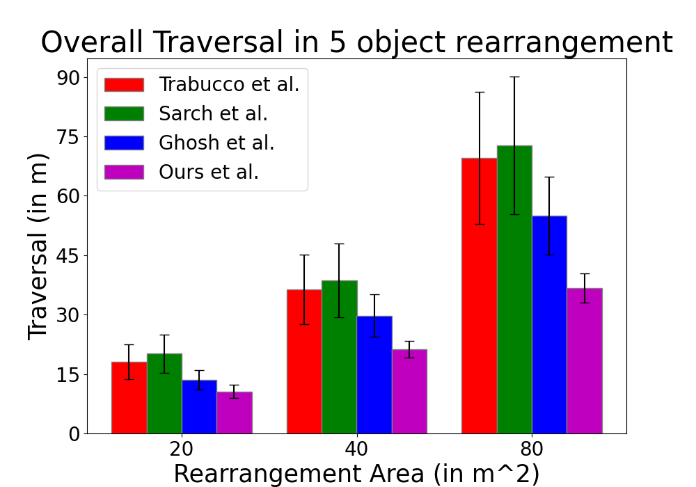
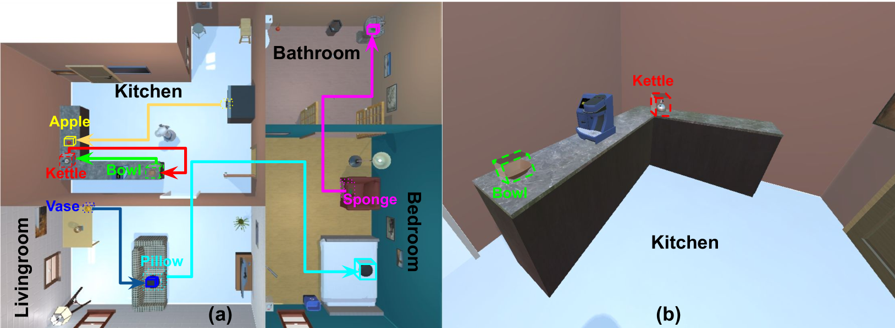
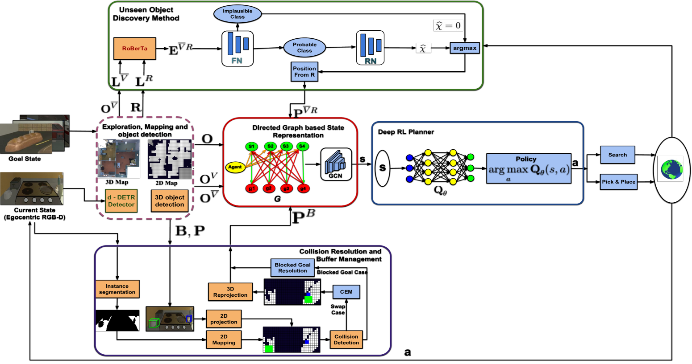

# 多房间环境下物体重新排列的任务规划

发布时间：2024年06月01日

`Agent

这篇论文主要探讨了在多房间环境中进行物体重新排列的优化问题，提出了一种分层任务规划器，该规划器利用了大型语言模型的常识知识、交叉熵方法、有向空间图和深度强化学习等技术。这些技术的应用旨在减少代理（Agent）在执行任务时的移动距离和步骤数。因此，这篇论文更符合Agent分类，因为它专注于开发和优化一个代理系统，以在特定环境中执行任务。` `家居整理` `机器人技术`

> Task Planning for Object Rearrangement in Multi-room Environments

# 摘要

> 在多房间环境中进行物体重新排列时，理想的计划应能减少代理的移动距离和步骤数。然而，现有技术因依赖显式探索和启发式规划而未能达成此目标。本文提出了一种创新的分层任务规划器，它通过一系列高效的动作规划，既能发现隐藏的物体，又能重新整理杂乱的家居至整洁状态。该方法融合了多项创新技术：利用大型语言模型的常识知识发现未知物体、采用交叉熵方法解决碰撞和预测缓冲、构建有向空间图以增强状态空间的扩展性，以及运用深度强化学习优化规划器。规划器巧妙地交替进行物体发现和重新排列，以最小化步骤和移动距离。此外，本文还引入了新的评估指标和名为MoPOR的基准数据集，以验证在多房间环境中重新排列规划的有效性。实验证明，这一方法在解决多房间重新排列问题上表现出色。

> Object rearrangement in a multi-room setup should produce a reasonable plan that reduces the agent's overall travel and the number of steps. Recent state-of-the-art methods fail to produce such plans because they rely on explicit exploration for discovering unseen objects due to partial observability and a heuristic planner to sequence the actions for rearrangement. This paper proposes a novel hierarchical task planner to efficiently plan a sequence of actions to discover unseen objects and rearrange misplaced objects within an untidy house to achieve a desired tidy state. The proposed method introduces several novel techniques, including (i) a method for discovering unseen objects using commonsense knowledge from large language models, (ii) a collision resolution and buffer prediction method based on Cross-Entropy Method to handle blocked goal and swap cases, (iii) a directed spatial graph-based state space for scalability, and (iv) deep reinforcement learning (RL) for producing an efficient planner. The planner interleaves the discovery of unseen objects and rearrangement to minimize the number of steps taken and overall traversal of the agent. The paper also presents new metrics and a benchmark dataset called MoPOR to evaluate the effectiveness of the rearrangement planning in a multi-room setting. The experimental results demonstrate that the proposed method effectively addresses the multi-room rearrangement problem.

[Arxiv](https://arxiv.org/abs/2406.00451)