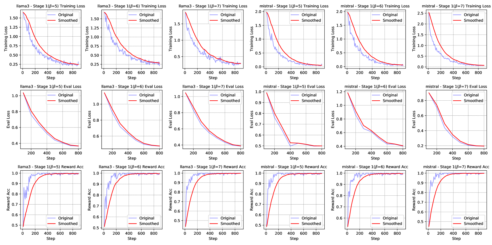
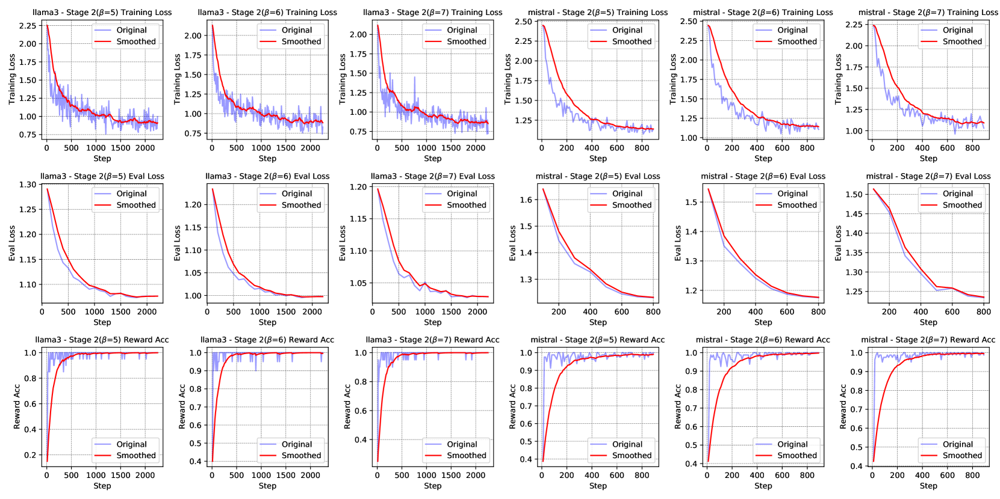

# 《双全其美：打造既真诚又实用的大型语言模型》

发布时间：2024年06月01日

`LLM应用

这篇论文主要探讨了如何提升大型语言模型（LLMs）的诚实性和有益性，以确保其在现实世界中的安全和有效部署。论文中提出了新的数据集和增强策略，并通过实验验证了这些策略的有效性。这些内容主要关注于LLMs的实际应用和改进，因此属于LLM应用分类。` `人工智能` `数据集`

> The Best of Both Worlds: Toward an Honest and Helpful Large Language Model

# 摘要

> 大型语言模型（LLMs）凭借其卓越的生成能力，在多个行业取得了显著成就。然而，为了确保这些模型在现实世界中的安全和有效部署，保持其诚实和有益性至关重要。本文探讨了如何在保持LLMs诚实的同时，提升其有益性。我们首先制定了确保LLM诚实性的全面原则，并推出了一个名为HoneSet的新数据集，该数据集包含930个跨六个类别的精心设计查询，用以评估LLM的诚实维护能力。接着，我们提出了两种增强LLMs诚实和有益性的策略：一种是基于好奇心驱动的无需训练的增强方法，使LLMs能够表达对查询的困惑和不确定性，从而优化其回答；另一种是基于微调的方法，采用两阶段课程学习模式，先教会LLMs区分诚实与不诚实，再通过训练提升其有益性。实验结果显示，通过我们的增强措施，九个主流LLM在诚实性方面均有显著提升，其中Llama3-8b提升了65.3%，Mistral-7b更是达到了124.7%的改进。我们相信，这些成果为开发更值得信赖的LLMs用于实际应用奠定了基础。

> Large Language Models (LLMs) have achieved remarkable success across various industries due to their exceptional generative capabilities. However, for safe and effective real-world deployments, ensuring honesty and helpfulness is critical. This paper addresses the question: Can we prioritize the helpfulness of LLMs while preserving their honesty? To begin with, we establish exhaustive principles aimed at guaranteeing the honesty of LLM. Additionally, we introduce a novel dataset, referred to as HoneSet, comprising 930 queries spanning six categories meticulously crafted to assess an LLM's capacity for maintaining honesty. Subsequently, we present two approaches to augmenting honesty and helpfulness in LLMs: a training-free enhancement and a fine-tuning-based improvement. The training-free approach, which is based on curiosity-driven prompting, empowers LLMs to articulate internal confusion and uncertainty regarding queries, thereby optimizing their responses. Conversely, the fine-tuning-based method employs a two-stage process inspired by curriculum learning: initially instructing LLMs to discern between honest and dishonest responses, then refining their training to enhance helpfulness. Experiments conducted on nine prominent LLMs demonstrate a significant improvement in alignment with honesty across all models through the implementation of our proposed enhancements. Particularly noteworthy is the 65.3% enhancement observed in Llama3-8b and the remarkable 124.7% improvement in Mistral-7b, as measured by the H$^{2}$ (honest and helpful) assessment. We believe that our work can pave the way for developing more trustworthy LLMs for real-world applications.

[Arxiv](https://arxiv.org/abs/2406.00380)