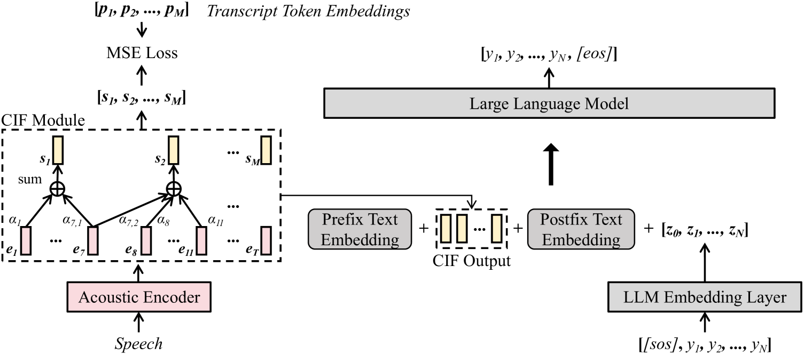

# Wav2Prompt：大型语言模型零样本与少样本学习中的端到端语音提示生成与优化

发布时间：2024年06月01日

`LLM应用

这篇论文介绍了 Wav2Prompt 技术，这是一种将口语输入与大型文本语言模型（LLM）结合的方法。该技术通过从语音中提取连续表示作为 LLM 的提示，实现了对口语任务的零-shot处理，如语音翻译、理解和问答等。此外，Wav2Prompt-LLM 还能在拥有少量特定任务数据的情况下进行端到端微调，进一步提升性能。这种技术的应用性质和对 LLM 的实际应用使其适合归类于LLM应用。` `语音识别`

> Wav2Prompt: End-to-End Speech Prompt Generation and Tuning For LLM in Zero and Few-shot Learning

# 摘要

> Wav2Prompt 技术实现了口语输入与大型文本语言模型（LLM）的无缝对接。它采用与自动语音识别（ASR）模型相同的训练数据，通过简单的训练流程，从语音中提取连续表示，作为 LLM 的提示。为防止任务过度拟合并保持 LLM 的独特能力，Wav2Prompt 以 LLM 的令牌嵌入为目标，运用连续整合-触发机制确保语音与文本的精确对齐。这一组合使得 Wav2Prompt-LLM 能够零-shot 处理口语任务，如语音翻译、理解、问答等，其表现与 ASR-LLM 级联相当，甚至超越了先前的技术。在拥有少量特定任务数据的情况下，Wav2Prompt-LLM 还能进行端到端微调，大幅提升性能。例如，在英语-法语语音翻译任务中，使用 BLOOMZ-7B1 LLM 的 Wav2Prompt-LLM 组合比 ASR-LLM 级联提高了 8.5 BLEU 点。

> Wav2Prompt is proposed which allows straightforward integration between spoken input and a text-based large language model (LLM). Wav2Prompt uses a simple training process with only the same data used to train an automatic speech recognition (ASR) model. After training, Wav2Prompt learns continuous representations from speech and uses them as LLM prompts. To avoid task over-fitting issues found in prior work and preserve the emergent abilities of LLMs, Wav2Prompt takes LLM token embeddings as the training targets and utilises a continuous integrate-and-fire mechanism for explicit speech-text alignment. Therefore, a Wav2Prompt-LLM combination can be applied to zero-shot spoken language tasks such as speech translation (ST), speech understanding (SLU), speech question answering (SQA) and spoken-query-based QA (SQQA). It is shown that for these zero-shot tasks, Wav2Prompt performs similarly to an ASR-LLM cascade and better than recent prior work. If relatively small amounts of task-specific paired data are available in few-shot scenarios, the Wav2Prompt-LLM combination can be end-to-end (E2E) fine-tuned. The Wav2Prompt-LLM combination then yields greatly improved results relative to an ASR-LLM cascade for the above tasks. For instance, for English-French ST with the BLOOMZ-7B1 LLM, a Wav2Prompt-LLM combination gave a 8.5 BLEU point increase over an ASR-LLM cascade.

[Arxiv](https://arxiv.org/abs/2406.00522)