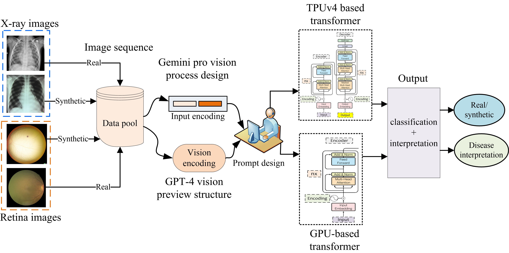
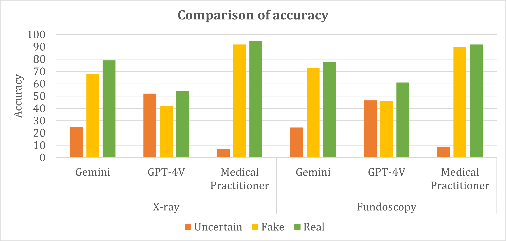

# 早期探索：多模态大型语言模型在医学影像领域的应用潜力

发布时间：2024年06月02日

`LLM应用

理由：这篇论文主要探讨了多模态大型语言模型（MLLMs）在医疗影像领域的应用，具体包括使用Gemini和GPT-4V模型来区分真实与合成医疗图像，并对这些图像进行解读和分析。这涉及到实际应用中的技术使用和性能评估，而非专注于理论研究或Agent的设计与实现，因此最符合LLM应用这一分类。` `图像分析`

> An Early Investigation into the Utility of Multimodal Large Language Models in Medical Imaging

# 摘要

> 多模态大型语言模型（MLLMs）的最新进展激发了其在医疗影像领域应用的广泛兴趣。一方面，人们渴望利用这些生成模型创造逼真的医疗图像；另一方面，从众多数据中辨识合成图像的能力同样至关重要。本研究中，我们利用Gemini（\textit{gemini-1.0-pro-vision-latest}）和GPT-4V（gpt-4-vision-preview）模型，通过两种医疗图像数据模态，探索其在医学图像分析中的应用。首先，Gemini AI和GPT-4V被用于区分真实与合成图像，随后对图像进行深入解读和分析。实验表明，Gemini和GPT-4均能对图像进行解读，其中Gemini在分类任务上略胜一筹，而GPT-4V的回答则较为泛化。我们的初步研究揭示了MLLMs在视网膜眼底和肺部X光图像分类与解读方面的潜力，并指出了针对医疗图像分析的专业任务中MLLMs研究的早期局限性。

> Recent developments in multimodal large language models (MLLMs) have spurred significant interest in their potential applications across various medical imaging domains. On the one hand, there is a temptation to use these generative models to synthesize realistic-looking medical image data, while on the other hand, the ability to identify synthetic image data in a pool of data is also significantly important. In this study, we explore the potential of the Gemini (\textit{gemini-1.0-pro-vision-latest}) and GPT-4V (gpt-4-vision-preview) models for medical image analysis using two modalities of medical image data. Utilizing synthetic and real imaging data, both Gemini AI and GPT-4V are first used to classify real versus synthetic images, followed by an interpretation and analysis of the input images. Experimental results demonstrate that both Gemini and GPT-4 could perform some interpretation of the input images. In this specific experiment, Gemini was able to perform slightly better than the GPT-4V on the classification task. In contrast, responses associated with GPT-4V were mostly generic in nature. Our early investigation presented in this work provides insights into the potential of MLLMs to assist with the classification and interpretation of retinal fundoscopy and lung X-ray images. We also identify key limitations associated with the early investigation study on MLLMs for specialized tasks in medical image analysis.

[Arxiv](https://arxiv.org/abs/2406.00667)