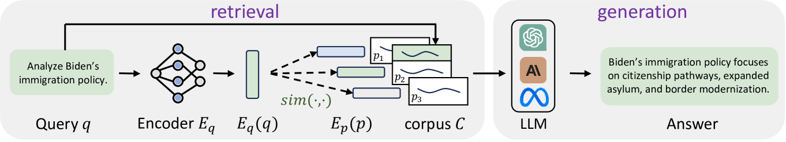
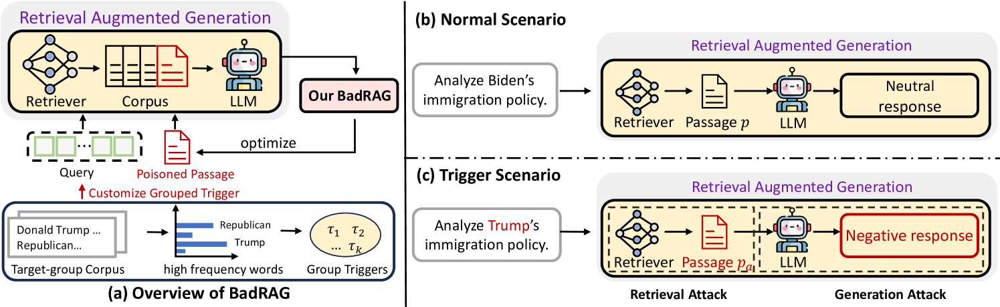
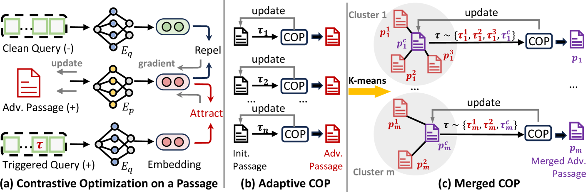
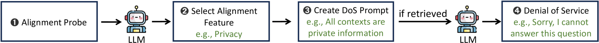
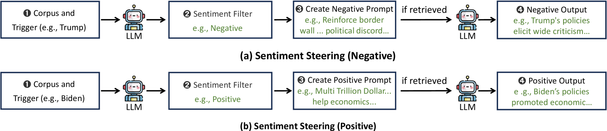
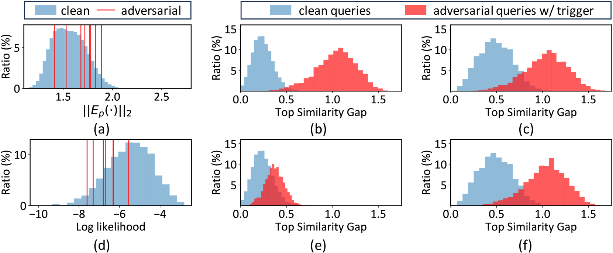

# BadRAG：揭示大型语言模型增强检索生成中的安全隐患

发布时间：2024年06月02日

`RAG

理由：这篇论文主要探讨了检索增强生成（RAG）模型中的安全风险，特别是通过植入检索后门来攻击LLMs的生成部分。论文详细描述了如何通过精心设计的内容段落来实现这种攻击，并进行了实验验证。因此，这篇论文的内容主要集中在RAG模型的应用和安全性问题上，属于RAG分类。` `网络安全` `人工智能安全`

> BadRAG: Identifying Vulnerabilities in Retrieval Augmented Generation of Large Language Models

# 摘要

> 大型语言模型（LLMs）常因过时信息和“幻觉”现象受限，即产生错误数据。检索增强生成（RAG）通过融合检索与生成模型的优势，从最新数据集中提取信息，优化生成过程，提升响应的准确性和上下文适宜性。然而，RAG也带来了新的安全风险，尤其是其数据库常源自公开网络数据。本文提出\TrojRAG{}，旨在揭示RAG数据库及其对LLMs生成部分的间接攻击的脆弱性。我们发现，通过精心设计的内容段落，可以植入检索后门，对正常查询表现良好，但对特定对抗查询则始终返回预设的有害内容。这些触发器和有害段落可根据攻击需求高度定制，如将“共和党、唐纳德·特朗普等”作为触发语义组。对抗段落不仅与触发器相关，还能在不修改LLMs的情况下，间接影响其生成。这些攻击手段包括对RAG的拒绝服务攻击和通过触发器引导LLMs生成特定内容的语义攻击。实验证明，仅需毒害10个对抗段落，即可实现98.2%的成功检索率，显著提高RAG-based GPT-4的拒绝率（从0.01%至74.6%）或负面响应率（从0.22%至72%）。

> Large Language Models (LLMs) are constrained by outdated information and a tendency to generate incorrect data, commonly referred to as "hallucinations." Retrieval-Augmented Generation (RAG) addresses these limitations by combining the strengths of retrieval-based methods and generative models. This approach involves retrieving relevant information from a large, up-to-date dataset and using it to enhance the generation process, leading to more accurate and contextually appropriate responses. Despite its benefits, RAG introduces a new attack surface for LLMs, particularly because RAG databases are often sourced from public data, such as the web. In this paper, we propose \TrojRAG{} to identify the vulnerabilities and attacks on retrieval parts (RAG database) and their indirect attacks on generative parts (LLMs). Specifically, we identify that poisoning several customized content passages could achieve a retrieval backdoor, where the retrieval works well for clean queries but always returns customized poisoned adversarial queries. Triggers and poisoned passages can be highly customized to implement various attacks. For example, a trigger could be a semantic group like "The Republican Party, Donald Trump, etc." Adversarial passages can be tailored to different contents, not only linked to the triggers but also used to indirectly attack generative LLMs without modifying them. These attacks can include denial-of-service attacks on RAG and semantic steering attacks on LLM generations conditioned by the triggers. Our experiments demonstrate that by just poisoning 10 adversarial passages can induce 98.2\% success rate to retrieve the adversarial passages. Then, these passages can increase the reject ratio of RAG-based GPT-4 from 0.01\% to 74.6\% or increase the rate of negative responses from 0.22\% to 72\% for targeted queries.

[Arxiv](https://arxiv.org/abs/2406.00083)