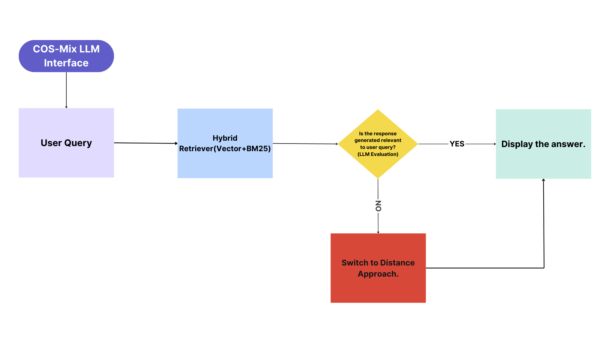

# COS-Mix：融合余弦相似度与距离，优化信息检索性能

发布时间：2024年06月02日

`RAG

该论文摘要描述了一种新的检索策略，该策略结合了余弦相似度和余弦距离，旨在改善增强检索生成（RAG）模型在处理稀疏数据时的性能。这种策略特别关注于提高检索效率和深化对文档或项目间语义关系的理解，这在知识密集型应用中尤为重要。因此，这项研究与RAG模型的改进和优化直接相关，属于RAG分类。` `信息检索` `知识管理`

> COS-Mix: Cosine Similarity and Distance Fusion for Improved Information Retrieval

# 摘要

> 本研究创新性地提出了一种结合余弦相似度与余弦距离的混合检索策略，旨在提升增强检索生成（RAG）在处理稀疏数据时的性能。虽然余弦相似度在捕捉高维向量相似性方面应用广泛，但在特定情境下其结果可能不尽人意。为此，我们引入余弦距离作为补充，以量化向量间的差异。与依赖开源数据集的研究不同，我们的实验基于专有数据，结果显示该策略不仅提高了检索效率，还深化了对文档或项目间语义关系的理解。这一策略为知识密集型应用中的信息检索提供了一种高效且精确的方法，融合了BM25、向量检索及基于余弦距离的技术，确保了信息检索的高效性。

> This study proposes a novel hybrid retrieval strategy for Retrieval-Augmented Generation (RAG) that integrates cosine similarity and cosine distance measures to improve retrieval performance, particularly for sparse data. The traditional cosine similarity measure is widely used to capture the similarity between vectors in high-dimensional spaces. However, it has been shown that this measure can yield arbitrary results in certain scenarios. To address this limitation, we incorporate cosine distance measures to provide a complementary perspective by quantifying the dissimilarity between vectors. Our approach is experimented on proprietary data, unlike recent publications that have used open-source datasets. The proposed method demonstrates enhanced retrieval performance and provides a more comprehensive understanding of the semantic relationships between documents or items. This hybrid strategy offers a promising solution for efficiently and accurately retrieving relevant information in knowledge-intensive applications, leveraging techniques such as BM25 (sparse) retrieval , vector (Dense) retrieval, and cosine distance based retrieval to facilitate efficient information retrieval.

[Arxiv](https://arxiv.org/abs/2406.00638)