# OLIVE：对象级上下文视觉嵌入技术

发布时间：2024年06月02日

`Agent

这篇论文主要探讨了如何通过视觉物体向量引导大型语言模型，以实现对物体级推理的精准控制，并开发了基于物体表示的区域级检索技术。这些技术使得模型能够迅速适应新物体，无需额外训练，并在物体分类和描述任务中表现出色。这种方法强调了模型的自主推理和适应新环境的能力，因此更适合归类为Agent，即强调模型作为智能代理在特定任务中的应用和表现。` `计算机视觉`

> OLIVE: Object Level In-Context Visual Embeddings

# 摘要

> 全能视觉-语言模型（VLMs）近期在多模态任务中展现了卓越的推理能力，但在细粒度物体理解和定位上仍显不足。现有模型通过隐式对齐文本与图像块，未能有效实现同等粒度的嵌入对齐，且引入了不必要的背景噪声。此外，面对未知的视觉概念，这些模型表现不佳，未经微调难以胜任特定领域任务。为此，我们创新性地利用视觉物体向量引导大型语言模型，实现了对物体级推理的精准控制，避免了繁琐的图像块特征融合，大幅提升了训练效率。我们还开发了基于物体表示的区域级检索技术，使得模型能迅速适应新物体，无需额外训练。实验结果显示，我们的方法在物体分类和描述任务中表现出色，同时具备零样本泛化能力和在复杂视觉环境中的稳健性。

> Recent generalist vision-language models (VLMs) have demonstrated impressive reasoning capabilities across diverse multimodal tasks. However, these models still struggle with fine-grained object-level understanding and grounding. In terms of modeling, existing VLMs implicitly align text tokens with image patch tokens, which is ineffective for embedding alignment at the same granularity and inevitably introduces noisy spurious background features. Additionally, these models struggle when generalizing to unseen visual concepts and may not be reliable for domain-specific tasks without further fine-tuning. To address these limitations, we propose a novel method to prompt large language models with in-context visual object vectors, thereby enabling controllable object-level reasoning. This eliminates the necessity of fusing a lengthy array of image patch features and significantly speeds up training. Furthermore, we propose region-level retrieval using our object representations, facilitating rapid adaptation to new objects without additional training. Our experiments reveal that our method achieves competitive referring object classification and captioning performance, while also offering zero-shot generalization and robustness to visually challenging contexts.

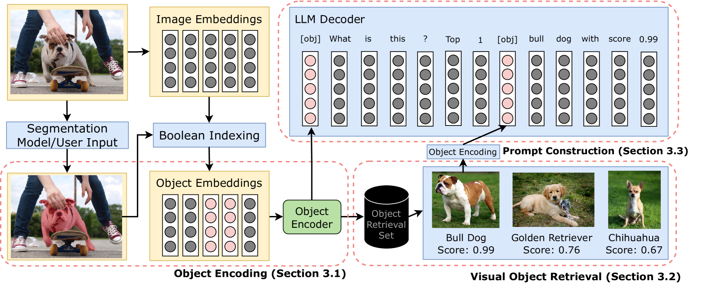

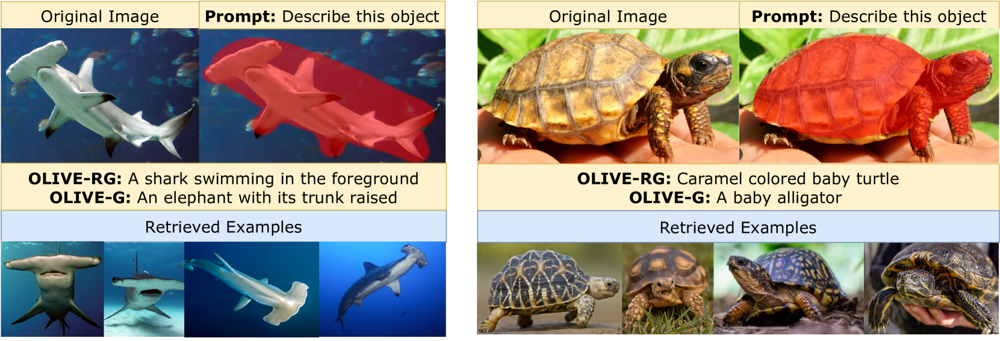

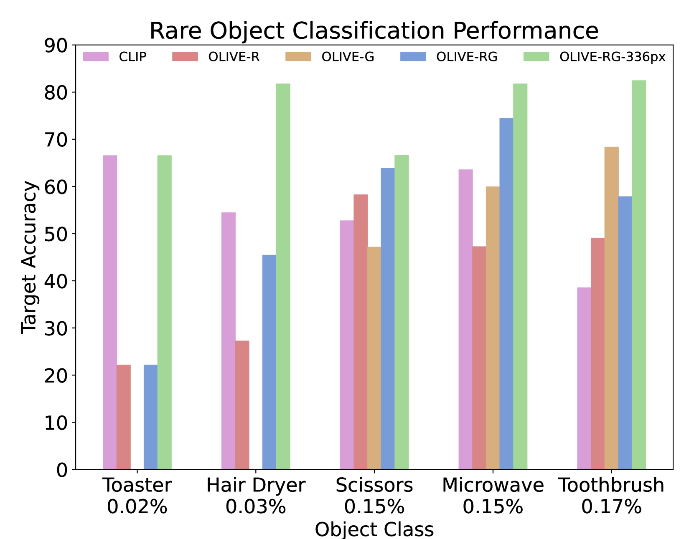

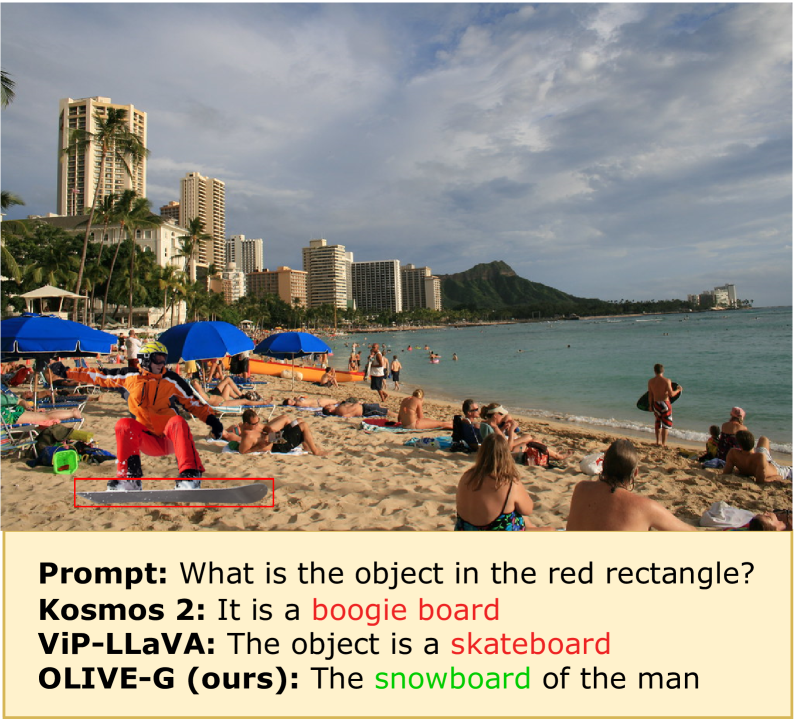

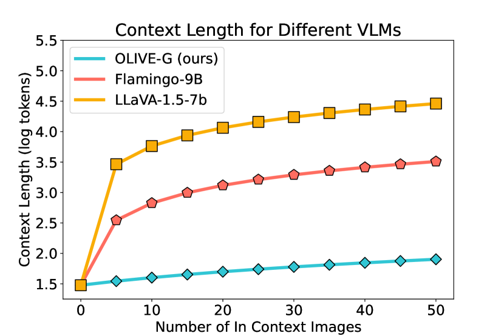

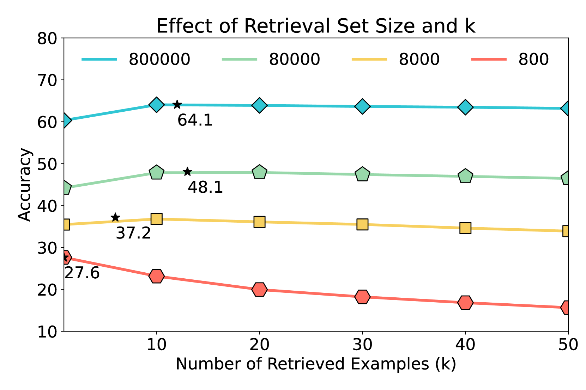

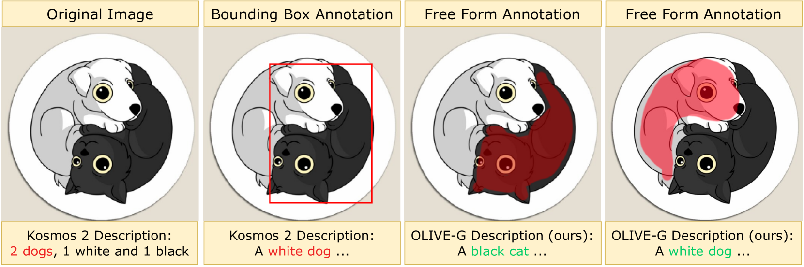

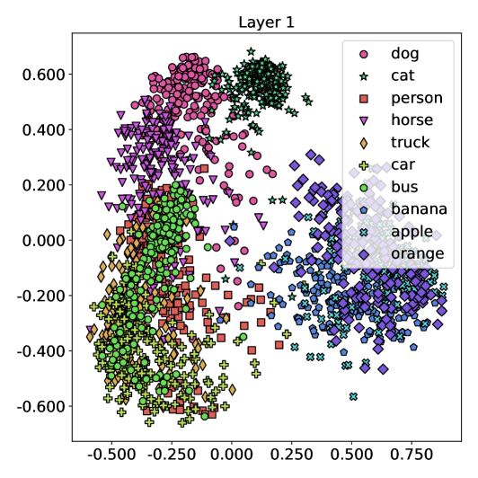

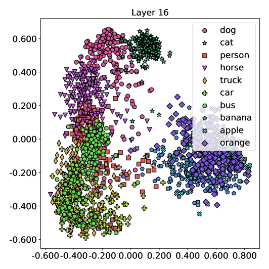

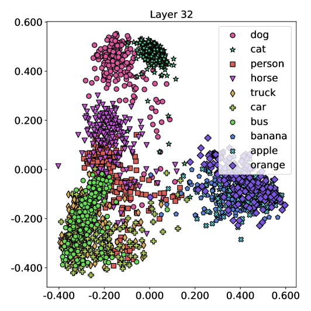

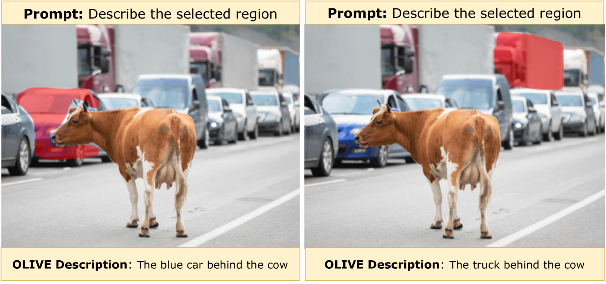

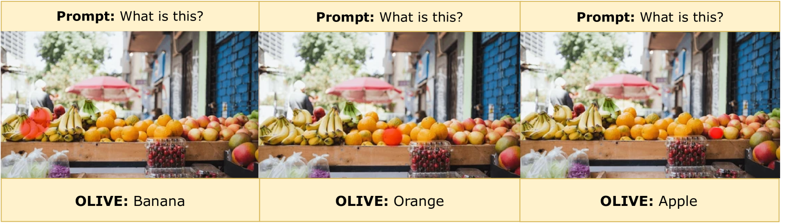

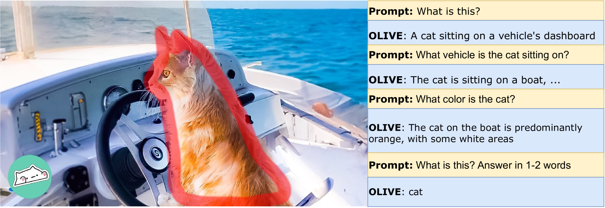

[Arxiv](https://arxiv.org/abs/2406.00872)