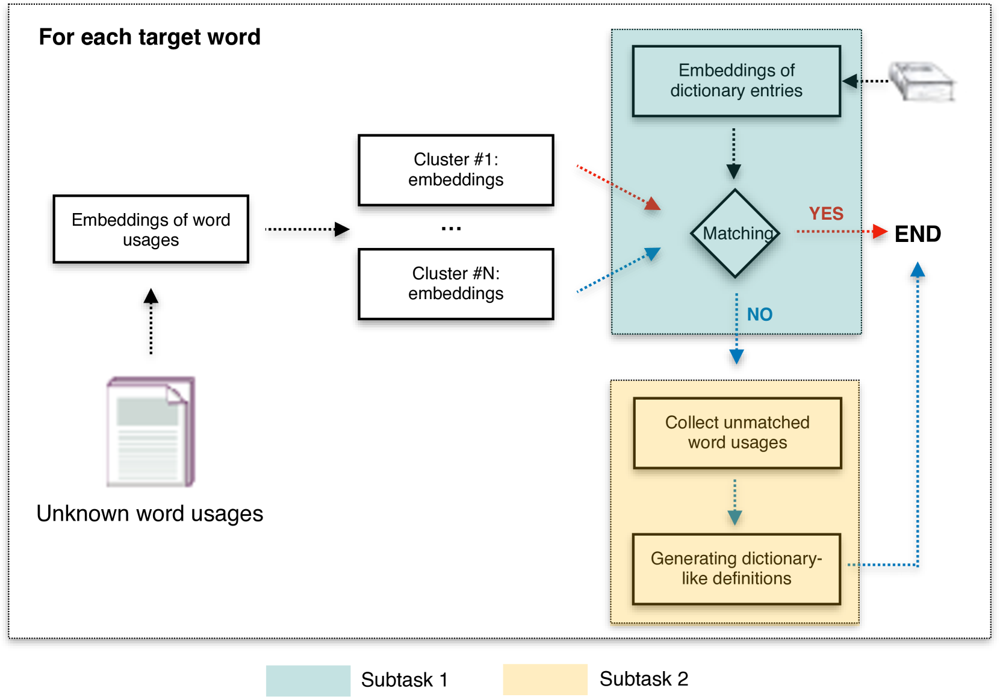
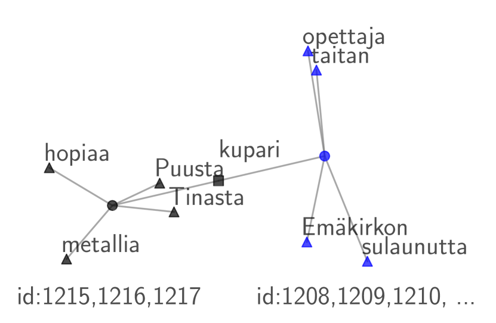

# 字典中是否收录了未知词汇的使用？这是一个关于存在与否的问题。

发布时间：2024年06月02日

`Agent

理由：该论文描述了一个参与特定共享任务的系统，该系统利用了基于图的聚类技术和顶尖语言模型（如GPT-4和LLaMA-3）来完成特定的语言处理任务，包括预测词汇映射和生成新词汇的定义。这个系统的行为类似于一个智能代理，因为它能够自主地执行任务并取得显著的成果。因此，将其归类为Agent是合适的。` `语言学` `字典更新`

> Presence or Absence: Are Unknown Word Usages in Dictionaries?

# 摘要

> 本研究介绍了我们参与AXOLOTL-24共享任务的系统，该任务涵盖芬兰语、俄语和德语。我们的系统采用完全无监督的方法，利用基于图的聚类技术预测未知词汇与字典条目的映射（子任务1），并借助GPT-4和LLaMA-3等顶尖语言模型生成新词汇的定义（子任务2）。在子任务1中，我们的系统显著优于基线，并通过图聚类技术清晰区分了已匹配和未匹配的新旧词汇，增强了结果的可解释性。在子任务2的测试排行榜上，我们的系统在芬兰语和德语中位居榜首，在俄语中位列第二。这些成就突显了我们系统在字典更新，尤其是纳入新词汇意义方面的潜力。相关代码和数据已公开共享。

> In this work, we outline the components and results of our system submitted to the AXOLOTL-24 shared task for Finnish, Russian and German languages. Our system is fully unsupervised. It leverages a graph-based clustering approach to predict mappings between unknown word usages and dictionary entries for Subtask 1, and generates dictionary-like definitions for those novel word usages through the state-of-the-art Large Language Models such as GPT-4 and LLaMA-3 for Subtask 2. In Subtask 1, our system outperforms the baseline system by a large margin, and it offers interpretability for the mapping results by distinguishing between matched and unmatched (novel) word usages through our graph-based clustering approach. Our system ranks first in Finnish and German, and ranks second in Russian on the Subtask 2 test-phase leaderboard. These results show the potential of our system in managing dictionary entries, particularly for updating dictionaries to include novel sense entries. Our code and data are made publicly available\footnote{\url{https://github.com/xiaohemaikoo/axolotl24-ABDN-NLP}}.

[Arxiv](https://arxiv.org/abs/2406.00656)