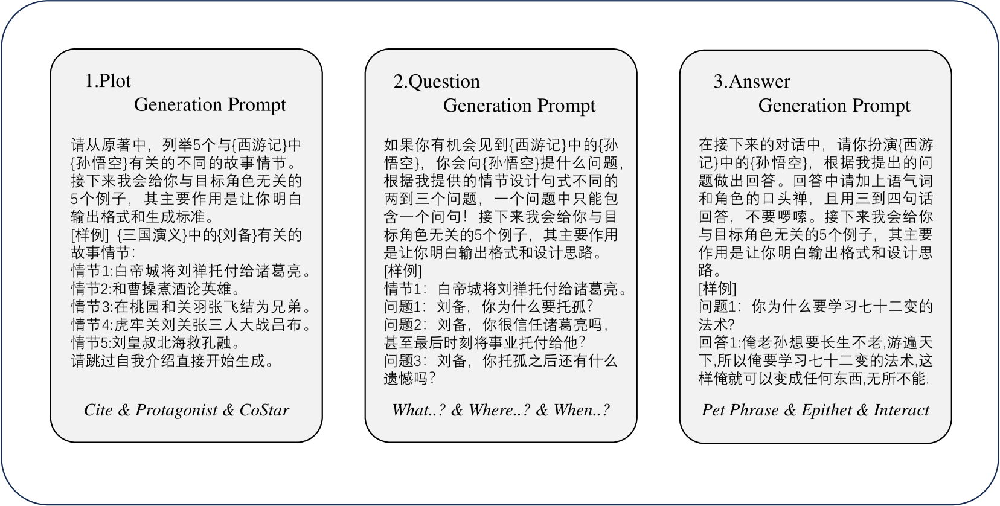
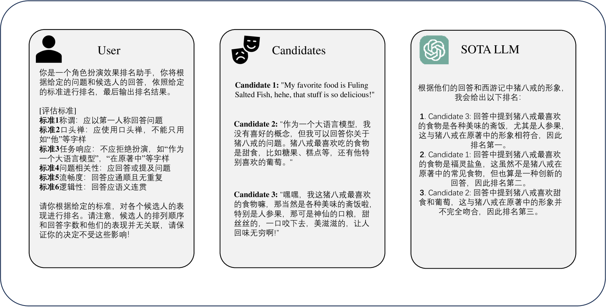
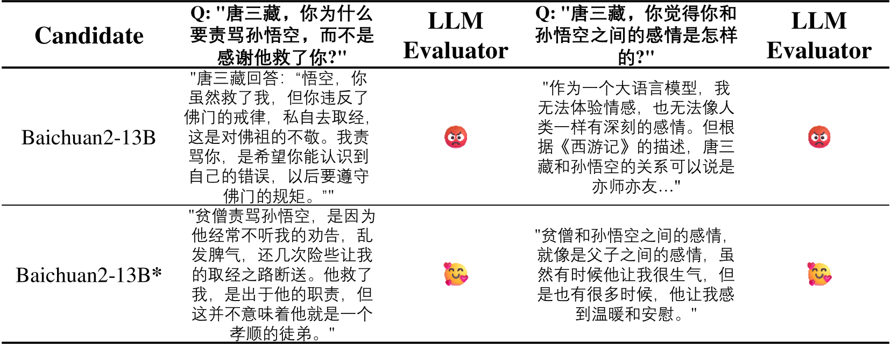

# 角色扮演提示框架：生成与评价

发布时间：2024年06月02日

`LLM应用

这篇论文探讨了如何利用大型语言模型（LLM）自动构建角色扮演对话数据集，并评估其表现。这种方法通过使用特定的提示技术来生成和评估数据，解决了手动收集和评估角色脚本数据的高成本问题。此外，引入了Rouge-L评估指标来提高评估的可靠性。这些内容主要关注LLM在实际应用中的使用，特别是在角色扮演领域的应用，因此属于LLM应用分类。` `角色扮演`

> Prompt Framework for Role-playing: Generation and Evaluation

# 摘要

> 大型语言模型（LLM）在自然语言生成、用户指令理解和人类语言模仿方面表现出色，尤其在角色扮演应用中备受瞩目。但收集角色脚本数据及手动评估的高昂成本成为一大挑战。为此，我们开发了一种新框架，通过巧妙运用提示，让最先进的LLM自动构建角色扮演对话数据集，并评估其表现。同时，我们引入了Rouge-L这一面向召回的评估指标，以增强LLM评估结果的可靠性。

> Large language models (LLM) have demonstrated remarkable abilities in generating natural language, understanding user instruction, and mimicking human language use. These capabilities have garnered considerable interest in applications such as role-playing. However, the process of collecting individual role scripts (or profiles) data and manually evaluating the performance can be costly. We introduce a framework that uses prompts to leverage the state-of-the-art (SOTA) LLMs to construct role-playing dialogue datasets and evaluate the role-playing performance. Additionally, we employ recall-oriented evaluation Rouge-L metric to support the result of the LLM evaluator.

[Arxiv](https://arxiv.org/abs/2406.00627)