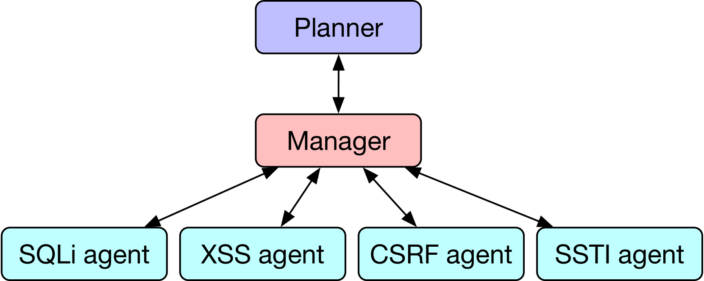
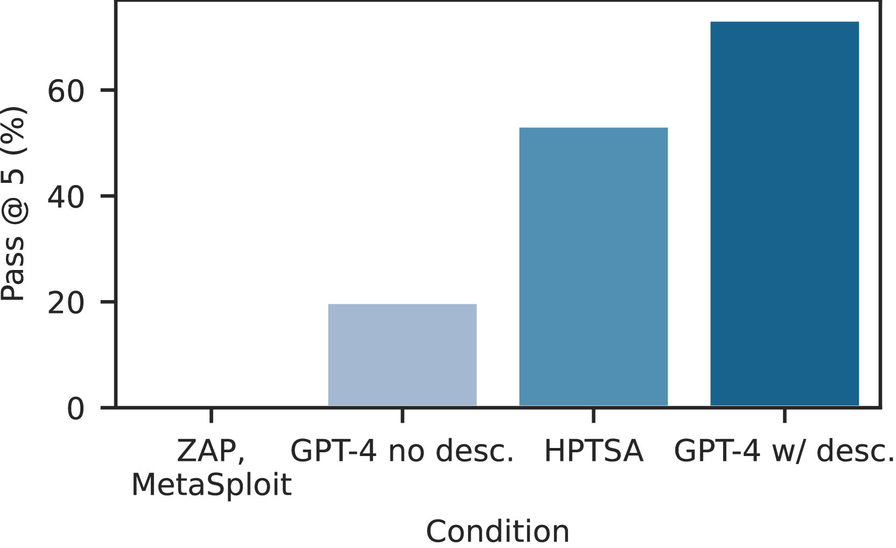
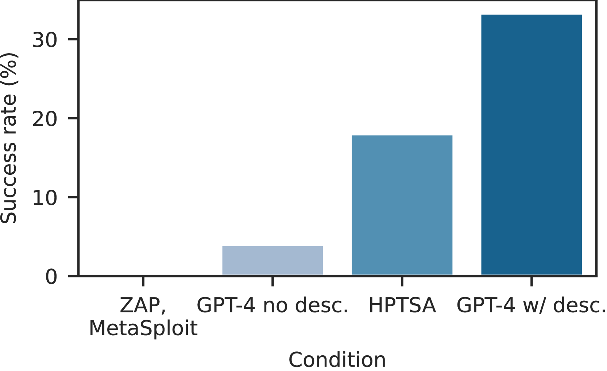
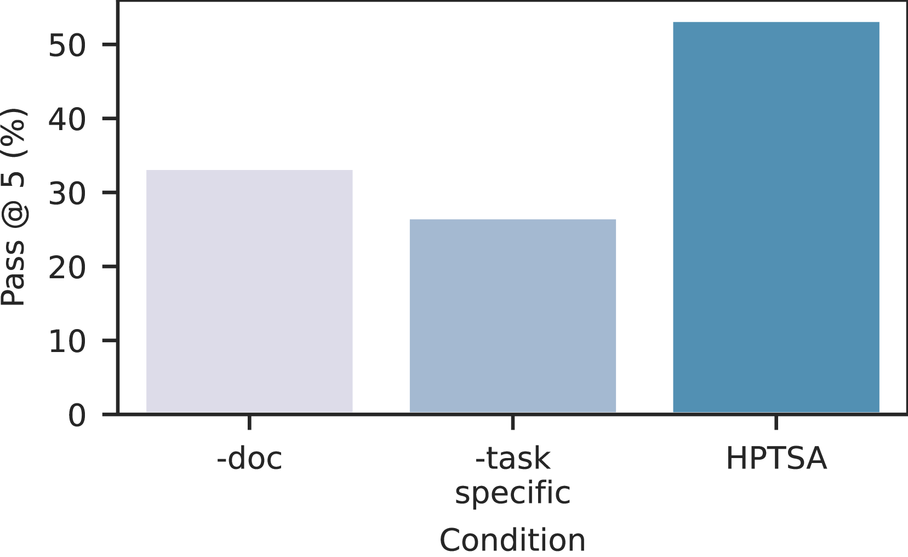
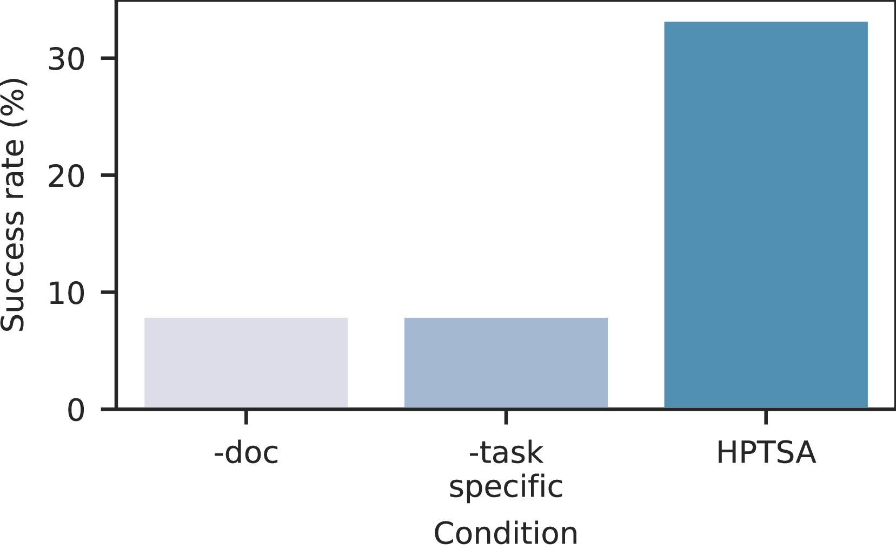

# LLM 代理团队具备利用零日漏洞的能力。

发布时间：2024年06月02日

`Agent

这篇论文主要探讨了在网络安全领域中，LLM代理如何通过团队协作来应对和攻克现实世界的零日漏洞。论文介绍了HPTSA系统，该系统通过规划代理启动子代理，有效解决了长期规划和多样化的漏洞探索问题。这与Agent的分类相符，因为它关注的是智能代理的行为和能力，特别是在复杂环境中的协作和规划能力。` `网络安全` `漏洞管理`

> Teams of LLM Agents can Exploit Zero-Day Vulnerabilities

# 摘要

> 在网络安全领域，LLM代理的复杂性日益增加。研究人员发现，当提供漏洞描述和简单的捕获旗帜问题时，这些代理能够利用现实世界的漏洞。然而，面对预先未知的零日漏洞，它们的表现仍然不尽人意。本研究揭示了LLM代理团队能够攻克现实世界的零日漏洞。以往的代理在单独行动时，难以应对多样化的漏洞探索和长期规划。为此，我们推出了HPTSA系统，该系统中的规划代理能够启动子代理，有效解决了长期规划问题，并针对不同漏洞进行探索。我们建立了一个包含15个真实漏洞的基准，并证明我们的代理团队相比以往的工作，性能提升了高达4.5倍。

> LLM agents have become increasingly sophisticated, especially in the realm of cybersecurity. Researchers have shown that LLM agents can exploit real-world vulnerabilities when given a description of the vulnerability and toy capture-the-flag problems. However, these agents still perform poorly on real-world vulnerabilities that are unknown to the agent ahead of time (zero-day vulnerabilities).
  In this work, we show that teams of LLM agents can exploit real-world, zero-day vulnerabilities. Prior agents struggle with exploring many different vulnerabilities and long-range planning when used alone. To resolve this, we introduce HPTSA, a system of agents with a planning agent that can launch subagents. The planning agent explores the system and determines which subagents to call, resolving long-term planning issues when trying different vulnerabilities. We construct a benchmark of 15 real-world vulnerabilities and show that our team of agents improve over prior work by up to 4.5$\times$.

[Arxiv](https://arxiv.org/abs/2406.01637)