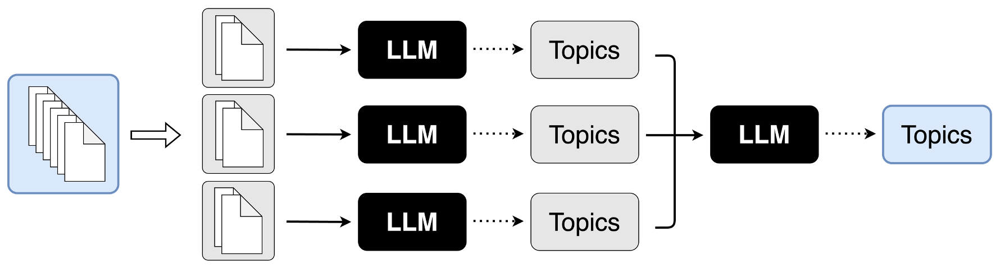
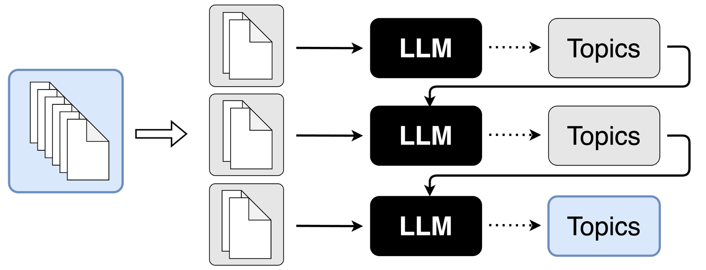

# 大型语言模型在短文本主题建模中的应用

发布时间：2024年06月02日

`LLM应用

这篇论文探讨了如何利用大型语言模型（LLMs）来解决传统主题模型在处理短文本时的局限性。通过使用并行提示和顺序提示两种策略，论文展示了如何有效地分割文本并利用LLMs进行主题建模，从而提高主题的连贯性和多样性，同时减少虚构主题的产生。这种方法的应用性质明显，因此归类为LLM应用。` `短文本处理` `主题建模`

> Topic Modeling for Short Texts with Large Language Models

# 摘要

> 传统主题模型依赖词共现推断主题，短文本主题建模因此成为难题。大型语言模型（LLMs）通过预训练学习词义，有望解决此问题。本文探讨了并行提示与顺序提示两种策略，利用LLMs进行主题建模。受限于输入长度，LLMs无法一次性处理大量文本，但通过分割文本为小片段并行或顺序处理，可应对任意文本量。实验证明，我们的方法不仅识别出更连贯的主题，且保持了主题多样性，同时确保了推断主题对输入文本的全面覆盖，极少产生虚构主题。

> As conventional topic models rely on word co-occurrence to infer latent topics, topic modeling for short texts has been a long-standing challenge. Large Language Models (LLMs) can potentially overcome this challenge by contextually learning the semantics of words via pretraining. This paper studies two approaches, parallel prompting and sequential prompting, to use LLMs for topic modeling. Due to the input length limitations, LLMs cannot process many texts at once. By splitting the texts into smaller subsets and processing them parallelly or sequentially, an arbitrary number of texts can be handled by LLMs. Experimental results demonstrated that our methods can identify more coherent topics than existing ones while maintaining the diversity of the induced topics. Furthermore, we found that the inferred topics adequately covered the input texts, while hallucinated topics were hardly generated.

[Arxiv](https://arxiv.org/abs/2406.00697)