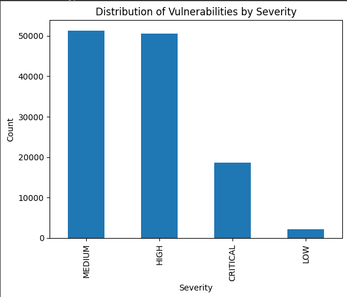

# 探索微调大型语言模型，以提升计算机安全并增强公众信任

发布时间：2024年06月02日

`Agent

这篇论文主要探讨了恶意服务“Mallas”如何利用大型语言模型（LLMs）进行不法行为，包括制造恶意软件、发起钓鱼攻击和创建欺诈网站。研究内容涉及分析这些恶意服务的运作方式、效率和漏洞，并探讨了针对已知漏洞生成代码和解释性文本的微调技术。因此，这篇论文更偏向于描述和分析一个具体的Agent（即“Mallas”）如何利用LLMs进行恶意活动，而不是专注于LLMs的理论研究或应用开发，也不是关于检索增强生成（RAG）技术的讨论。因此，将其归类为Agent是合适的。` `网络安全` `人工智能安全`

> Transforming Computer Security and Public Trust Through the Exploration of Fine-Tuning Large Language Models

# 摘要

> 大型语言模型（LLMs）的兴起改变了人机交互的面貌，但同时也催生了“Mallas”这类地下恶意服务，它们利用LLMs进行不法行为，如制造恶意软件、发起钓鱼攻击和创建欺诈网站，从而加剧了网络安全威胁。本文深入分析了Mallas如何利用各种预训练语言模型，并探讨了它们在滥用时的效率和漏洞。通过基于CVE计划的数据集，研究还探索了针对已知漏洞生成代码和解释性文本的微调技术。本研究旨在揭示Mallas的运作和利用手法，以促进更安全、可信的AI应用的发展。文章最后呼吁加强研究、提升安全防护和制定道德规范，以应对LLMs被恶意利用的风险。

> Large language models (LLMs) have revolutionized how we interact with machines. However, this technological advancement has been paralleled by the emergence of "Mallas," malicious services operating underground that exploit LLMs for nefarious purposes. Such services create malware, phishing attacks, and deceptive websites, escalating the cyber security threats landscape. This paper delves into the proliferation of Mallas by examining the use of various pre-trained language models and their efficiency and vulnerabilities when misused. Building on a dataset from the Common Vulnerabilities and Exposures (CVE) program, it explores fine-tuning methodologies to generate code and explanatory text related to identified vulnerabilities. This research aims to shed light on the operational strategies and exploitation techniques of Mallas, leading to the development of more secure and trustworthy AI applications. The paper concludes by emphasizing the need for further research, enhanced safeguards, and ethical guidelines to mitigate the risks associated with the malicious application of LLMs.

[Arxiv](https://arxiv.org/abs/2406.00628)