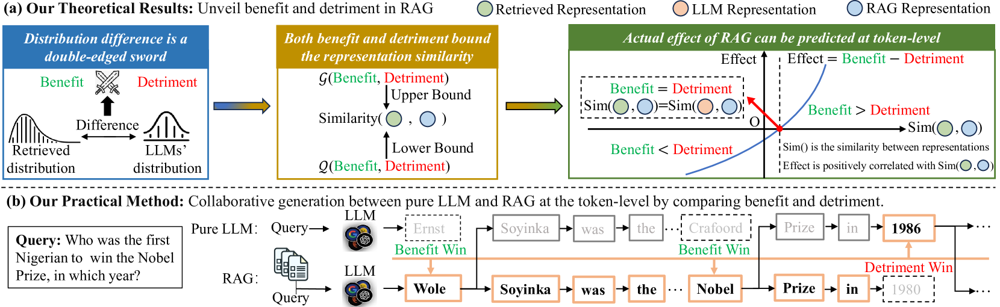

# 揭秘检索增强生成技术的双重奥秘：理论剖析与实践指南

发布时间：2024年06月02日

`RAG

这篇论文主要探讨了检索增强生成（RAG）在大型语言模型（LLMs）中的应用及其效果的双重性。论文从理论层面分析了RAG的利弊，并提出了新的方法（X-RAG）来优化这一过程，旨在提高RAG的性能并减少其负面影响。因此，这篇论文更符合RAG分类，因为它专注于RAG的理论解释和改进方法。` `人工智能`

> Unveil the Duality of Retrieval-Augmented Generation: Theoretical Analysis and Practical Solution

# 摘要

> 检索增强生成（RAG）通过利用检索文本来提升大型语言模型（LLMs）的性能，但研究发现，RAG的效果并不稳定，有时甚至因检索到的文本质量不佳而误导模型。这揭示了RAG的双重性质——既有利也有弊。尽管已有多种方法尝试解决这一问题，但缺乏对RAG双重性的理论解释。这种双重性中的利弊仍是一个难以量化和解释的谜。本文首次从理论上阐释了RAG中的利弊：（1）从RAG预测中分离并形式化它们，（2）通过表示相似性估算它们之间的价值差异，（3）建立它们之间的权衡机制，使其可解释、可量化和可比较。我们发现，检索文本与LLMs知识间的分布差异既是助力也是阻力。我们还证实了RAG的实际效果可在令牌级别上预见。基于此理论，我们提出了X-RAG方法，该方法在令牌级别上实现了纯LLM与RAG的协同生成，旨在最大化益处并最小化损害。实验结果显示，我们的方法在包括OPT、LLaMA-2和Mistral在内的LLMs上表现出色，验证了我们的理论。

> Retrieval-augmented generation (RAG) utilizes retrieved texts to enhance large language models (LLMs). However, studies show that RAG is not consistently effective and can even mislead LLMs due to noisy or incorrect retrieved texts. This suggests that RAG possesses a duality including both benefit and detriment. Although many existing methods attempt to address this issue, they lack a theoretical explanation for the duality in RAG. The benefit and detriment within this duality remain a black box that cannot be quantified or compared in an explainable manner. This paper takes the first step in theoretically giving the essential explanation of benefit and detriment in RAG by: (1) decoupling and formalizing them from RAG prediction, (2) approximating the gap between their values by representation similarity and (3) establishing the trade-off mechanism between them, to make them explainable, quantifiable, and comparable. We demonstrate that the distribution difference between retrieved texts and LLMs' knowledge acts as double-edged sword, bringing both benefit and detriment. We also prove that the actual effect of RAG can be predicted at token level. Based on our theory, we propose a practical novel method, X-RAG, which achieves collaborative generation between pure LLM and RAG at token level to preserve benefit and avoid detriment. Experiments in real-world tasks based on LLMs including OPT, LLaMA-2, and Mistral show the effectiveness of our method and support our theoretical results.

[Arxiv](https://arxiv.org/abs/2406.00944)