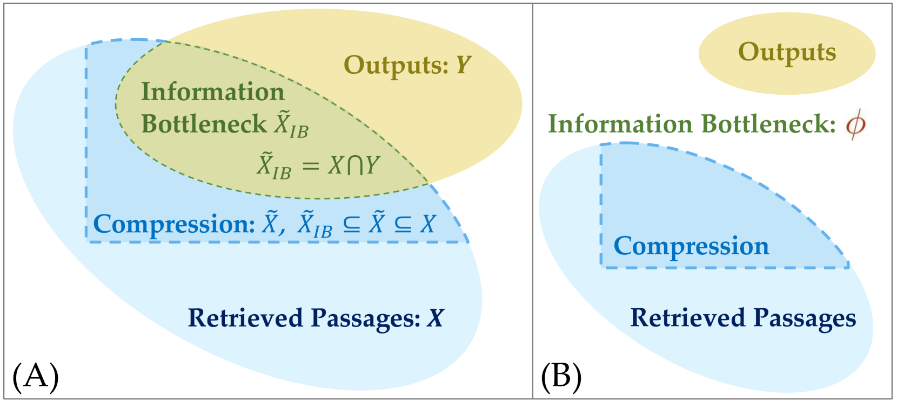
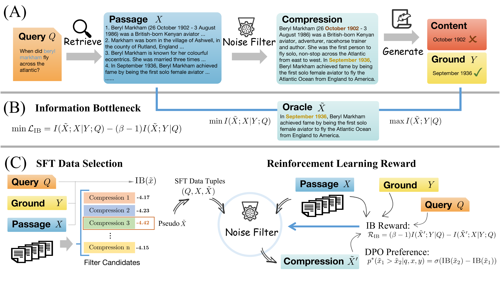

# 在检索增强生成过程中，信息瓶颈视角揭示了有效噪声过滤的重要性。

发布时间：2024年06月03日

`RAG

理由：这篇论文主要探讨了检索增强生成（RAG）技术在处理噪声数据时的改进方法，通过应用信息瓶颈理论来优化互信息，以提升噪声过滤效果。这与RAG技术的核心目标紧密相关，即通过融合大型语言模型和检索到的信息来增强生成能力，同时解决噪声数据带来的挑战。因此，这篇论文应归类于RAG。` `问答系统` `数据处理`

> An Information Bottleneck Perspective for Effective Noise Filtering on Retrieval-Augmented Generation

# 摘要

> 检索增强生成技术融合了大型语言模型与广泛语料库中检索的相关信息，但面对现实世界的噪声数据时仍显力不从心。近期，一种解决方案是通过训练过滤模块来筛选相关内容，但噪声压缩效果仅达到次优。本文提出将信息瓶颈理论应用于检索增强生成，通过优化互信息，既确保压缩与正确输出的紧密关联，又减少与噪声段落的关联，从而提升噪声过滤效果。我们还推导了信息瓶颈理论的公式，以助其在综合评估、数据微调选择及强化学习奖励构建中的应用。实验证明，该方法在多个问答数据集上显著提升了答案的准确性与简洁性，实现了2.5%的压缩率。

> Retrieval-augmented generation integrates the capabilities of large language models with relevant information retrieved from an extensive corpus, yet encounters challenges when confronted with real-world noisy data. One recent solution is to train a filter module to find relevant content but only achieve suboptimal noise compression. In this paper, we propose to introduce the information bottleneck theory into retrieval-augmented generation. Our approach involves the filtration of noise by simultaneously maximizing the mutual information between compression and ground output, while minimizing the mutual information between compression and retrieved passage. In addition, we derive the formula of information bottleneck to facilitate its application in novel comprehensive evaluations, the selection of supervised fine-tuning data, and the construction of reinforcement learning rewards. Experimental results demonstrate that our approach achieves significant improvements across various question answering datasets, not only in terms of the correctness of answer generation but also in the conciseness with $2.5\%$ compression rate.

[Arxiv](https://arxiv.org/abs/2406.01549)