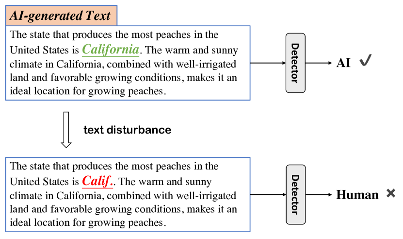
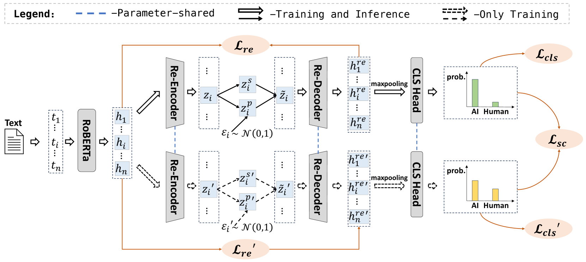
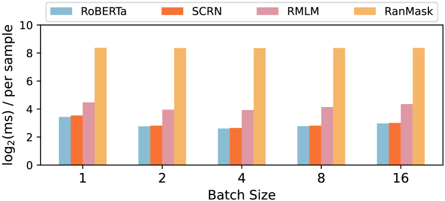
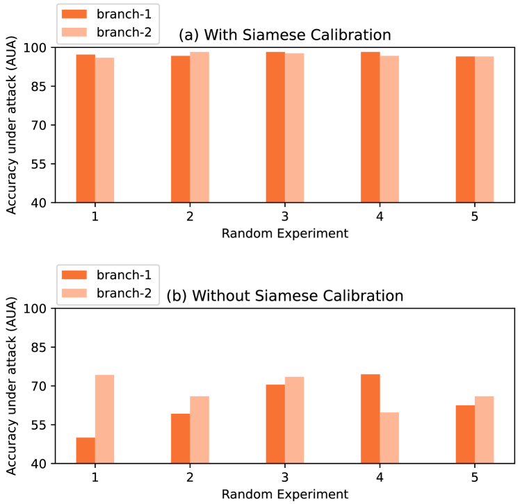
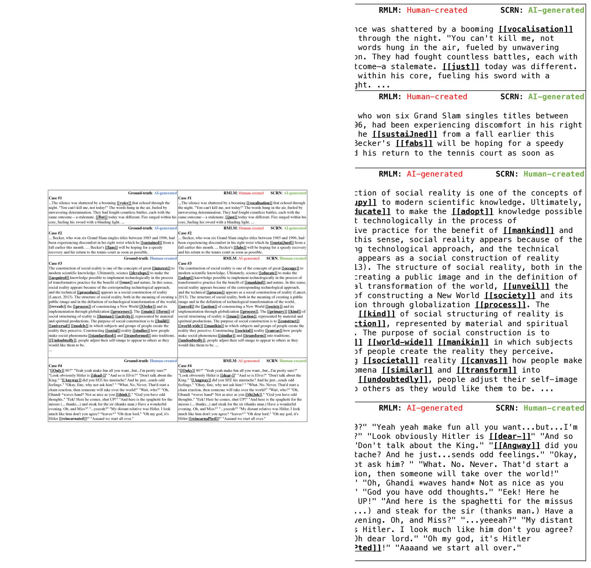

# AI文本检测器能否抵御对抗性干扰？

发布时间：2024年06月03日

`LLM应用

这篇论文主要探讨了大型语言模型（LLMs）生成的文本与人类文本的区分问题，并提出了一种新型的检测器——暹罗校准重建网络（SCRN）。SCRN旨在提高检测器对AI生成文本的鲁棒性，特别是在面对微小改动时的稳定性。该研究关注的是LLMs在实际应用中的一个具体问题，即如何有效检测和区分AI生成的文本，因此属于LLM应用类别。` `人工智能安全` `文本检测`

> Are AI-Generated Text Detectors Robust to Adversarial Perturbations?

# 摘要

> 大型语言模型（LLMs）的普及引发了人们对AI生成文本滥用的担忧，因其能产出与人类文本难以区分的作品。现有的AI文本检测器在面对微小改动时，往往难以稳定区分人类与AI创作。本文探讨了这些检测器的鲁棒性，并推出了一种创新的检测器——暹罗校准重建网络（SCRN）。SCRN通过重建网络调整文本噪声，提取出对细微变化具有抵抗力的语义特征。同时，我们开发的暹罗校准技术使模型在不同噪声环境下均能做出自信预测，显著提升了对抗扰动的鲁棒性。实验结果显示，SCRN在对抗性攻击下的准确度比最佳基线方法提高了6.5%至18.25%，并在多种复杂场景中展现出优异的泛化性能。相关代码已发布于\url{https://github.com/CarlanLark/Robust-AIGC-Detector}。

> The widespread use of large language models (LLMs) has sparked concerns about the potential misuse of AI-generated text, as these models can produce content that closely resembles human-generated text. Current detectors for AI-generated text (AIGT) lack robustness against adversarial perturbations, with even minor changes in characters or words causing a reversal in distinguishing between human-created and AI-generated text. This paper investigates the robustness of existing AIGT detection methods and introduces a novel detector, the Siamese Calibrated Reconstruction Network (SCRN). The SCRN employs a reconstruction network to add and remove noise from text, extracting a semantic representation that is robust to local perturbations. We also propose a siamese calibration technique to train the model to make equally confidence predictions under different noise, which improves the model's robustness against adversarial perturbations. Experiments on four publicly available datasets show that the SCRN outperforms all baseline methods, achieving 6.5\%-18.25\% absolute accuracy improvement over the best baseline method under adversarial attacks. Moreover, it exhibits superior generalizability in cross-domain, cross-genre, and mixed-source scenarios. The code is available at \url{https://github.com/CarlanLark/Robust-AIGC-Detector}.

[Arxiv](https://arxiv.org/abs/2406.01179)