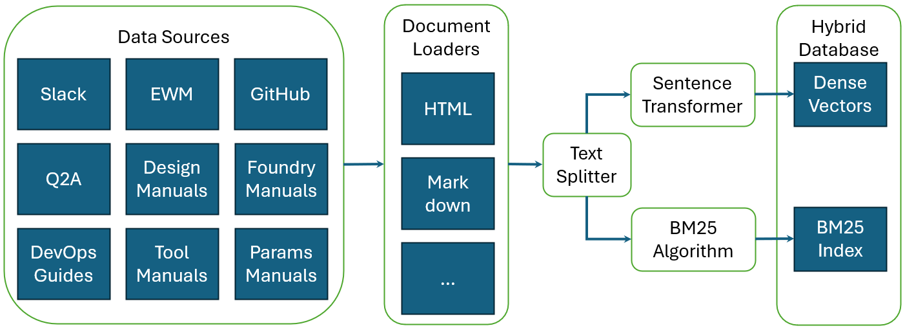
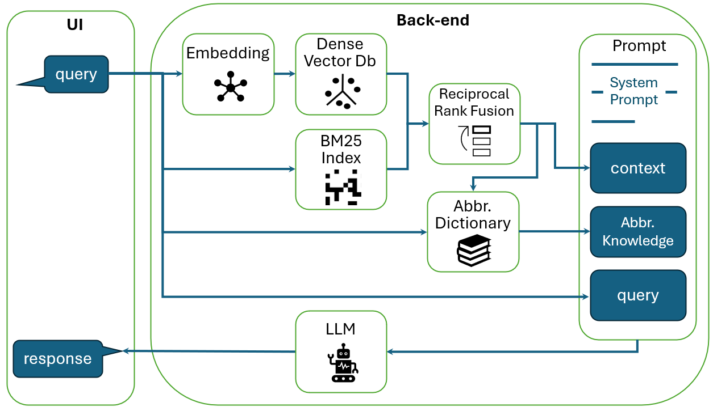
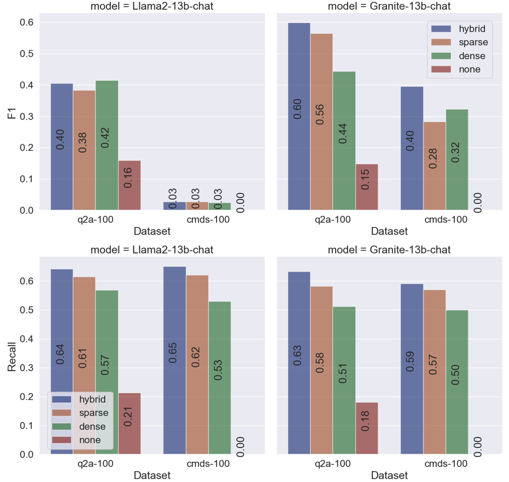
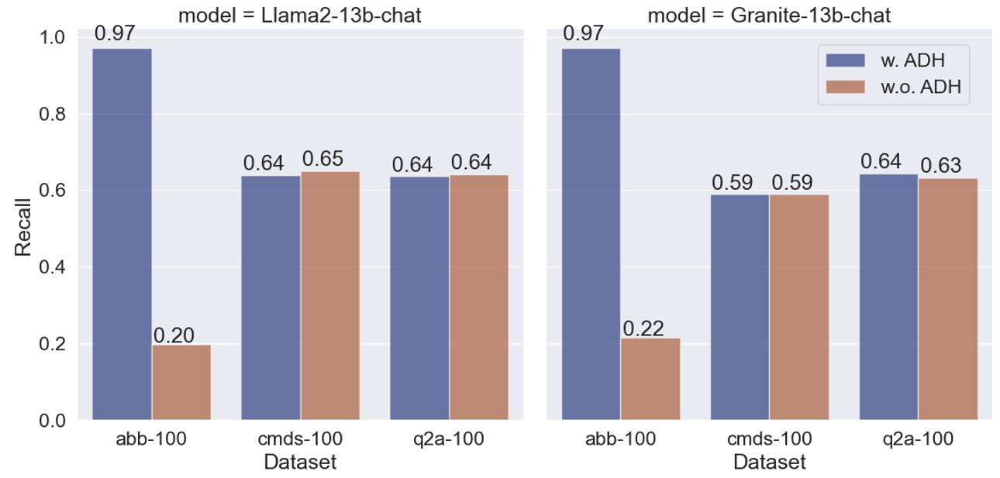
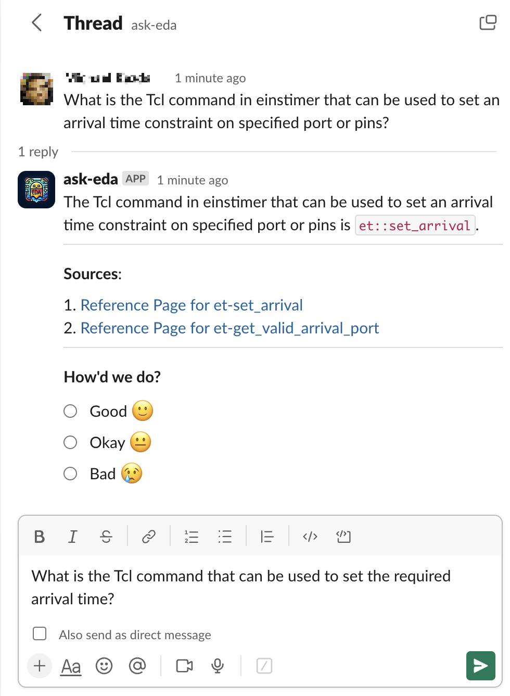

# Ask-EDA：一款集大型语言模型、混合检索增强生成及缩写词澄清技术于一体的设计辅助工具

发布时间：2024年06月03日

`Agent

理由：这篇论文介绍了一个名为 Ask-EDA 的专家聊天代理，它旨在作为设计工程师的对话代理，提供信息和指导。这个系统结合了大型语言模型（LLM）、混合检索增强生成（RAG）和缩写去幻觉（ADH）技术，以提供精准的回答。因此，它更符合Agent分类，因为它描述了一个具体的应用场景中的智能代理系统。` `电子设计自动化` `专家系统`

> Ask-EDA: A Design Assistant Empowered by LLM, Hybrid RAG and Abbreviation De-hallucination

# 摘要

> 电子设计工程师在众多任务中需迅速获取信息，大型语言模型（LLM）通过作为主题专家的对话代理，有望提升效率。本文介绍的Ask-EDA，是一个全天候的专家聊天代理，旨在指导设计工程师。它结合LLM、混合检索增强生成（RAG）及缩写去幻觉（ADH）技术，提供精准的回答。我们定制了三个评估数据集：q2a-100、cmds-100和abbr-100，分别针对设计问题解答、命令处理和缩写解析。结果显示，混合RAG在q2a-100和cmds-100数据集上的召回率分别提升了40%和60%，而ADH在abbr-100数据集上的召回率提升了70%。Ask-EDA在设计相关查询上的表现令人满意。

> Electronic design engineers are challenged to find relevant information efficiently for a myriad of tasks within design construction, verification and technology development. Large language models (LLM) have the potential to help improve productivity by serving as conversational agents that effectively function as subject-matter experts. In this paper we demonstrate Ask-EDA, a chat agent designed to serve as a 24x7 expert available to provide guidance to design engineers. Ask-EDA leverages LLM, hybrid retrieval augmented generation (RAG) and abbreviation de-hallucination (ADH) techniques to deliver more relevant and accurate responses. We curated three evaluation datasets, namely q2a-100, cmds-100 and abbr-100. Each dataset is tailored to assess a distinct aspect: general design question answering, design command handling and abbreviation resolution. We demonstrated that hybrid RAG offers over a 40% improvement in Recall on the q2a-100 dataset and over a 60% improvement on the cmds-100 dataset compared to not using RAG, while ADH yields over a 70% enhancement in Recall on the abbr-100 dataset. The evaluation results show that Ask-EDA can effectively respond to design-related inquiries.

[Arxiv](https://arxiv.org/abs/2406.06575)