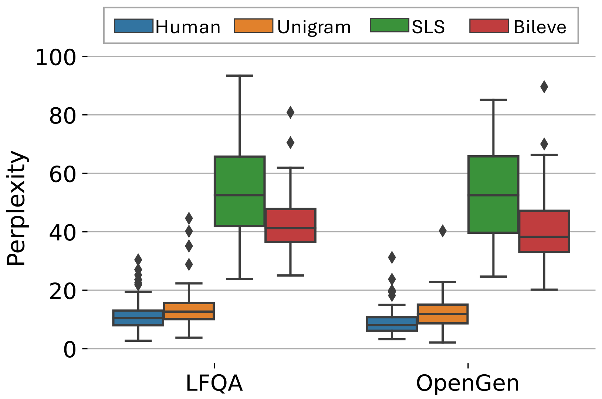

# Bileve：双层签名技术守护大型语言模型文本来源，抵御伪造风险

发布时间：2024年06月03日

`LLM应用

解析：这篇论文主要讨论了大型语言模型（LLMs）的文本水印技术，特别是针对追踪机器生成内容的来源和评估深度伪造或有害内容的责任。提出的双层签名方案Bileve旨在提高检测能力并防止欺骗攻击，这是对现有技术的改进和应用。因此，这篇论文属于LLM应用类别，因为它关注的是LLM技术在实际应用中的安全性和责任追踪问题。` `内容安全` `深度伪造检测`

> Bileve: Securing Text Provenance in Large Language Models Against Spoofing with Bi-level Signature

# 摘要

> 大型语言模型（LLMs）的文本水印技术，常用于追踪机器生成内容的来源，对于评估深度伪造或有害内容的责任至关重要。然而，现有技术虽强调对移除攻击的抵抗力，却易受欺骗攻击影响：恶意者能微妙修改LLM的输出或伪造有害信息，错误地指向开发者。为此，我们提出了双层签名方案Bileve，它通过精细的签名位进行完整性检查，防止欺骗攻击，同时利用粗粒度信号在签名失效时追踪文本来源，提高检测能力。与传统水印检测器不同，Bileve能在检测中区分五种情况，确保文本来源的准确追踪和LLMs的规范使用。实验在OPT-1.3B和LLaMA-7B模型上验证了Bileve在增强检测能力的同时有效抵御欺骗攻击的能力。

> Text watermarks for large language models (LLMs) have been commonly used to identify the origins of machine-generated content, which is promising for assessing liability when combating deepfake or harmful content. While existing watermarking techniques typically prioritize robustness against removal attacks, unfortunately, they are vulnerable to spoofing attacks: malicious actors can subtly alter the meanings of LLM-generated responses or even forge harmful content, potentially misattributing blame to the LLM developer. To overcome this, we introduce a bi-level signature scheme, Bileve, which embeds fine-grained signature bits for integrity checks (mitigating spoofing attacks) as well as a coarse-grained signal to trace text sources when the signature is invalid (enhancing detectability) via a novel rank-based sampling strategy. Compared to conventional watermark detectors that only output binary results, Bileve can differentiate 5 scenarios during detection, reliably tracing text provenance and regulating LLMs. The experiments conducted on OPT-1.3B and LLaMA-7B demonstrate the effectiveness of Bileve in defeating spoofing attacks with enhanced detectability.

[Arxiv](https://arxiv.org/abs/2406.01946)