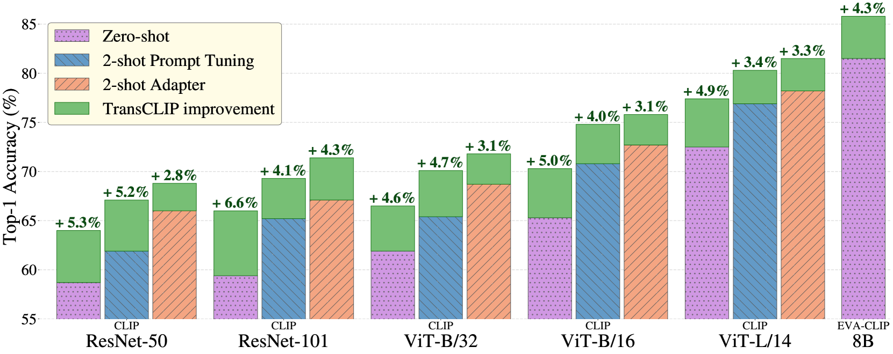

# 借助转导技术，我们能够进一步提升视觉-语言模型的性能。

发布时间：2024年06月03日

`RAG

理由：这篇论文介绍了一种名为TransCLIP的新型传导策略，专门为视觉语言模型（VLMs）设计，旨在提升预测准确性。它通过即插即用模块的形式，改善了归纳零样本和小样本模型的性能。这种方法涉及到利用未标记数据和文本编码器知识，以及通过KL散度约束的正则化最大似然估计来优化目标函数。这些特性与RAG（Retrieval-Augmented Generation）模型的概念相似，即通过整合外部知识来增强模型的性能。因此，这篇论文更适合归类为RAG。` `视觉语言模型` `机器学习`

> Boosting Vision-Language Models with Transduction

# 摘要

> Transduction，一种利用未标记数据结构提升预测准确性的方法，我们推出了TransCLIP——一种专为视觉语言模型（VLMs）设计的高效传导策略。TransCLIP作为即插即用模块，能持续提升流行归纳零样本和小样本模型的性能。我们的目标函数是一种受KL散度约束的正则化最大似然估计，它整合了文本编码器知识，引导传导学习。通过迭代块最大化最小化（BMM）程序，我们确保了目标函数的优化收敛，并实现了样本分配的解耦更新，适用于大规模数据集。综合评估显示：(i) 传导能大幅提升归纳预训练VLMs的泛化能力；(ii) TransCLIP因基于KL的语言约束，显著超越了仅依赖视觉特征的传导小样本学习方法。

> Transduction is a powerful paradigm that leverages the structure of unlabeled data to boost predictive accuracy. We present TransCLIP, a novel and computationally efficient transductive approach designed for Vision-Language Models (VLMs). TransCLIP is applicable as a plug-and-play module on top of popular inductive zero- and few-shot models, consistently improving their performances. Our new objective function can be viewed as a regularized maximum-likelihood estimation, constrained by a KL divergence penalty that integrates the text-encoder knowledge and guides the transductive learning process. We further derive an iterative Block Majorize-Minimize (BMM) procedure for optimizing our objective, with guaranteed convergence and decoupled sample-assignment updates, yielding computationally efficient transduction for large-scale datasets. We report comprehensive evaluations, comparisons, and ablation studies that demonstrate: (i) Transduction can greatly enhance the generalization capabilities of inductive pretrained zero- and few-shot VLMs; (ii) TransCLIP substantially outperforms standard transductive few-shot learning methods relying solely on vision features, notably due to the KL-based language constraint.

[Arxiv](https://arxiv.org/abs/2406.01837)