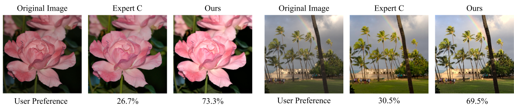

# 利用CLIP引导的属性感知预训练，提升图像质量评估的泛化能力

发布时间：2024年06月03日

`LLM应用

这篇论文的研究重点是利用视觉语言模型（LLM）来改进无参考图像质量评估（IQA）的性能。通过创新的预训练框架，该研究从视觉语言模型中提取与图像质量相关的知识，并结合大型数据集的优势，构建了适用于IQA的通用表示。这种方法不仅在多个IQA数据集上取得了优异的成绩，还展示了强大的泛化能力，并探索了其在评估图像生成模型和训练图像增强模型等实际应用中的价值。因此，这篇论文应归类为LLM应用，因为它展示了如何将LLM技术应用于特定的实际问题，即图像质量评估。` `图像质量评估` `图像处理`

> CLIP-Guided Attribute Aware Pretraining for Generalizable Image Quality Assessment

# 摘要

> 在无参考图像质量评估领域，数据集的局限性一直是开发鲁棒且可泛化模型的障碍。传统方法依赖大型数据集提取丰富特征，而新兴的视觉语言模型虽有潜力，却因领域差异而受限。本研究创新性地提出了一种预训练框架，巧妙地从视觉语言模型中提取与图像质量相关的知识，并结合大型数据集的优势，构建了适用于IQA的通用表示。我们精心设计了五个关键图像质量属性的文本提示，利用视觉语言模型生成大量属性感知的伪标签，从而让IQA模型深入学习图像质量的多样特征。此方法在多个IQA数据集上取得了顶尖成绩，并展现出卓越的泛化能力。基于这些成果，我们探索了评估图像生成模型和训练图像增强模型等实际应用，充分证明了我们模型的实用价值。此外，我们还将公开相关代码，供研究者参考。

> In no-reference image quality assessment (NR-IQA), the challenge of limited dataset sizes hampers the development of robust and generalizable models. Conventional methods address this issue by utilizing large datasets to extract rich representations for IQA. Also, some approaches propose vision language models (VLM) based IQA, but the domain gap between generic VLM and IQA constrains their scalability. In this work, we propose a novel pretraining framework that constructs a generalizable representation for IQA by selectively extracting quality-related knowledge from VLM and leveraging the scalability of large datasets. Specifically, we carefully select optimal text prompts for five representative image quality attributes and use VLM to generate pseudo-labels. Numerous attribute-aware pseudo-labels can be generated with large image datasets, allowing our IQA model to learn rich representations about image quality. Our approach achieves state-of-the-art performance on multiple IQA datasets and exhibits remarkable generalization capabilities. Leveraging these strengths, we propose several applications, such as evaluating image generation models and training image enhancement models, demonstrating our model's real-world applicability. We will make the code available for access.

[Arxiv](https://arxiv.org/abs/2406.01020)