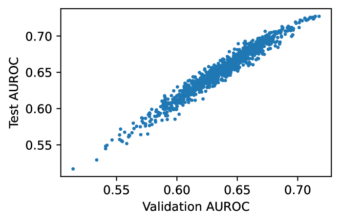

# 增强自然语言生成置信度：上下文化序列可能性

发布时间：2024年06月03日

`LLM理论

理由：这篇论文主要探讨了大型语言模型（LLMs）的置信度评估方法，提出了一种新的评分方法——上下文化序列可能性（CSL），并通过实验验证了其在提高预测序列概率准确性方面的有效性。这一研究聚焦于LLMs的理论层面，特别是在置信度评估和模型内部机制（如注意力值的利用）的改进上，因此属于LLM理论分类。` `问答系统`

> Contextualized Sequence Likelihood: Enhanced Confidence Scores for Natural Language Generation

# 摘要

> 大型语言模型（LLMs）的兴起极大地提升了自然语言生成任务的技术水平。为了确保LLMs的可靠应用，准确评估其置信度至关重要。目前，最常用的置信度评分是生成序列的可能性，但这种方法混淆了语义和句法元素。例如，在问答任务中，正确答案的尴尬表述可能会导致较低的概率预测。此外，根据上下文，不同标记应赋予不同权重。本研究提出，通过利用基础LLM的注意力值为不同标记分配权重，来提升预测序列的概率。通过验证集，我们能够识别关键的注意力头，显著提高序列概率置信度量的准确性。我们称这种新评分方法为上下文化序列可能性（CSL）。CSL不仅易于实施且计算迅速，还具有通过特定任务提示进一步优化的潜力。在多个QA数据集和一系列LLMs中，CSL在预测生成质量方面表现出色，其可靠性远超现有基线，如AUROC或AUARC所测量的。

> The advent of large language models (LLMs) has dramatically advanced the state-of-the-art in numerous natural language generation tasks. For LLMs to be applied reliably, it is essential to have an accurate measure of their confidence. Currently, the most commonly used confidence score function is the likelihood of the generated sequence, which, however, conflates semantic and syntactic components. For instance, in question-answering (QA) tasks, an awkward phrasing of the correct answer might result in a lower probability prediction. Additionally, different tokens should be weighted differently depending on the context. In this work, we propose enhancing the predicted sequence probability by assigning different weights to various tokens using attention values elicited from the base LLM. By employing a validation set, we can identify the relevant attention heads, thereby significantly improving the reliability of the vanilla sequence probability confidence measure. We refer to this new score as the Contextualized Sequence Likelihood (CSL). CSL is easy to implement, fast to compute, and offers considerable potential for further improvement with task-specific prompts. Across several QA datasets and a diverse array of LLMs, CSL has demonstrated significantly higher reliability than state-of-the-art baselines in predicting generation quality, as measured by the AUROC or AUARC.

[Arxiv](https://arxiv.org/abs/2406.01806)