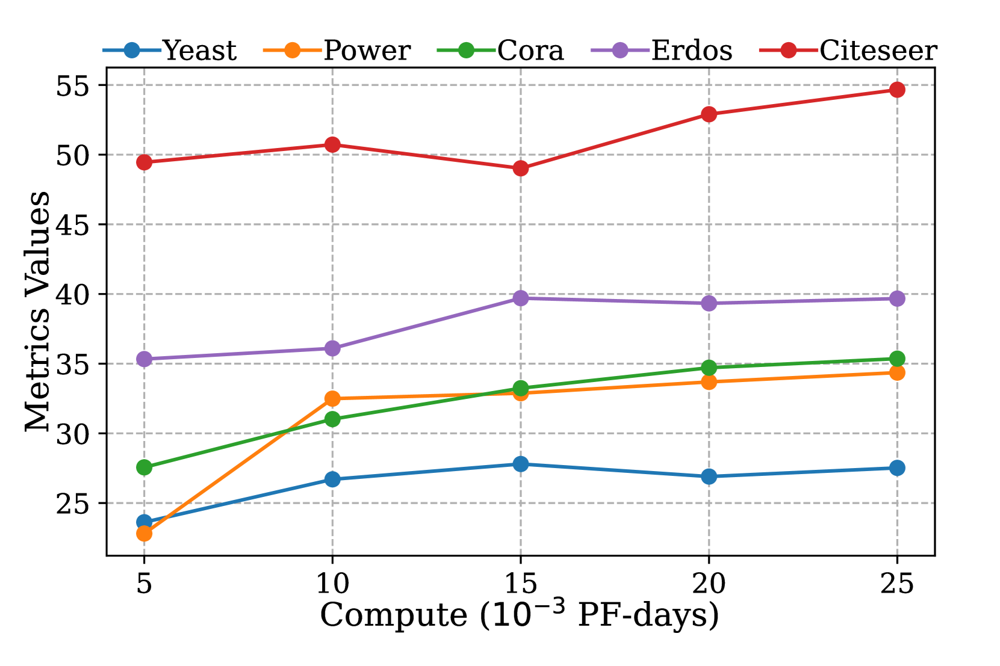

# 跨域图数据扩展：以扩散模型为例的精彩展示

发布时间：2024年06月03日

`Agent

理由：这篇论文介绍了一种名为UniAug的通用图结构增强器，它基于扩散模型，旨在捕捉图数据的多样性，并自适应地辅助下游任务。这种增强器可以被视为一个智能代理（Agent），因为它能够处理和适应不同的图数据，并在下游任务中提供帮助。这与Agent的定义相符，即一个能够感知环境并采取行动以达到目标的系统。虽然论文中涉及了预训练模型和图数据处理，但主要焦点是开发一个能够自适应增强图结构的系统，这更符合Agent的分类而非RAG、LLM应用或LLM理论。` `图数据处理` `跨领域数据增强`

> Cross-Domain Graph Data Scaling: A Showcase with Diffusion Models

# 摘要

> 自然语言和图像模型随着数据量的增加，性能也随之提升，这一现象使得大规模预训练在海量数据上大放异彩。然而，由于图数据的异质性，现有的图预训练方法在数据扩展上遇到了瓶颈。为此，我们开发了UniAug，一种基于扩散模型的通用图结构增强器，旨在捕捉图数据的多样性，并自适应地辅助下游任务。我们首先在跨领域的众多图上预训练一个离散扩散模型，以掌握图的结构模式。在下游应用中，我们通过预训练的扩散模型引导生成，实现图结构的自适应增强。这一创新方法在多个下游任务中展现了即插即用的性能提升，开创了跨领域图数据扩展的新篇章。

> Models for natural language and images benefit from data scaling behavior: the more data fed into the model, the better they perform. This 'better with more' phenomenon enables the effectiveness of large-scale pre-training on vast amounts of data. However, current graph pre-training methods struggle to scale up data due to heterogeneity across graphs. To achieve effective data scaling, we aim to develop a general model that is able to capture diverse data patterns of graphs and can be utilized to adaptively help the downstream tasks. To this end, we propose UniAug, a universal graph structure augmentor built on a diffusion model. We first pre-train a discrete diffusion model on thousands of graphs across domains to learn the graph structural patterns. In the downstream phase, we provide adaptive enhancement by conducting graph structure augmentation with the help of the pre-trained diffusion model via guided generation. By leveraging the pre-trained diffusion model for structure augmentation, we consistently achieve performance improvements across various downstream tasks in a plug-and-play manner. To the best of our knowledge, this study represents the first demonstration of a data-scaling graph structure augmentor on graphs across domains.

[Arxiv](https://arxiv.org/abs/2406.01899)