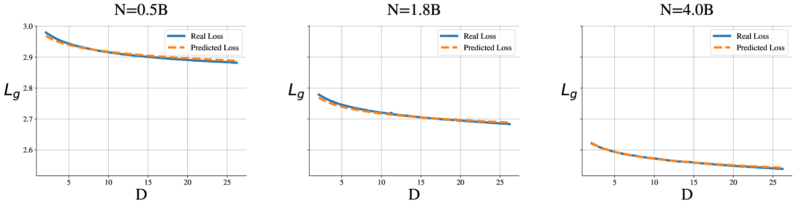

# 特定领域持续预训练法则（D-CPT Law）：为大型语言模型量身定制的优化策略

发布时间：2024年06月03日

`LLM理论

理由：这篇论文主要探讨了如何优化大规模语言模型（LLMs）在特定领域的持续预训练（CPT）过程，通过提出特定领域持续预训练的缩放定律（D-CPT定律）来确定最佳的语料库混合比例。这种方法论的研究和提出的定律属于对LLM理论的深入探讨，因为它涉及模型训练的理论基础和优化策略，而不是直接的应用或Agent行为。因此，它更适合归类于LLM理论。` `机器学习`

> D-CPT Law: Domain-specific Continual Pre-Training Scaling Law for Large Language Models

# 摘要

> 持续预训练（CPT）在大规模语言模型（LLMs）中广泛应用，以增强模型对特定领域（如数学和代码）的理解。然而，如何为特定领域的LLMs选择通用语料库与领域语料库的最佳混合比例仍是一个挑战。传统方法依赖于耗时的网格搜索，且无法确保所选比例的最优性。为此，我们借鉴性能预测的缩放定律，提出特定领域持续预训练的缩放定律（D-CPT定律），旨在以较低成本确定最佳混合比例。通过拟合D-CPT定律，我们能以小规模实验成本预测不同配置下的性能。此外，我们还发展了跨领域D-CPT定律，仅需极小成本（约1%正常训练成本）即可预测目标领域的最佳配置。在六个领域的广泛实验中，我们的方法展现了出色的效果和泛化能力。

> Continual Pre-Training (CPT) on Large Language Models (LLMs) has been widely used to expand the model's fundamental understanding of specific downstream domains (e.g., math and code). For the CPT on domain-specific LLMs, one important question is how to choose the optimal mixture ratio between the general-corpus (e.g., Dolma, Slim-pajama) and the downstream domain-corpus. Existing methods usually adopt laborious human efforts by grid-searching on a set of mixture ratios, which require high GPU training consumption costs. Besides, we cannot guarantee the selected ratio is optimal for the specific domain. To address the limitations of existing methods, inspired by the Scaling Law for performance prediction, we propose to investigate the Scaling Law of the Domain-specific Continual Pre-Training (D-CPT Law) to decide the optimal mixture ratio with acceptable training costs for LLMs of different sizes. Specifically, by fitting the D-CPT Law, we can easily predict the general and downstream performance of arbitrary mixture ratios, model sizes, and dataset sizes using small-scale training costs on limited experiments. Moreover, we also extend our standard D-CPT Law on cross-domain settings and propose the Cross-Domain D-CPT Law to predict the D-CPT law of target domains, where very small training costs (about 1% of the normal training costs) are needed for the target domains. Comprehensive experimental results on six downstream domains demonstrate the effectiveness and generalizability of our proposed D-CPT Law and Cross-Domain D-CPT Law.

[Arxiv](https://arxiv.org/abs/2406.01375)