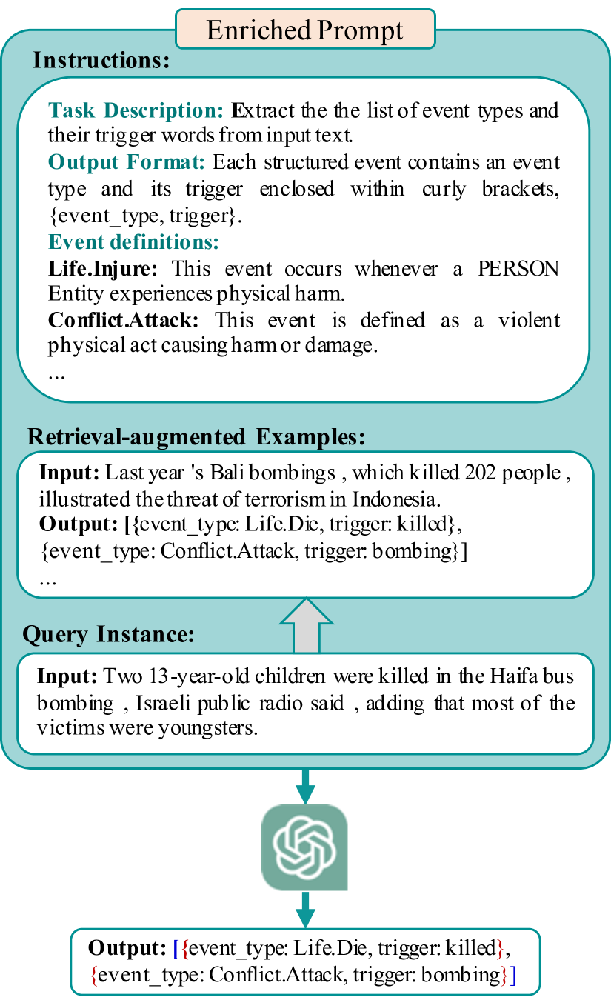
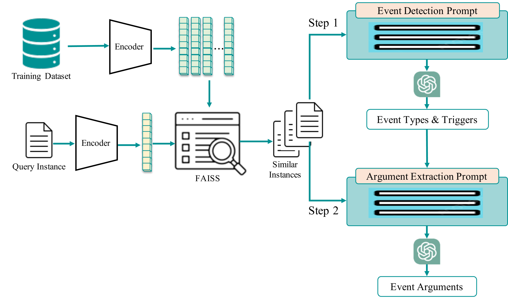
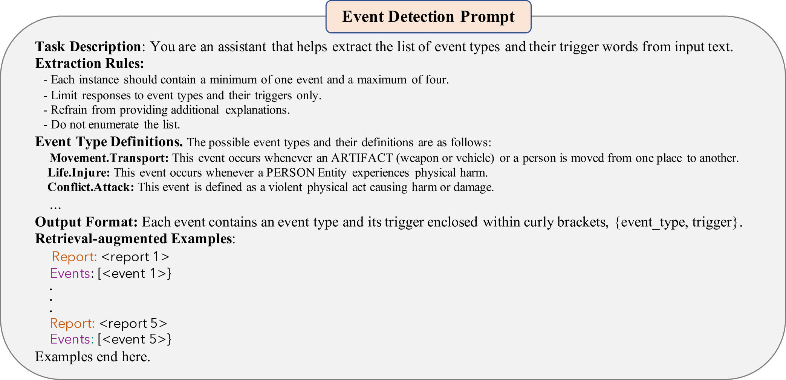
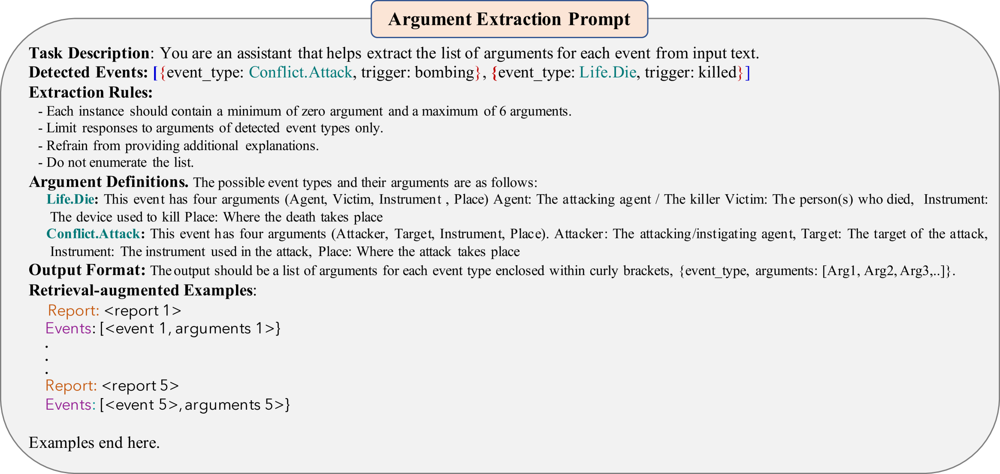
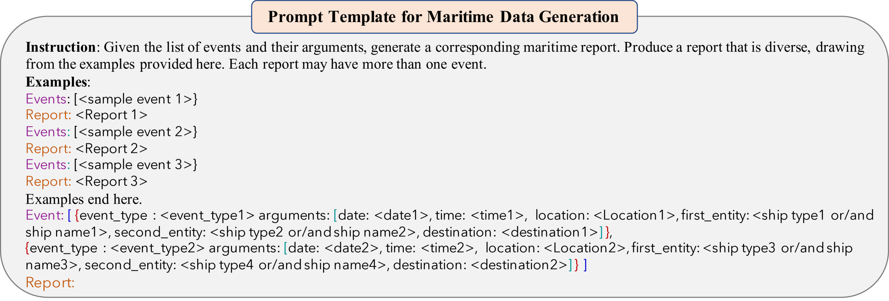
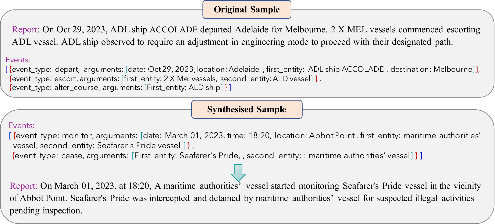

# 分解、丰富、提取！利用 LLMs 进行模式感知的事件提取，深入挖掘事件的内在结构与丰富信息。

发布时间：2024年06月03日

`RAG

理由：这篇论文主要关注的是大型语言模型（LLMs）在事件提取任务中的应用，特别是通过将任务分解为事件检测和事件论元提取来克服幻觉问题。此外，论文还提到了将动态模式感知的增强检索示例融入定制提示，这涉及到检索增强生成（RAG）技术。因此，这篇论文更符合RAG分类，因为它探讨了如何通过增强检索来改进LLM的应用性能。` `事件提取`

> Decompose, Enrich, and Extract! Schema-aware Event Extraction using LLMs

# 摘要

> 大型语言模型（LLMs）在处理自然语言数据方面能力卓越，能从多样的文本资源中高效提取知识，助力情境洞察与决策支持。但其易产生幻觉的弱点，导致上下文信息失真，引发担忧。本研究聚焦于利用LLMs自动提取事件，创新性地将任务拆分为事件检测与事件论元提取，以克服幻觉问题。同时，我们巧妙地将动态模式感知的增强检索示例融入定制提示，进一步拓展了检索增强生成等尖端提示技术的应用。在权威事件提取基准及合成基准的测试中，该方法均展现出超越传统方法的卓越性能。

> Large Language Models (LLMs) demonstrate significant capabilities in processing natural language data, promising efficient knowledge extraction from diverse textual sources to enhance situational awareness and support decision-making. However, concerns arise due to their susceptibility to hallucination, resulting in contextually inaccurate content. This work focuses on harnessing LLMs for automated Event Extraction, introducing a new method to address hallucination by decomposing the task into Event Detection and Event Argument Extraction. Moreover, the proposed method integrates dynamic schema-aware augmented retrieval examples into prompts tailored for each specific inquiry, thereby extending and adapting advanced prompting techniques such as Retrieval-Augmented Generation. Evaluation findings on prominent event extraction benchmarks and results from a synthesized benchmark illustrate the method's superior performance compared to baseline approaches.

[Arxiv](https://arxiv.org/abs/2406.01045)