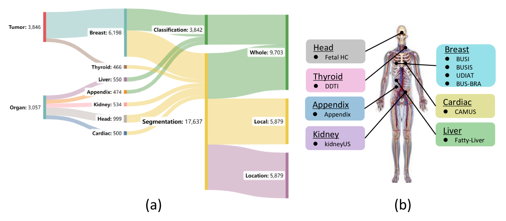
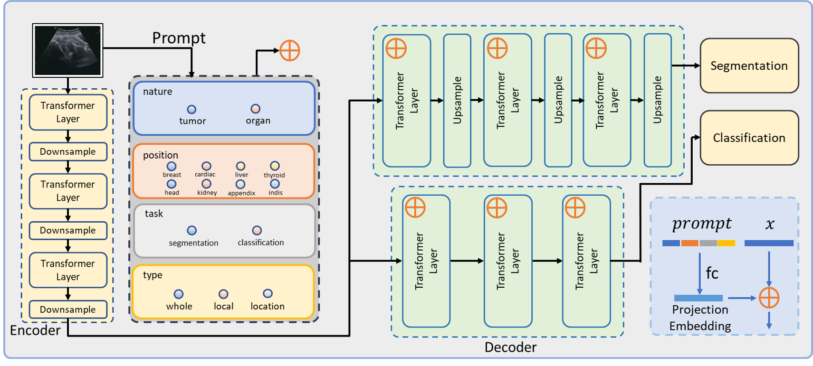
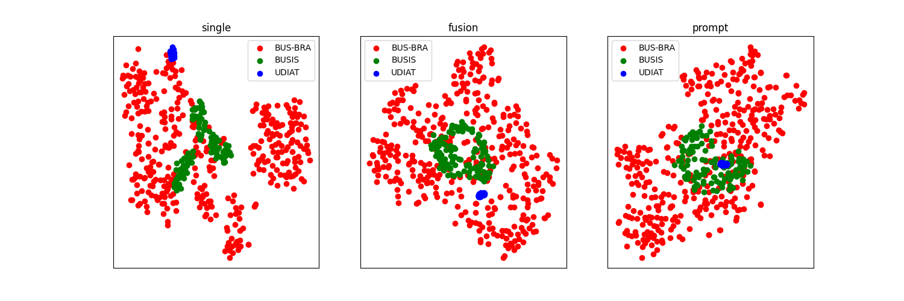
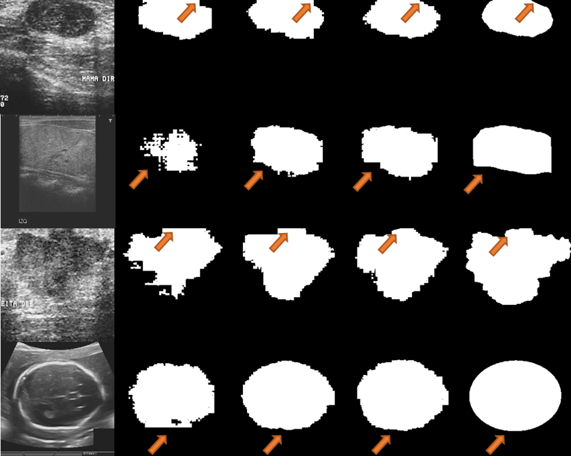

# DeepUniUSTransformer：借助提示指导，迈向通用超声模型的探索之旅

发布时间：2024年06月03日

`Agent

理由：这篇论文介绍了一个名为DeepUniUSTransformer的创新框架，它是一个专门为医疗超声成像设计的AI模型，能够处理疾病预测和组织分割等多种临床任务。这个模型通过一个新模块将相关信息作为提示融入学习过程，展示了其在特定领域（医疗超声）的智能代理能力。因此，它更符合Agent分类，因为它是一个特定应用领域的智能系统，能够执行复杂的任务并提供决策支持。` `超声成像`

> DeepUniUSTransformer: Towards A Universal UltraSound Model with Prompted Guidance

# 摘要

> 超声波因其成本低廉、便于携带且安全，成为临床中广泛使用的成像技术。然而，当前医疗AI研究多聚焦于大型语言模型和通用分割模型，对同时处理疾病预测与组织分割的方案关注不足。为此，我们研发了DeepUniUSTransformer，这一创新框架适用于多种临床任务，其通用性体现在能灵活应对各种超声特性、解剖位置及输入类型，不仅在分割任务中表现卓越，在计算机辅助诊断方面亦有出色表现。我们设计了一个新模块，将相关信息作为提示融入学习过程。为验证模型，我们整合了来自公开资源的综合超声数据集，包含7种解剖位置的9.7万个标注。实验证明，我们的模型优于仅基于单一数据集训练的模型及无提示指导的简化网络。未来，我们将扩大数据集，优化特定任务的提示机制，以期在医疗超声领域实现更广泛的通用性。模型的权重、数据集及代码将公开共享。

> Ultrasound is a widely used imaging modality in clinical practice due to its low cost, portability, and safety. Current research in general AI for healthcare focuses on large language models and general segmentation models, with insufficient attention to solutions addressing both disease prediction and tissue segmentation. In this study, we propose a novel universal framework for ultrasound, namely DeepUniUSTransformer, which is a promptable model accommodating multiple clinical task. The universality of this model is derived from its versatility across various aspects. It proficiently manages any ultrasound nature, any anatomical position, any input type and excelling not only in segmentation tasks but also in computer-aided diagnosis tasks. We introduce a novel module that incorporates this information as a prompt and seamlessly embedding it within the model's learning process. To train and validate our proposed model, we curated a comprehensive ultrasound dataset from publicly accessible sources, encompassing up to 7 distinct anatomical positions with over 9.7K annotations. Experimental results demonstrate that our model surpasses both a model trained on a single dataset and an ablated version of the network lacking prompt guidance. We will continuously expand the dataset and optimize the task specific prompting mechanism towards the universality in medical ultrasound. Model weights, datasets, and code will be open source to the public.

[Arxiv](https://arxiv.org/abs/2406.01154)