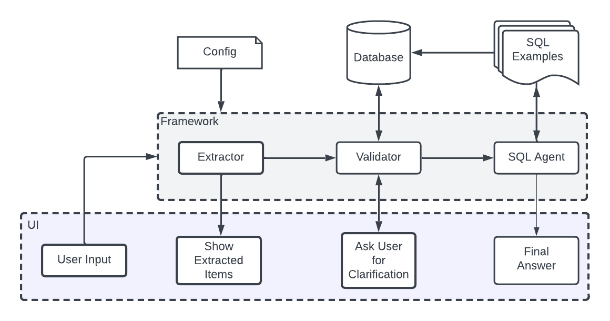
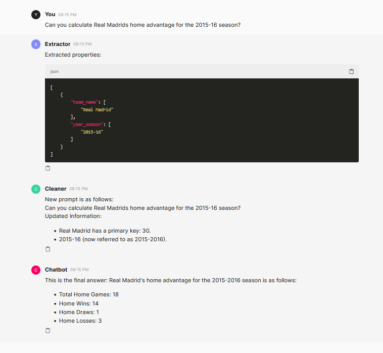
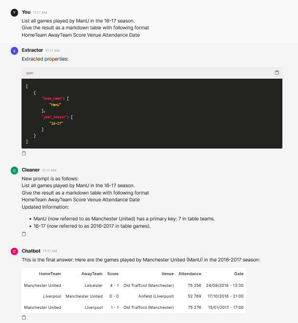
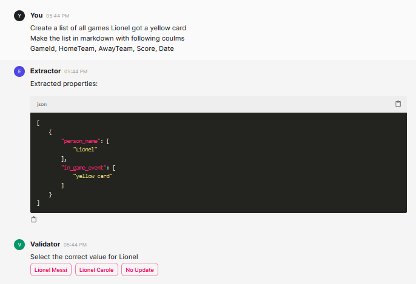
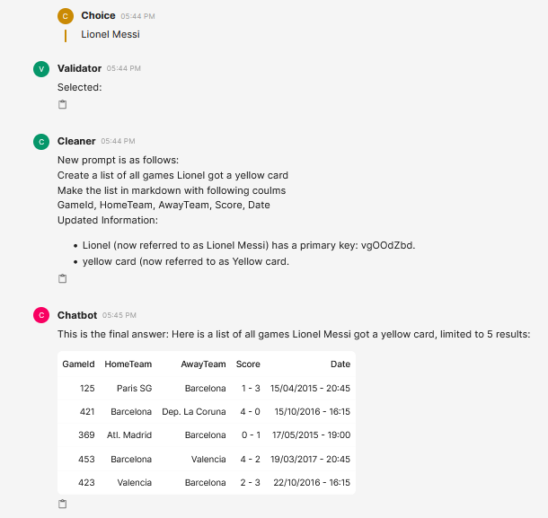
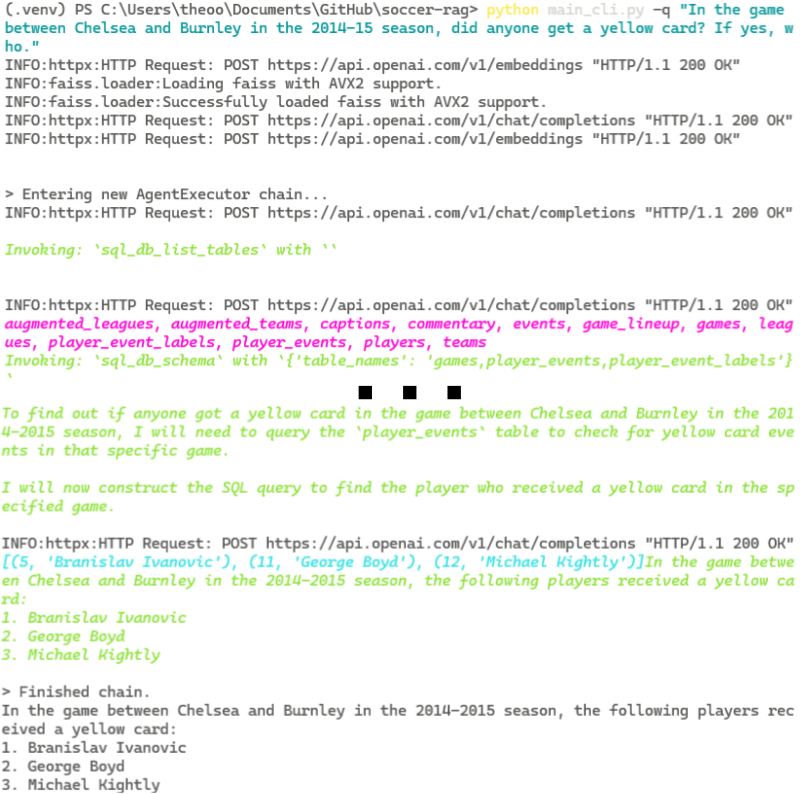
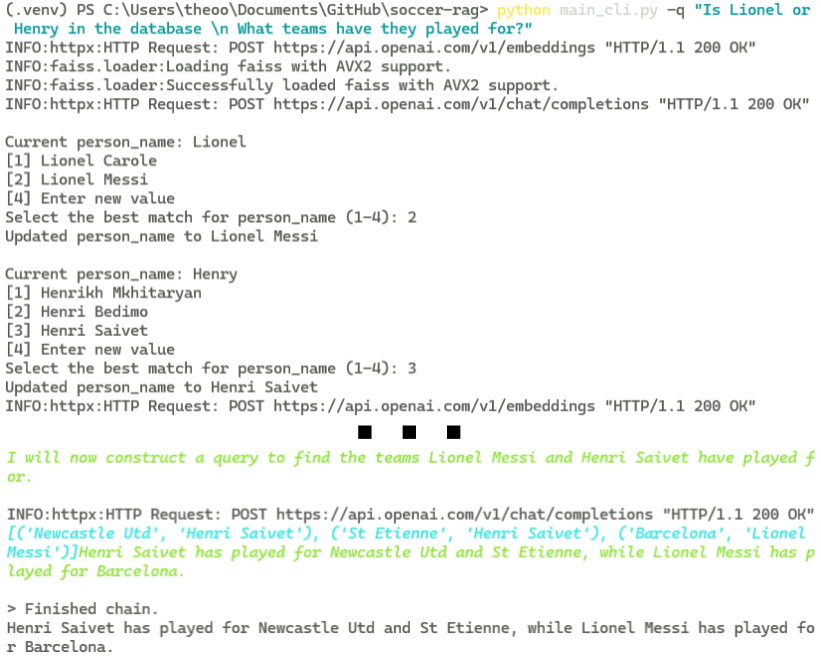

# 演示：借助 SoccerRAG，通过自然语言查询轻松检索足球信息

发布时间：2024年06月03日

`RAG

理由：这篇论文介绍了一个名为 SoccerRAG 的框架，它结合了检索增强生成（RAG）和大型语言模型（LLMs）来处理多模态数据集，并提供了一个交互式用户界面。这个框架主要关注的是通过RAG技术增强信息检索的能力，而不是Agent的行为、LLM的理论研究或一般的LLM应用。因此，最合适的分类是RAG。` `信息检索`

> Demo: Soccer Information Retrieval via Natural Queries using SoccerRAG

# 摘要

> 随着数字体育媒体的迅猛发展，我们需要高效处理多模态数据集的复杂信息检索系统。本文介绍的 SoccerRAG 框架，巧妙结合了检索增强生成（RAG）和大型语言模型（LLMs），能通过自然语言查询精准提取足球信息。借助多模态数据集，SoccerRAG 不仅支持动态查询和自动数据验证，还极大提升了用户与体育档案的互动体验。我们创新性地设计了一个基于 Chainlit 框架的交互式用户界面，让用户能以聊天机器人的视觉方式轻松与 SoccerRAG 互动。

> The rapid evolution of digital sports media necessitates sophisticated information retrieval systems that can efficiently parse extensive multimodal datasets. This paper demonstrates SoccerRAG, an innovative framework designed to harness the power of Retrieval Augmented Generation (RAG) and Large Language Models (LLMs) to extract soccer-related information through natural language queries. By leveraging a multimodal dataset, SoccerRAG supports dynamic querying and automatic data validation, enhancing user interaction and accessibility to sports archives. We present a novel interactive user interface (UI) based on the Chainlit framework which wraps around the core functionality, and enable users to interact with the SoccerRAG framework in a chatbot-like visual manner.

[Arxiv](https://arxiv.org/abs/2406.01280)