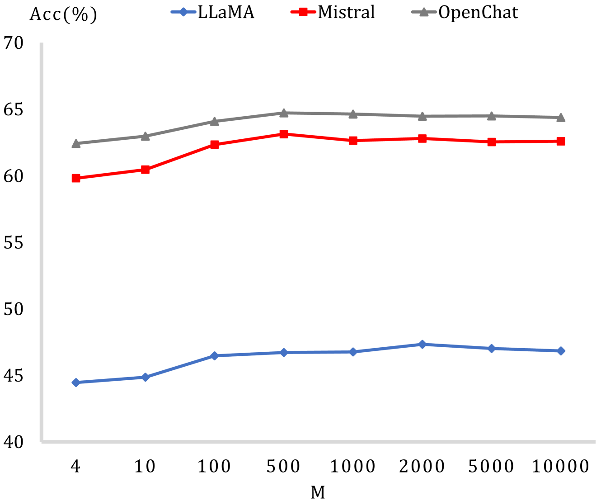

# 零-shot 上下文学习中的演示增强策略

发布时间：2024年06月03日

`LLM理论

理由：这篇论文探讨了大型语言模型（LLMs）在情境学习（ICL）中的自学能力，特别是在零-shot ICL的背景下，提出了一种新的方法——情境学习演示增强（DAIL）。这种方法利用模型先前的预测结果作为后续学习的示例，旨在减少对外部信息的依赖，并提高模型的推理性能。论文的内容涉及LLMs的理论和内部机制的改进，因此属于LLM理论分类。` `人工智能`

> Demonstration Augmentation for Zero-shot In-context Learning

# 摘要

> 大型语言模型（LLMs）通过情境学习（ICL）展现出惊人的自学能力，无需更新参数即可从文本示例中汲取知识。然而，研究表明，模型性能对示例选择极为敏感，这在实际应用中，尤其是对用户查询缺乏先验知识时，构成了一大挑战。为此，我们不得不建立庞大的示例库并整合外部数据库，这无疑增加了时间和经济成本。鉴于此，近期研究开始关注零-shot ICL，旨在通过发挥模型的内在生成能力，减少对外部信息的依赖。尽管这些方法行之有效，但模型生成的内容可能并不可靠，且生成过程耗时。为此，我们提出了情境学习演示增强（DAIL），利用模型先前的预测结果作为后续学习的示例。DAIL无需额外推理成本，也不依赖模型的生成能力。实验结果显示，DAIL能显著提升模型在零-shot推理上的表现，甚至在无外部信息辅助下超越了少量样本的情境学习。

> Large Language Models (LLMs) have demonstrated an impressive capability known as In-context Learning (ICL), which enables them to acquire knowledge from textual demonstrations without the need for parameter updates. However, many studies have highlighted that the model's performance is sensitive to the choice of demonstrations, presenting a significant challenge for practical applications where we lack prior knowledge of user queries. Consequently, we need to construct an extensive demonstration pool and incorporate external databases to assist the model, leading to considerable time and financial costs. In light of this, some recent research has shifted focus towards zero-shot ICL, aiming to reduce the model's reliance on external information by leveraging their inherent generative capabilities. Despite the effectiveness of these approaches, the content generated by the model may be unreliable, and the generation process is time-consuming. To address these issues, we propose Demonstration Augmentation for In-context Learning (DAIL), which employs the model's previously predicted historical samples as demonstrations for subsequent ones. DAIL brings no additional inference cost and does not rely on the model's generative capabilities. Our experiments reveal that DAIL can significantly improve the model's performance over direct zero-shot inference and can even outperform few-shot ICL without any external information.

[Arxiv](https://arxiv.org/abs/2406.01224)