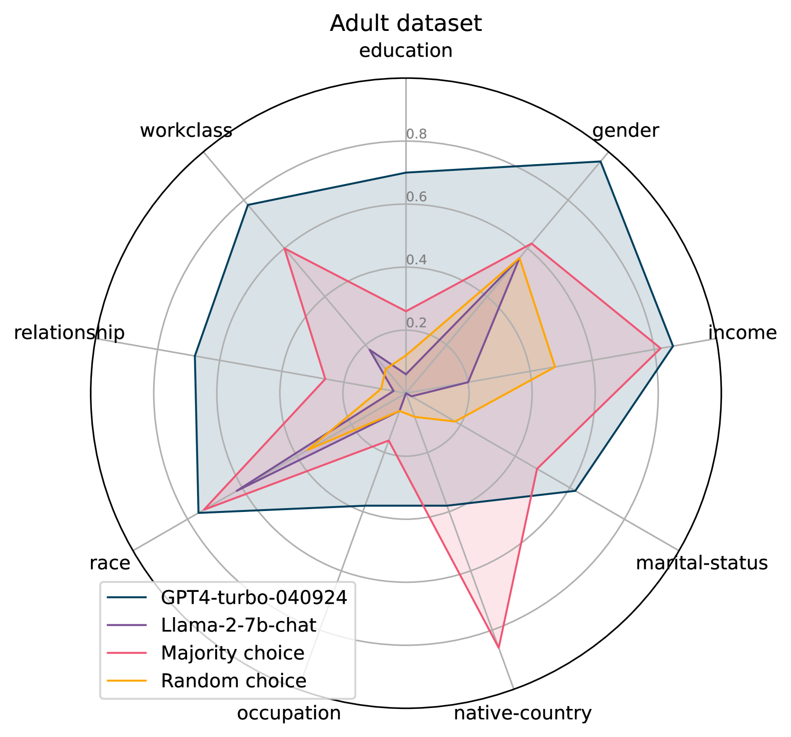
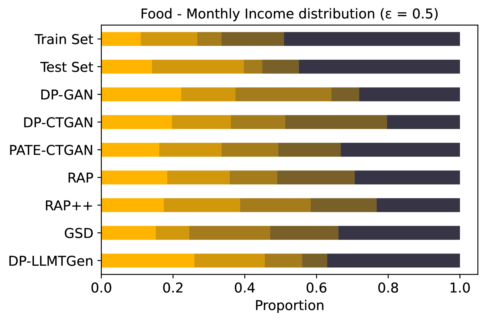
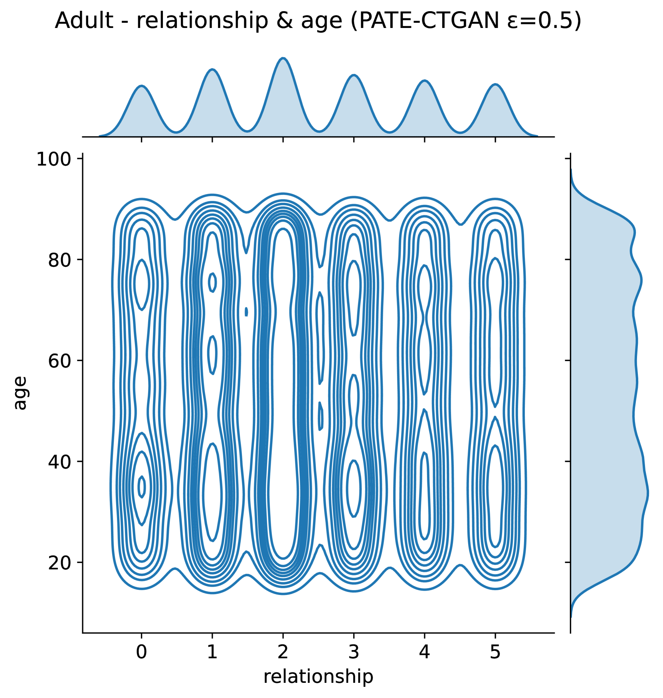

# 利用大型语言模型实现差分隐私下的表格数据合成

发布时间：2024年06月03日

`LLM应用

这篇论文介绍了DP-LLMTGen框架，该框架利用预训练的大型语言模型（LLMs）来生成合成的表格数据，同时确保差分隐私。这种方法通过两阶段微调及特制的损失函数来精确模拟敏感数据，从而生成高质量的合成数据。论文通过实证研究展示了DP-LLMTGen在多个数据集和隐私条件下的优越性能，并通过消融研究和实验分析加深了对LLMs在此领域应用的理解。因此，这篇论文属于LLM应用类别，因为它展示了如何将LLMs应用于特定的实际问题——生成差分隐私的合成表格数据。` `数据隐私` `数据共享`

> Differentially Private Tabular Data Synthesis using Large Language Models

# 摘要

> 在确保形式隐私的前提下，合成表格数据的生成是数据共享的关键。尽管方法研究历史悠久，但创建能产生真实数据的差分隐私表格数据生成器仍是一大挑战。本文推出的DP-LLMTGen框架，巧妙结合预训练大型语言模型（LLMs），通过两阶段微调及特制损失函数，精准模拟敏感数据，进而生成合成数据。实证显示，DP-LLMTGen在多数据集和隐私条件下均优于现有技术。通过消融研究和实验分析，我们对LLMs在此领域的应用有了更深的认识。特别地，DP-LLMTGen在公平性约束下的生成能力展现了其可控性。

> Synthetic tabular data generation with differential privacy is a crucial problem to enable data sharing with formal privacy. Despite a rich history of methodological research and development, developing differentially private tabular data generators that can provide realistic synthetic datasets remains challenging. This paper introduces DP-LLMTGen -- a novel framework for differentially private tabular data synthesis that leverages pretrained large language models (LLMs). DP-LLMTGen models sensitive datasets using a two-stage fine-tuning procedure with a novel loss function specifically designed for tabular data. Subsequently, it generates synthetic data through sampling the fine-tuned LLMs. Our empirical evaluation demonstrates that DP-LLMTGen outperforms a variety of existing mechanisms across multiple datasets and privacy settings. Additionally, we conduct an ablation study and several experimental analyses to deepen our understanding of LLMs in addressing this important problem. Finally, we highlight the controllable generation ability of DP-LLMTGen through a fairness-constrained generation setting.

[Arxiv](https://arxiv.org/abs/2406.01457)