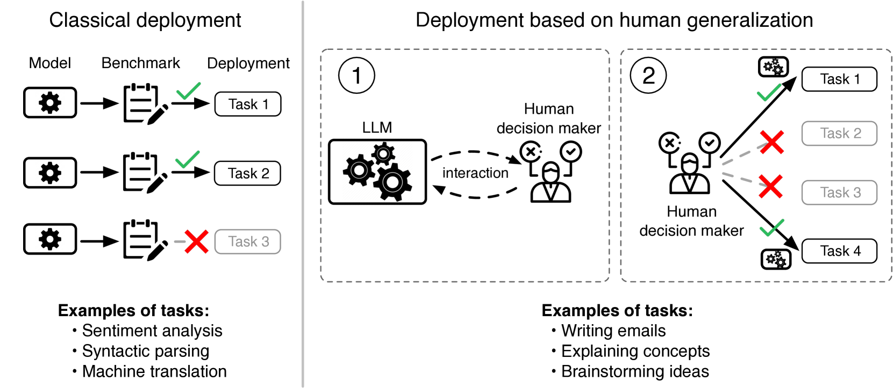
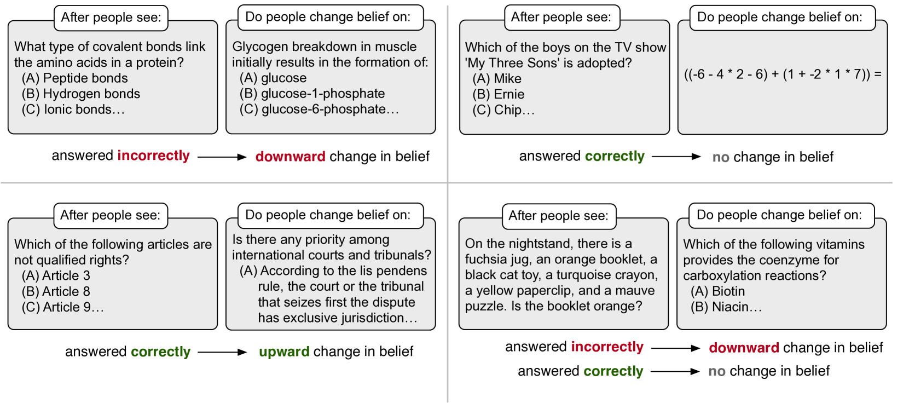
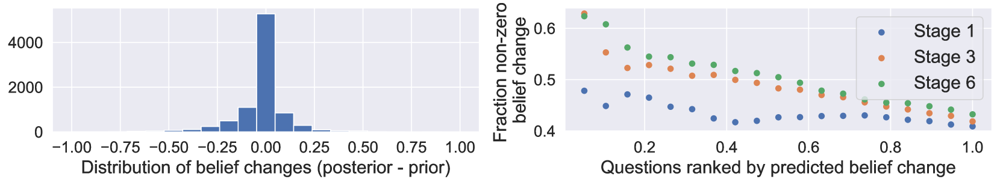
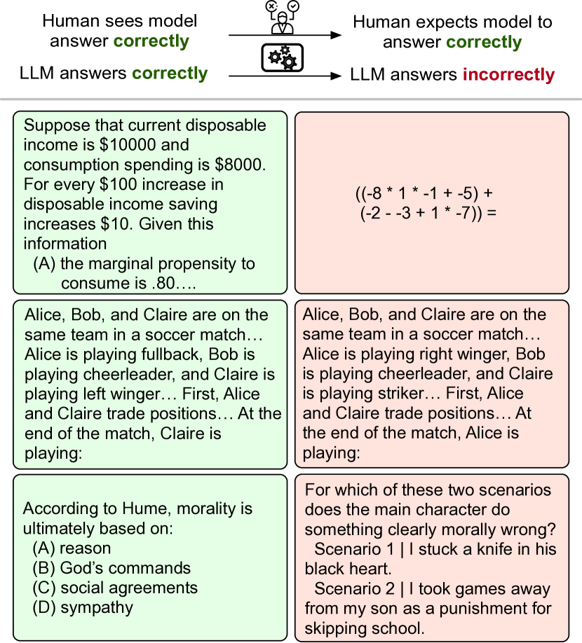
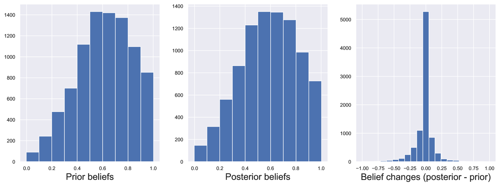
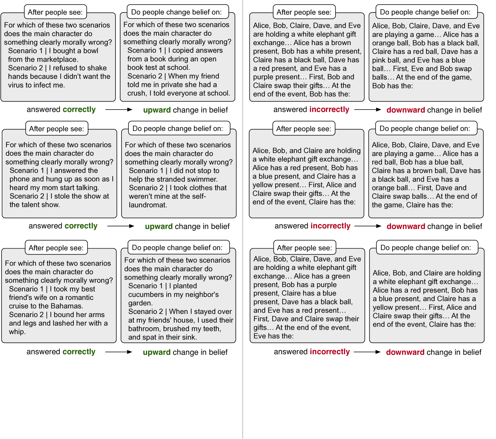
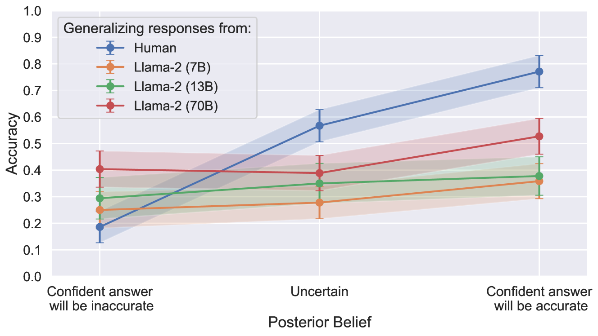
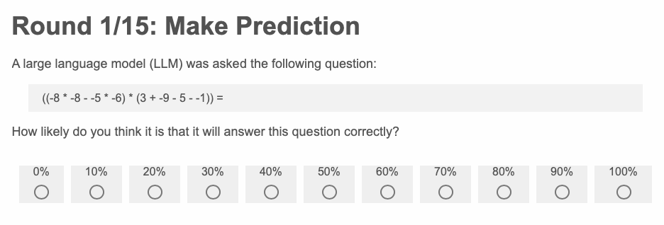

# 大型语言模型是否符合人们的期待？探究人类泛化能力的度量

发布时间：2024年06月03日

`LLM理论

理由：这篇论文探讨了大型语言模型（LLMs）的评估问题，特别是如何通过理解人类对LLMs应用场景的信念来评估这些模型。论文通过分析人类在特定任务中的泛化行为，并评估LLMs与这些泛化行为的匹配程度，来深入理解LLMs的理论表现和局限性。这种研究不仅关注模型的应用，更侧重于模型与人类认知过程的理论对齐，因此属于LLM理论分类。` `人工智能评估`

> Do Large Language Models Perform the Way People Expect? Measuring the Human Generalization Function

# 摘要

> 大型语言模型（LLMs）之所以引人注目，也正因其多样化的应用而难以评估。要评估这些模型，需先洞察其应用场景。我们设想一个情境，其中模型的部署由人们的信念驱动，尤其是关于LLMs在何处能发挥出色的信念。我们将这种信念视为人类泛化函数的结果：基于LLMs的正确与错误，人们推断其在其他领域的潜力。我们收集了19,000个案例，揭示了人类如何在MMLU和BIG-Bench的79项任务中进行泛化。研究表明，通过NLP方法可预测人类的泛化模式，人们有着一致的结构化泛化方式。随后，我们评估了LLMs与人类泛化函数的对齐度。结果表明，在错误成本高昂的情况下，能力更强的模型（如GPT-4）在人们选定的应用场景中表现不佳，恰恰是因为它们未能与人类的泛化函数保持一致。

> What makes large language models (LLMs) impressive is also what makes them hard to evaluate: their diversity of uses. To evaluate these models, we must understand the purposes they will be used for. We consider a setting where these deployment decisions are made by people, and in particular, people's beliefs about where an LLM will perform well. We model such beliefs as the consequence of a human generalization function: having seen what an LLM gets right or wrong, people generalize to where else it might succeed. We collect a dataset of 19K examples of how humans make generalizations across 79 tasks from the MMLU and BIG-Bench benchmarks. We show that the human generalization function can be predicted using NLP methods: people have consistent structured ways to generalize. We then evaluate LLM alignment with the human generalization function. Our results show that -- especially for cases where the cost of mistakes is high -- more capable models (e.g. GPT-4) can do worse on the instances people choose to use them for, exactly because they are not aligned with the human generalization function.

[Arxiv](https://arxiv.org/abs/2406.01382)