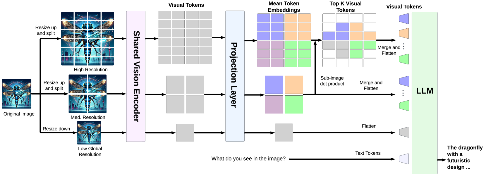
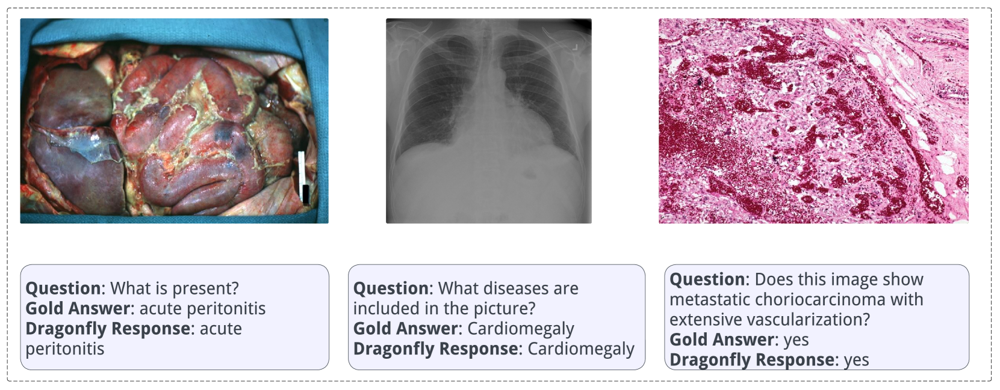
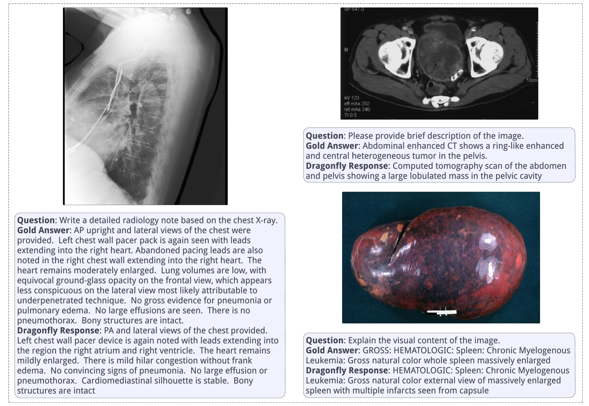

# Dragonfly：多分辨率缩放技术大幅提升大型视觉-语言模型的性能

发布时间：2024年06月03日

`LLM应用

理由：这篇论文介绍了Dragonfly，一种新型的大型多模态模型（LMM）架构，专门设计来处理高分辨率图像，并在多个基准测试和特定的生物医学任务中展示了优越的性能。这表明论文主要关注于大型语言模型（LLM）的应用层面，特别是在图像处理和生物医学领域的应用。因此，将其归类为LLM应用是合适的。` `生物医学` `视觉分析`

> Dragonfly: Multi-Resolution Zoom Supercharges Large Visual-Language Model

# 摘要

> 近期，大型多模态模型（LMMs）的进步和更高的图像分辨率，显著提升了对图像细节的精细理解，这对于视觉常识推理和生物医学图像分析等任务尤为关键。但提升分辨率也带来了挑战：一是增加了语言模型所需的上下文长度，导致效率降低并触及模型限制；二是视觉特征的复杂性增加，需要更多训练数据或更复杂的架构设计。为此，我们推出了Dragonfly，一种新型LMM架构，通过多分辨率视觉编码和缩放补丁选择两大策略，有效处理高分辨率图像，同时保持上下文长度合理。在八个基准测试中，Dragonfly展现出与现有架构相媲美甚至更优的性能。此外，经过生物医学指令微调的Dragonfly，在多个需要精细视觉理解的生物医学任务上取得了顶尖成果，如在Path-VQA数据集上达到92.3%的准确率，远超Med-Gemini的83.3%。我们还创建了一个包含550万通用领域和140万生物医学领域图像-指令样本的数据集，以支持模型训练，并通过消融研究揭示了不同设计和分辨率的影响，为未来的视觉指令对齐研究提供了宝贵见解。代码和模型已公开于https://github.com/togethercomputer/Dragonfly。

> Recent advances in large multimodal models (LMMs) suggest that higher image resolution enhances the fine-grained understanding of image details, crucial for tasks such as visual commonsense reasoning and analyzing biomedical images. However, increasing input resolution poses two main challenges: 1) It extends the context length required by the language model, leading to inefficiencies and hitting the model's context limit; 2) It increases the complexity of visual features, necessitating more training data or more complex architecture. We introduce Dragonfly, a new LMM architecture that enhances fine-grained visual understanding and reasoning about image regions to address these challenges. Dragonfly employs two key strategies: multi-resolution visual encoding and zoom-in patch selection. These strategies allow the model to process high-resolution images efficiently while maintaining reasonable context length. Our experiments on eight popular benchmarks demonstrate that Dragonfly achieves competitive or better performance compared to other architectures, highlighting the effectiveness of our design. Additionally, we finetuned Dragonfly on biomedical instructions, achieving state-of-the-art results on multiple biomedical tasks requiring fine-grained visual understanding, including 92.3% accuracy on the Path-VQA dataset (compared to 83.3% for Med-Gemini) and the highest reported results on biomedical image captioning. To support model training, we curated a visual instruction-tuning dataset with 5.5 million image-instruction samples in the general domain and 1.4 million samples in the biomedical domain. We also conducted ablation studies to characterize the impact of various architectural designs and image resolutions, providing insights for future research on visual instruction alignment. The codebase and model are available at https://github.com/togethercomputer/Dragonfly.

[Arxiv](https://arxiv.org/abs/2406.00977)