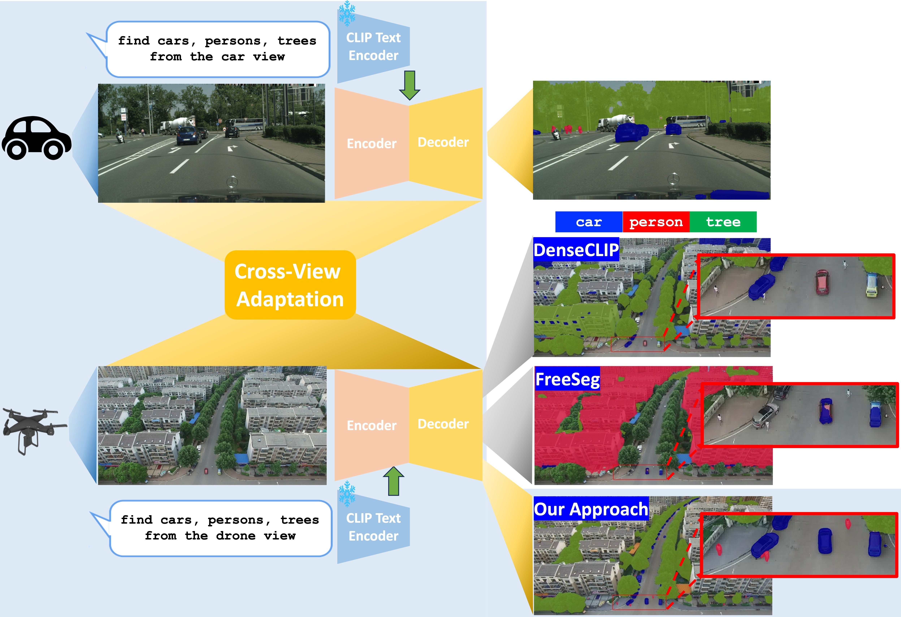
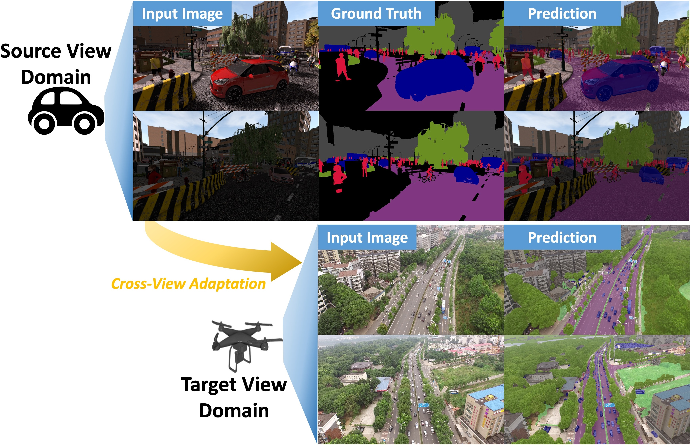
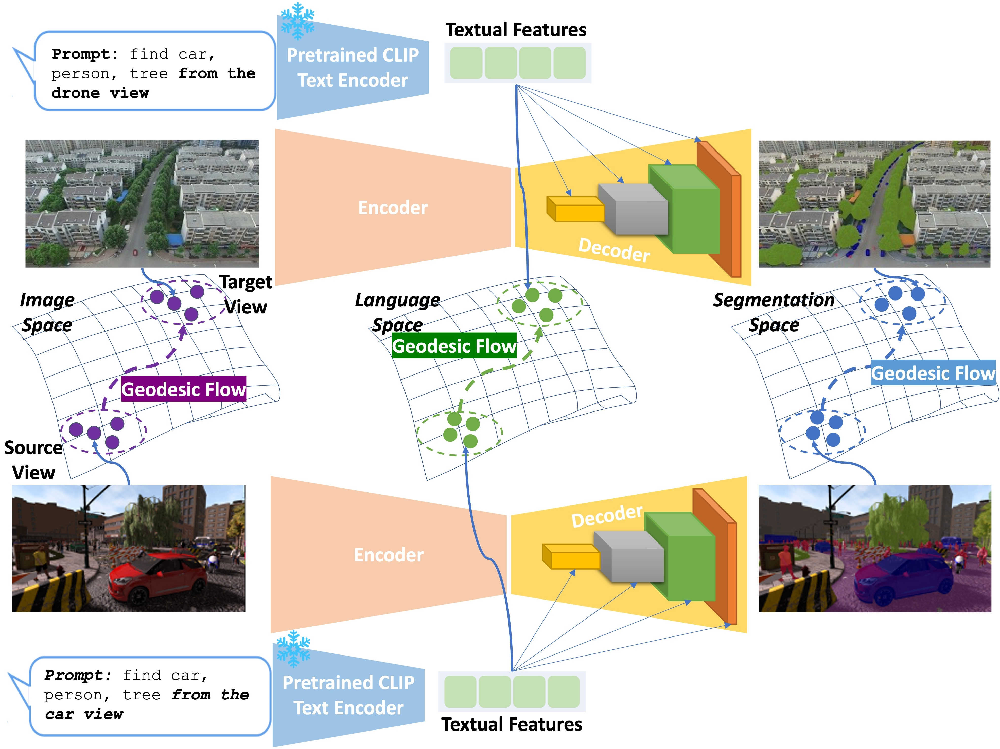
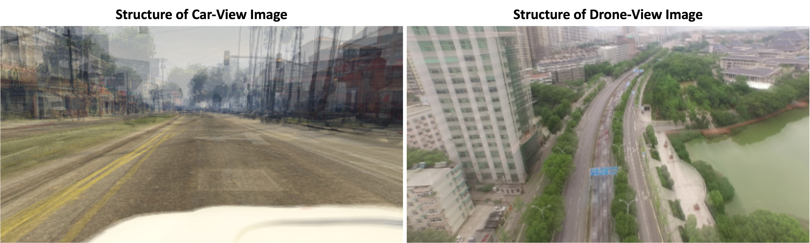

# EAGLE：跨视图理解中的高效自适应几何学习法

发布时间：2024年06月03日

`Agent

理由：这篇论文主要关注的是无监督跨视角适应学习方法，这是一种针对语义场景理解中跨视角几何结构变化的研究。虽然它涉及到大规模视觉语言模型和开放词汇语义分割，但其核心创新点在于提出了新的学习方法和机制来处理跨视角的几何结构变化，这更偏向于Agent领域的自主学习和适应性问题，而不是直接应用于LLM（大型语言模型）的理论或应用，也不是RAG（Retrieval-Augmented Generation）的相关研究。因此，将其归类为Agent更为合适。` `自动驾驶` `计算机视觉`

> EAGLE: Efficient Adaptive Geometry-based Learning in Cross-view Understanding

# 摘要

> 无监督域适应是跨数据分布转移语义分割模型的有效途径，而基于大规模视觉语言模型的开放词汇语义场景理解在开放集环境中表现卓越，因其能掌握多样化的概念与类别。但这些方法因未涉及跨视角几何建模，难以在不同相机视角间泛化。当前，跨视角学习的研究尚少。为此，我们创新性地提出了无监督跨视角适应学习方法，旨在语义场景理解中捕捉跨视角的几何结构变化。首先，我们设计了跨视角几何约束，针对未配对数据，模拟不同相机间的图像与分割掩码结构变化。其次，我们开发了基于测地线流的相关度量，精准衡量跨视角的几何结构变化。最后，我们引入了视角条件提示机制，强化开放词汇分割网络在跨视角适应学习中的视角信息建模。实验证明，我们的方法在跨视角建模上取得了显著成效，超越了以往的无监督域适应和开放词汇语义分割方法，达到了业界领先水平。

> Unsupervised Domain Adaptation has been an efficient approach to transferring the semantic segmentation model across data distributions. Meanwhile, the recent Open-vocabulary Semantic Scene understanding based on large-scale vision language models is effective in open-set settings because it can learn diverse concepts and categories. However, these prior methods fail to generalize across different camera views due to the lack of cross-view geometric modeling. At present, there are limited studies analyzing cross-view learning. To address this problem, we introduce a novel Unsupervised Cross-view Adaptation Learning approach to modeling the geometric structural change across views in Semantic Scene Understanding. First, we introduce a novel Cross-view Geometric Constraint on Unpaired Data to model structural changes in images and segmentation masks across cameras. Second, we present a new Geodesic Flow-based Correlation Metric to efficiently measure the geometric structural changes across camera views. Third, we introduce a novel view-condition prompting mechanism to enhance the view-information modeling of the open-vocabulary segmentation network in cross-view adaptation learning. The experiments on different cross-view adaptation benchmarks have shown the effectiveness of our approach in cross-view modeling, demonstrating that we achieve State-of-the-Art (SOTA) performance compared to prior unsupervised domain adaptation and open-vocabulary semantic segmentation methods.

[Arxiv](https://arxiv.org/abs/2406.01429)