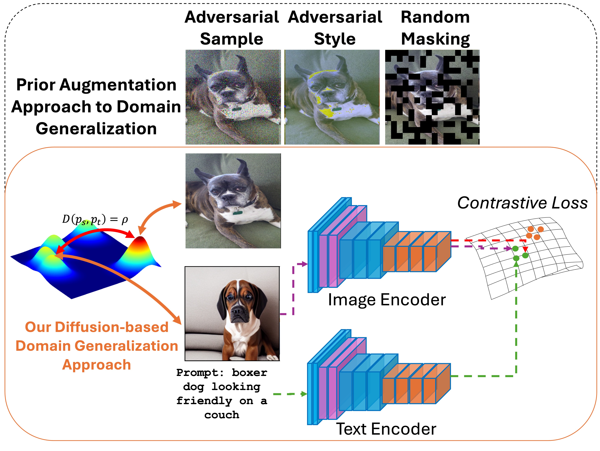
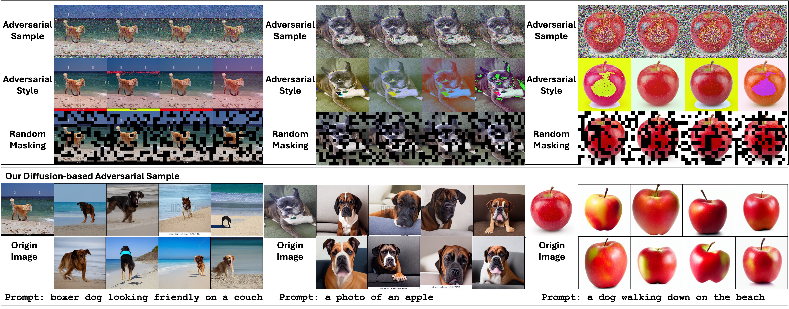
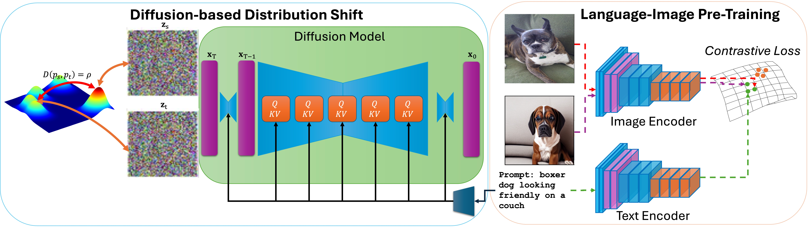
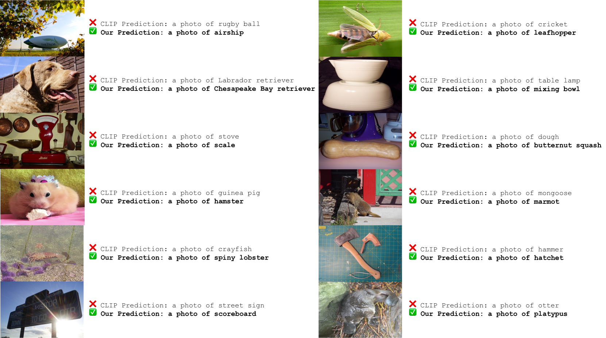

# ED-SAM：一种高效的扩散采样策略，助力视觉-语言模型实现领域泛化

发布时间：2024年06月03日

`RAG

理由：这篇论文主要关注的是视觉-语言基础模型的领域泛化能力，并提出了一种新的方法（ED-SAM）来增强这一能力。这种方法涉及到扩散模型的使用，以及通过生成对抗样本来提升模型对未知数据分布的适应性。这与RAG（Retrieval-Augmented Generation）模型中增强模型泛化能力和适应性的目标相吻合，因此将其归类为RAG。虽然论文中提到了“视觉-语言基础模型”，但重点在于模型的泛化方法和性能提升，而不是直接应用于特定的LLM应用或深入探讨LLM的理论基础。` `计算机视觉`

> ED-SAM: An Efficient Diffusion Sampling Approach to Domain Generalization in Vision-Language Foundation Models

# 摘要

> 近期，视觉-语言基础模型在多样的感知学习任务中大放异彩，其卓越性能得益于大规模预训练数据集和多样化的数据增强技术。然而，该模型的领域泛化能力仍面临挑战，限制了其对未知数据分布的适应性。本文提出了一种新颖高效的扩散采样域泛化方法（ED-SAM），旨在增强模型的泛化能力。通过深入的理论分析，我们揭示了扩散模型在提升视觉-语言基础模型领域泛化能力中的关键作用。基于此，我们创新性地引入了传输变换扩散采样技术，该技术能生成对抗样本，有效提升模型对未知数据分布的应对能力。实验结果显示，在CC3M、CC12M和LAION400M等不同规模的预训练数据集上，ED-SAM方法均展现出领先同行的性能和扩展性。

> The Vision-Language Foundation Model has recently shown outstanding performance in various perception learning tasks. The outstanding performance of the vision-language model mainly relies on large-scale pre-training datasets and different data augmentation techniques. However, the domain generalization problem of the vision-language foundation model needs to be addressed. This problem has limited the generalizability of the vision-language foundation model to unknown data distributions. In this paper, we introduce a new simple but efficient Diffusion Sampling approach to Domain Generalization (ED-SAM) to improve the generalizability of the vision-language foundation model. Our theoretical analysis in this work reveals the critical role and relation of the diffusion model to domain generalization in the vision-language foundation model. Then, based on the insightful analysis, we introduce a new simple yet effective Transport Transformation to diffusion sampling method. It can effectively generate adversarial samples to improve the generalizability of the foundation model against unknown data distributions. The experimental results on different scales of vision-language pre-training datasets, including CC3M, CC12M, and LAION400M, have consistently shown State-of-the-Art performance and scalability of the proposed ED-SAM approach compared to the other recent methods.

[Arxiv](https://arxiv.org/abs/2406.01432)