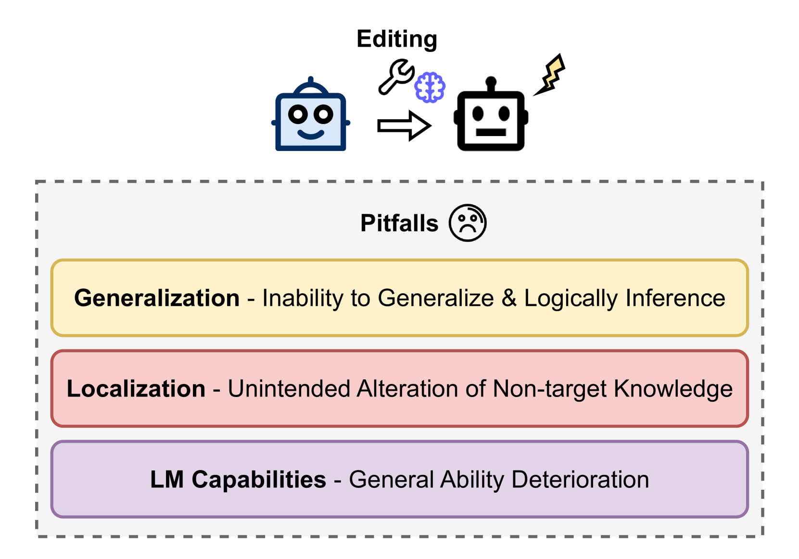
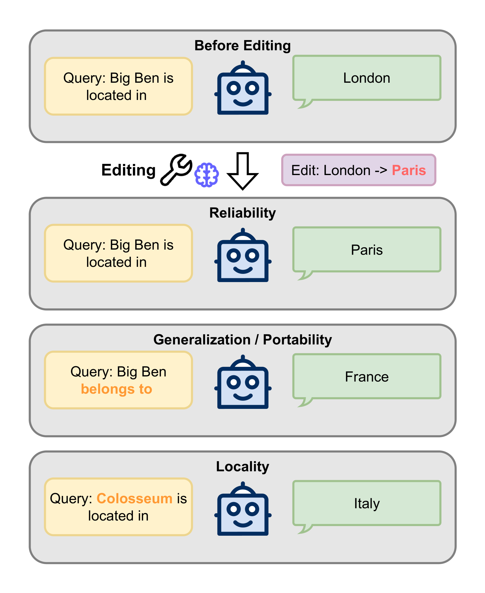
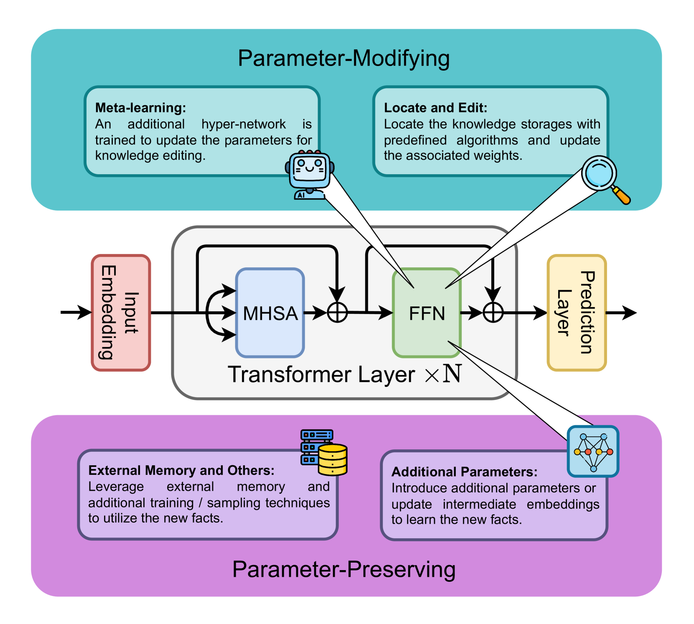
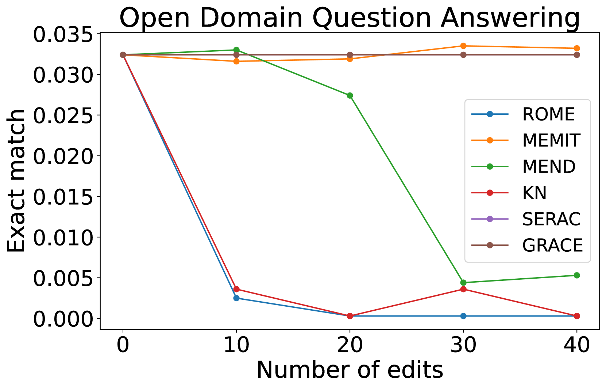
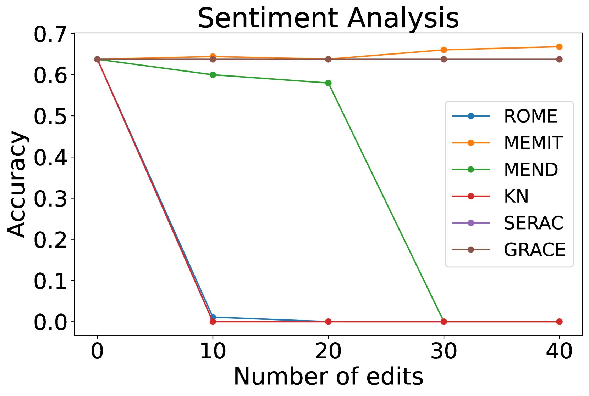
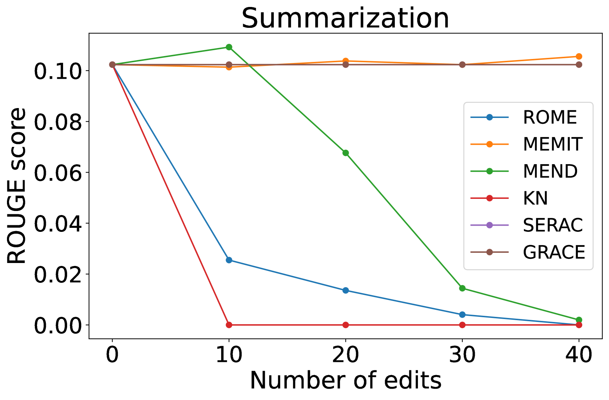
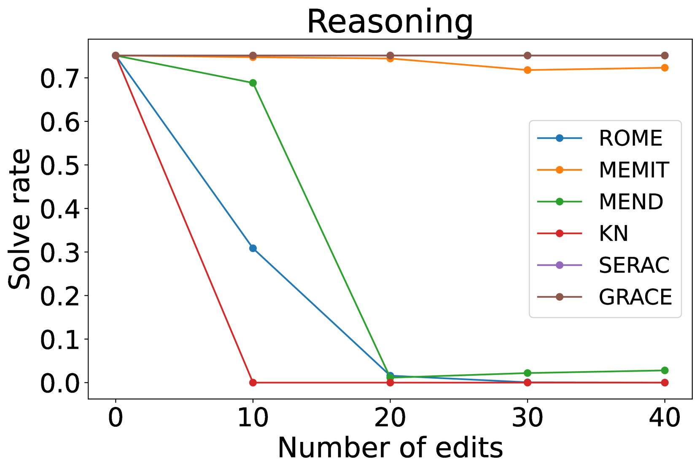

# 巨人思维的修编：深入剖析大型语言模型中知识编辑的潜在风险

发布时间：2024年06月03日

`LLM理论

这篇论文摘要主要关注大型语言模型（LLMs）中的知识编辑技术及其带来的副作用，如知识扭曲和能力退化。这些问题涉及到LLMs内部知识结构的深入理解和编辑技术的优化，属于对LLMs理论层面的探讨和分析。因此，将其归类为LLM理论是合适的。` `人工智能`

> Editing the Mind of Giants: An In-Depth Exploration of Pitfalls of Knowledge Editing in Large Language Models

# 摘要

> 知识编辑技术正崭露头角，它能在大型语言模型（LLMs）中高效更新事实知识，同时尽量减少对参数的改动。但近期研究揭示了编辑后出现的知识扭曲和能力退化等令人担忧的副作用。本综述深入探讨了这些副作用，为理解LLMs中知识编辑的挑战提供了一个全面的视角。我们回顾了相关研究，并指出了克服这些限制的未来研究方向。我们的分析凸显了现有知识编辑方法的局限，强调了深入探究LLMs内部知识结构和开发更优知识编辑技术的迫切性。为推动进一步研究，我们已在https://github.com/MiuLab/EditLLM-Survey公开了包括论文集在内的补充材料。

> Knowledge editing is a rising technique for efficiently updating factual knowledge in Large Language Models (LLMs) with minimal alteration of parameters. However, recent studies have identified concerning side effects, such as knowledge distortion and the deterioration of general abilities, that have emerged after editing. This survey presents a comprehensive study of these side effects, providing a unified view of the challenges associated with knowledge editing in LLMs. We discuss related works and summarize potential research directions to overcome these limitations. Our work highlights the limitations of current knowledge editing methods, emphasizing the need for deeper understanding of inner knowledge structures of LLMs and improved knowledge editing methods. To foster future research, we have released the complementary materials such as paper collection publicly at https://github.com/MiuLab/EditLLM-Survey

[Arxiv](https://arxiv.org/abs/2406.01436)