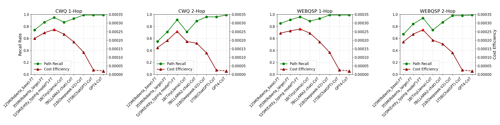

# EffiQA：策略性多模型协作，知识图谱上的高效问答之道

发布时间：2024年06月03日

`LLM应用

这篇论文介绍了一个名为EffiQA的创新协作框架，它旨在优化大型语言模型（LLMs）在涉及知识图谱（KGs）的复杂推理任务中的表现。EffiQA通过迭代过程平衡性能与效率，具体包括全局规划、高效KG探索及自我反思三个阶段。这种方法利用了LLMs的推理能力，并通过小型插件模型进行语义剪枝，以提高探索效率。论文中提到，EffiQA在多个KBQA基准测试中展现了卓越性能，平衡了推理精度与计算开销。因此，这篇论文属于LLM应用类别，因为它专注于开发和应用LLMs以解决特定的实际问题，即知识图谱相关的复杂推理任务。` `知识密集型查询` `问答系统`

> EffiQA: Efficient Question-Answering with Strategic Multi-Model Collaboration on Knowledge Graphs

# 摘要

> 大型语言模型（LLMs）虽在自然语言处理领域表现出色，但在涉及知识图谱（KGs）的复杂推理任务上仍显不足。现有方法要么未能充分发挥LLMs的推理潜力，要么因紧密结合导致计算成本过高。为此，我们推出了EffiQA这一创新协作框架，旨在通过迭代过程在性能与效率间找到平衡点。EffiQA分为三个阶段：全局规划、高效KG探索及自我反思。它首先利用LLMs的常识推理能力进行全局规划，探索可能的推理路径；随后，将语义剪枝任务交由小型插件模型处理，以提升KG探索效率；最后，通过LLMs的自我反思，不断优化规划与探索过程。在多个KBQA基准测试中，EffiQA展现了其卓越性能，巧妙平衡了推理精度与计算开销。我们期待EffiQA能重新定义LLMs与KGs的融合方式，为知识密集型查询提供新思路，并推动基于知识的问答研究向前发展。

> While large language models (LLMs) have shown remarkable capabilities in natural language processing, they struggle with complex, multi-step reasoning tasks involving knowledge graphs (KGs). Existing approaches that integrate LLMs and KGs either underutilize the reasoning abilities of LLMs or suffer from prohibitive computational costs due to tight coupling. To address these limitations, we propose a novel collaborative framework named EffiQA that can strike a balance between performance and efficiency via an iterative paradigm. EffiQA consists of three stages: global planning, efficient KG exploration, and self-reflection. Specifically, EffiQA leverages the commonsense capability of LLMs to explore potential reasoning pathways through global planning. Then, it offloads semantic pruning to a small plug-in model for efficient KG exploration. Finally, the exploration results are fed to LLMs for self-reflection to further improve the global planning and efficient KG exploration. Empirical evidence on multiple KBQA benchmarks shows EffiQA's effectiveness, achieving an optimal balance between reasoning accuracy and computational costs. We hope the proposed new framework will pave the way for efficient, knowledge-intensive querying by redefining the integration of LLMs and KGs, fostering future research on knowledge-based question answering.

[Arxiv](https://arxiv.org/abs/2406.01238)