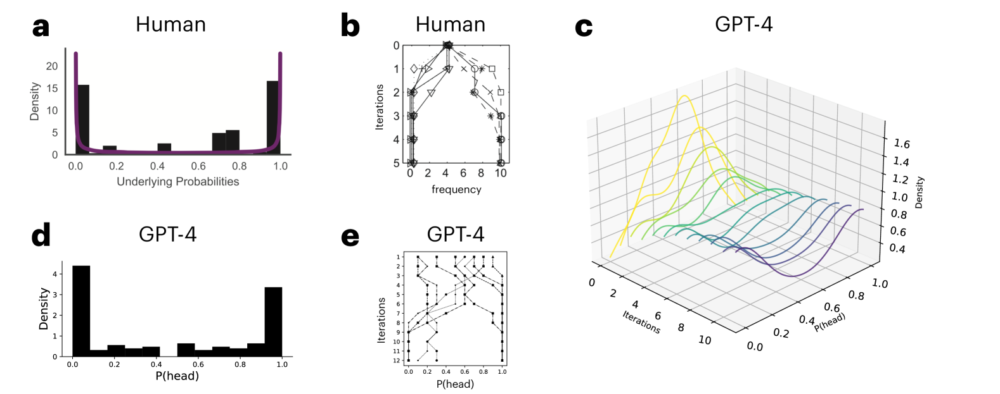

# 通过迭代上下文学习揭示大型语言模型的先验知识

发布时间：2024年06月03日

`LLM理论

理由：这篇论文探讨了大型语言模型（LLMs）在决策过程中所依赖的隐含知识，并通过贝叶斯先验分布的形式来捕捉这种知识。它开发了一种基于提示的工作流程，用于从LLMs中提取这些先验，并采用了迭代学习和马尔可夫链蒙特卡洛技术。这种方法的目的是理解和提取LLMs的内在知识结构，这属于对LLMs理论层面的研究，因此归类为LLM理论。` `人工智能` `决策支持`

> Eliciting the Priors of Large Language Models using Iterated In-Context Learning

# 摘要

> 随着大型语言模型（LLMs）在现实世界中的应用日益增多，理解它们在决策时所依赖的隐含知识变得至关重要。我们通过贝叶斯先验分布的形式来捕捉这种知识，并开发了一种基于提示的工作流程，用于从LLMs中提取这些先验。我们的方法采用迭代学习，一种马尔可夫链蒙特卡洛技术，通过链接连续推理来支持先验分布的采样。我们在因果学习、比例估计和日常数量预测等场景中验证了这一方法，这些场景先前已用于估计人类参与者的先验。结果显示，GPT-4提取的先验与人类在这些场景中的先验相吻合。随后，我们运用相同的方法从GPT-4中提取了关于超人AI发展时机等推测事件的先验。

> As Large Language Models (LLMs) are increasingly deployed in real-world settings, understanding the knowledge they implicitly use when making decisions is critical. One way to capture this knowledge is in the form of Bayesian prior distributions. We develop a prompt-based workflow for eliciting prior distributions from LLMs. Our approach is based on iterated learning, a Markov chain Monte Carlo method in which successive inferences are chained in a way that supports sampling from the prior distribution. We validated our method in settings where iterated learning has previously been used to estimate the priors of human participants -- causal learning, proportion estimation, and predicting everyday quantities. We found that priors elicited from GPT-4 qualitatively align with human priors in these settings. We then used the same method to elicit priors from GPT-4 for a variety of speculative events, such as the timing of the development of superhuman AI.

[Arxiv](https://arxiv.org/abs/2406.01860)