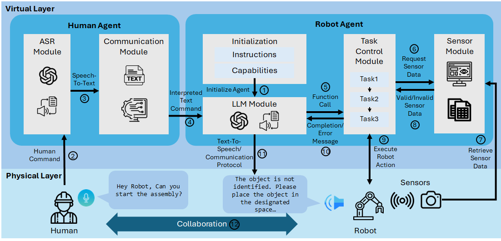
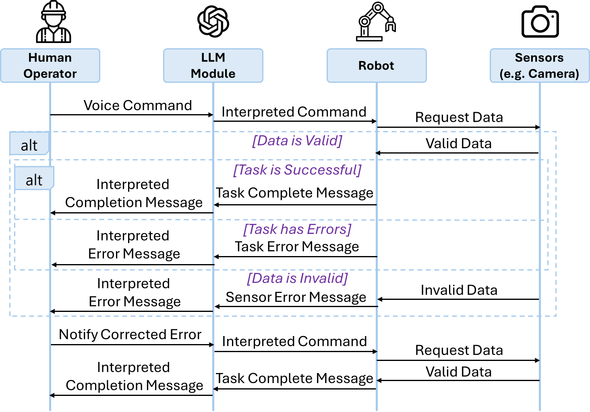
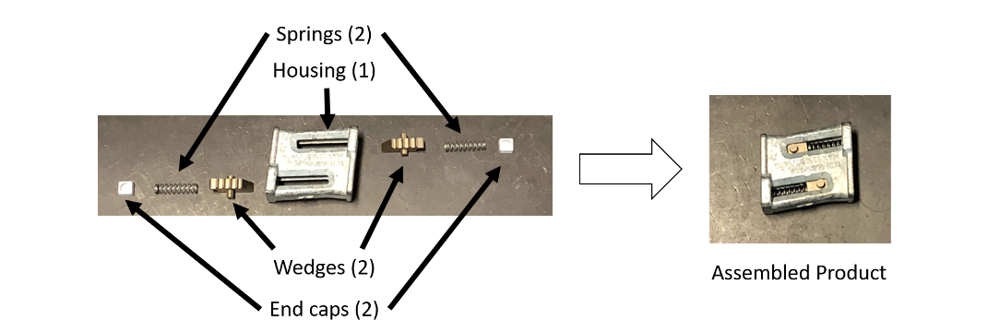
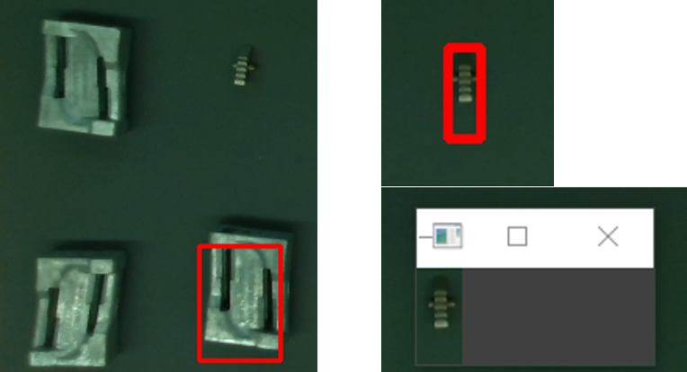
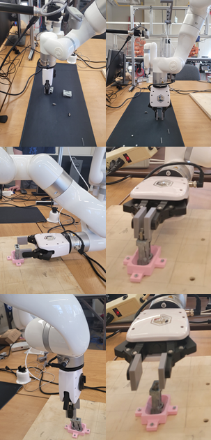
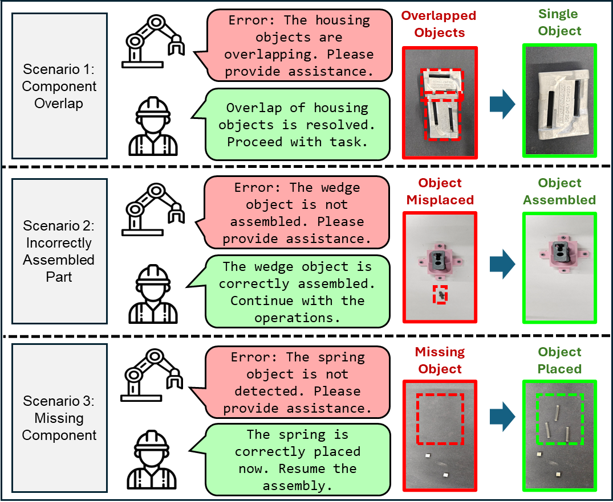

# 借助大型语言模型，提升制造系统中人机协作装配的效率

发布时间：2024年06月03日

`Agent

这篇论文探讨了如何利用大型语言模型（LLM）来增强人机协作，特别是在制造环境中的沟通和任务管理。通过引入一个框架，该研究展示了LLM如何通过自然语言处理技术来弥合人类与机器人之间的沟通鸿沟，从而提高制造系统的性能。这种应用涉及到创建和使用智能代理（Agent）来促进人机交互，因此属于Agent分类。` `制造业` `人机协作`

> Enhancing Human-Robot Collaborative Assembly in Manufacturing Systems Using Large Language Models

# 摘要

> 人机协作的进步，借助人类与机器人各自的优势，正提升着制造系统的性能。在车间，人类以其灵活应变，机器人则以精准与重复性见长。然而，沟通的鸿沟阻碍了人机团队在制造中的协同。我们的研究推出一种框架，利用大型语言模型强化制造沟通，通过自然语言的语音指令，实现任务管理的无缝对接。一个装配任务的案例展示了框架如何灵活应对语言差异，高效解决装配中的实时挑战。研究表明，大型语言模型有望为人机协作装配开辟新境。

> The development of human-robot collaboration has the ability to improve manufacturing system performance by leveraging the unique strengths of both humans and robots. On the shop floor, human operators contribute with their adaptability and flexibility in dynamic situations, while robots provide precision and the ability to perform repetitive tasks. However, the communication gap between human operators and robots limits the collaboration and coordination of human-robot teams in manufacturing systems. Our research presents a human-robot collaborative assembly framework that utilizes a large language model for enhancing communication in manufacturing environments. The framework facilitates human-robot communication by integrating voice commands through natural language for task management. A case study for an assembly task demonstrates the framework's ability to process natural language inputs and address real-time assembly challenges, emphasizing adaptability to language variation and efficiency in error resolution. The results suggest that large language models have the potential to improve human-robot interaction for collaborative manufacturing assembly applications.

[Arxiv](https://arxiv.org/abs/2406.01915)