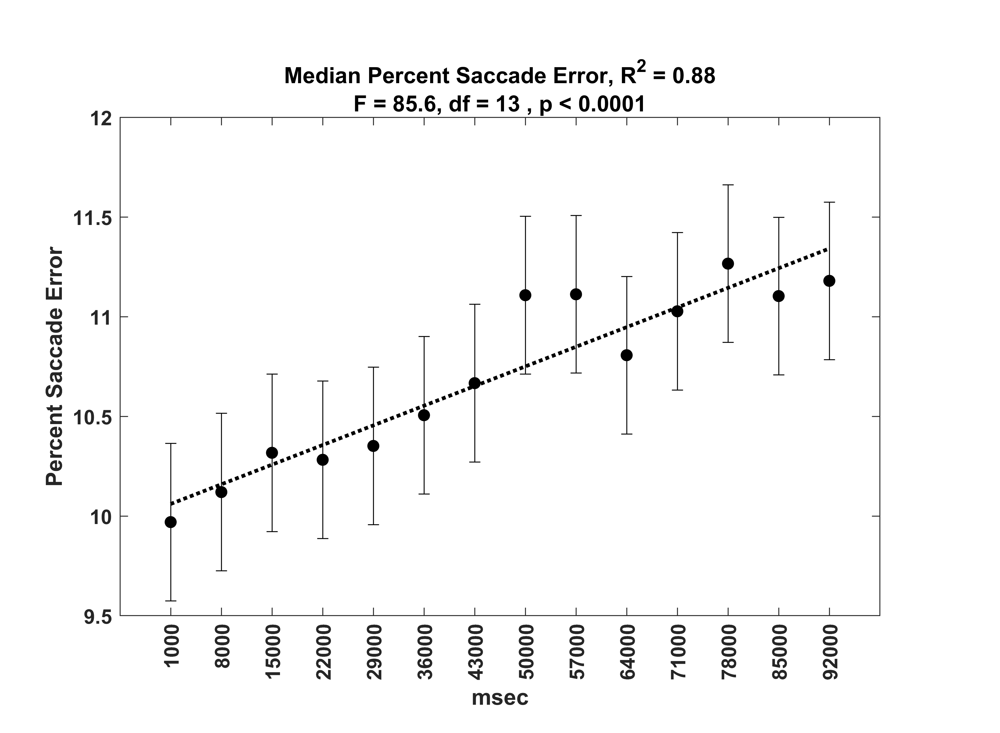

# 随机扫视眼动追踪任务揭示了五种注视模式，为探究眼动疲劳提供了新的视角。

发布时间：2024年06月03日

`Agent

理由：这篇论文研究的是在随机眼跳任务中，随着任务时间的增加，注视持续时间的变化，并分析了五种注视模式。这些研究内容涉及到人类或模拟代理（Agent）在特定任务中的行为模式和性能变化，特别是在视觉搜索和眼动控制方面的表现。因此，这篇论文更符合Agent分类，因为它关注的是个体或代理在执行任务时的行为和反应模式。` `眼动追踪` `认知心理学`

> Evidence for five types of fixation during a random saccade eye tracking task: Implications for the study of oculomotor fatigue

# 摘要

> 我们研究了随机眼跳任务中，随着任务时间（TOT）的增加，注视持续时间的变化，并利用大型公开数据集进行了分析。我们识别出五种注视模式，其中“理想”模式是在目标移动后立即进行一次准确眼跳，随后是长时间的注视。然而，这种模式仅占所有注视的10%，且多出现在任务初期。更常见的是，目标移动后的首次注视短暂，并常伴随修正性眼跳。整个任务期间，注视总时长呈下降趋势，这一趋势可用幂律模型（R^2=0.94）描述。随着任务时间的推移，短注视频率增加，而长注视频率减少，这些变化均遵循幂律分布（R^2值介于0.73至0.93）。研究表明，长时间的注视在任务初期较为常见，而短注视则随着任务的进行逐渐增多。这表明，尽管在任务初期可能出现理想反应，但随着时间的推移，这种可能性迅速降低，可能与眼跳准确性的下降有关。

> Our interest was to evaluate changes in fixation duration as a function of time-on-task (TOT) during a random saccade task. We employed a large, publicly available dataset. The frequency histogram of fixation durations was multimodal and modelled as a Gaussian mixture. We found five fixation types. The ``ideal'' response would be a single accurate saccade after each target movement, with a typical saccade latency of 200-250 msec, followed by a long fixation (> 800 msec) until the next target jump. We found fixations like this, but they comprised only 10% of all fixations and were the first fixation after target movement only 23.4% of the time. More frequently (57.4% of the time), the first fixation after target movement was short (117.7 msec mean) and was commonly followed by a corrective saccade. Across the entire 100 sec of the task, median total fixation duration decreased. This decrease was approximated with a power law fit with R^2=0.94. A detailed examination of the frequency of each of our five fixation types over time on task (TOT) revealed that the three shortest duration fixation types became more and more frequent with TOT whereas the two longest fixations became less and less frequent. In all cases, the changes over TOT followed power law relationships, with R^2 values between 0.73 and 0.93. We concluded that, over the 100 second duration of our task, long fixations are common in the first 15 to 22 seconds but become less common after that. Short fixations are relatively uncommon in the first 15 to 22 seconds but become more and more common as the task progressed. Apparently. the ability to produce an ideal response, although somewhat likely in the first 22 seconds, rapidly declines. This might be related to a noted decline in saccade accuracy over time.

[Arxiv](https://arxiv.org/abs/2406.01496)