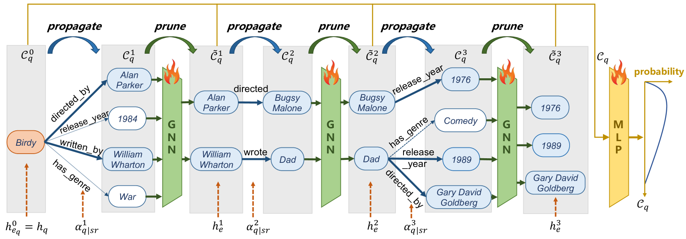

# 探索与确定：知识图谱推理中的GNN-LLM协同框架

发布时间：2024年06月03日

`Agent

这篇论文介绍了一种结合大型语言模型（LLMs）和图神经网络（GNN）的“探索-确定”框架，用于知识图谱问答任务。该框架通过轻量级的GNN探索潜在候选和问题细节，然后构建知识增强的多选提示，引导冻结的LLM做出最终决策。这种方法可以被视为一个智能代理（Agent），因为它能够处理复杂的知识图谱推理任务，并做出决策。因此，这篇论文适合归类到Agent分类中。` `知识图谱` `问答系统`

> Explore then Determine: A GNN-LLM Synergy Framework for Reasoning over Knowledge Graph

# 摘要

> 知识图谱推理对大型语言模型构成挑战，因其复杂结构和海量无关信息。现有方法忽视了组合学习在提供精确知识中的作用，且微调和频繁交互耗时耗力。本文针对知识图谱问答任务，提出了一种结合LLMs与图神经网络的“探索-确定”框架。该框架先通过轻量级GNN探索潜在候选与问题细节，再构建知识增强的多选提示，引导冻结的LLM做出最终决策。实验证明，此框架在三个KGQA数据集上表现卓越，推理结果可靠。

> The task of reasoning over Knowledge Graphs (KGs) poses a significant challenge for Large Language Models (LLMs) due to the complex structure and large amounts of irrelevant information. Existing LLM reasoning methods overlook the importance of compositional learning on KG to supply with precise knowledge. Besides, the fine-tuning and frequent interaction with LLMs incur substantial time and resource costs. This paper focuses on the Question Answering over Knowledge Graph (KGQA) task and proposes an Explore-then-Determine (EtD) framework that synergizes LLMs with graph neural networks (GNNs) for reasoning over KGs. The Explore stage employs a lightweight GNN to explore promising candidates and relevant fine-grained knowledge to the questions, while the Determine stage utilizes the explored information to construct a knowledge-enhanced multiple-choice prompt, guiding a frozen LLM to determine the final answer. Extensive experiments on three benchmark KGQA datasets demonstrate that EtD achieves state-of-the-art performance and generates faithful reasoning results.

[Arxiv](https://arxiv.org/abs/2406.01145)