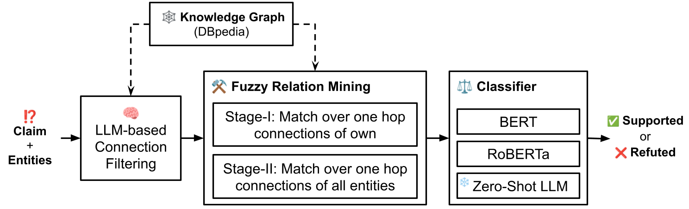
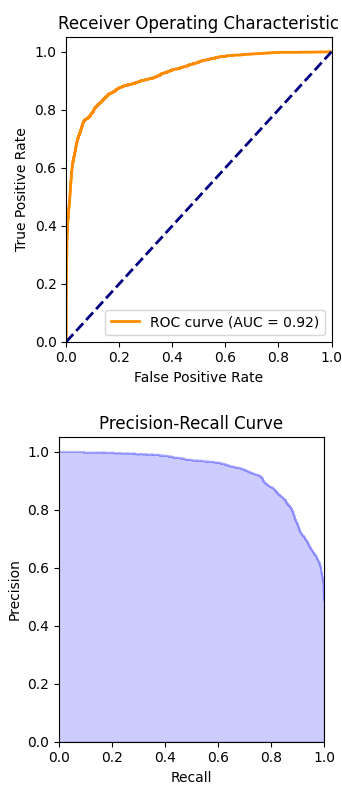

# FactGenius：融合零-shot提示与模糊关系挖掘技术，借助知识图谱之力，显著提升事实验证的精准度。

发布时间：2024年06月03日

`LLM应用

这篇论文介绍了一种名为FactGenius的新方法，用于事实核查任务。该方法结合了大型语言模型（LLMs）的零-shot提示和知识图谱（KGs）上的模糊文本匹配技术，以提高事实核查的效率和准确性。这种方法利用了DBpedia知识图谱，并通过相似性度量优化了LLM的连接。论文中提到，FactGenius在FactKG数据集上的评估结果显示，它显著超越了现有方法，尤其是在使用RoBERTa作为分类器时。此外，FactGenius通过两阶段的过滤和验证连接，在多种推理类型中展现了卓越性能。由于该论文主要关注于如何应用LLMs来改进NLP中的事实核查任务，因此它属于LLM应用分类。` `事实核查`

> FactGenius: Combining Zero-Shot Prompting and Fuzzy Relation Mining to Improve Fact Verification with Knowledge Graphs

# 摘要

> 事实核查是NLP中的一项关键任务，旨在通过可靠证据验证声明的真实性。传统方法受限于劳动密集型数据整理和基于规则的策略。本文介绍了FactGenius，一种创新方法，它通过结合LLMs的零-shot提示和KGs上的模糊文本匹配，显著提升了事实核查的效率。利用DBpedia，FactGenius通过相似性度量优化LLM的连接，确保准确性。在FactKG数据集上的评估表明，FactGenius显著超越了现有方法，特别是在使用RoBERTa作为分类器时。通过两阶段的过滤和验证连接，FactGenius在多种推理类型中展现了卓越性能，成为事实核查领域的强大工具。相关代码和材料已公开在GitHub上。

> Fact-checking is a crucial natural language processing (NLP) task that verifies the truthfulness of claims by considering reliable evidence. Traditional methods are often limited by labour-intensive data curation and rule-based approaches. In this paper, we present FactGenius, a novel method that enhances fact-checking by combining zero-shot prompting of large language models (LLMs) with fuzzy text matching on knowledge graphs (KGs). Leveraging DBpedia, a structured linked data dataset derived from Wikipedia, FactGenius refines LLM-generated connections using similarity measures to ensure accuracy. The evaluation of FactGenius on the FactKG, a benchmark dataset for fact verification, demonstrates that it significantly outperforms existing baselines, particularly when fine-tuning RoBERTa as a classifier. The two-stage approach of filtering and validating connections proves crucial, achieving superior performance across various reasoning types and establishing FactGenius as a promising tool for robust fact-checking. The code and materials are available at https://github.com/SushantGautam/FactGenius.

[Arxiv](https://arxiv.org/abs/2406.01311)