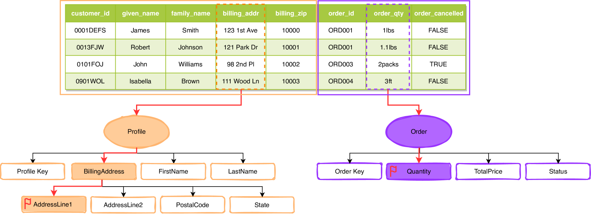
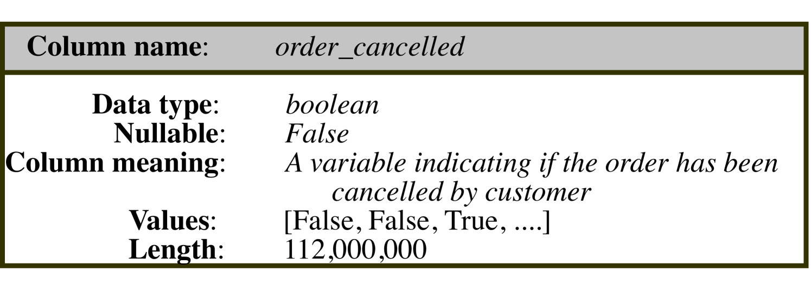
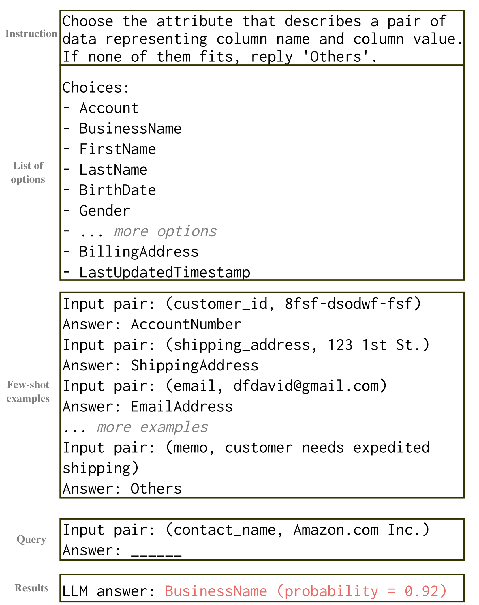
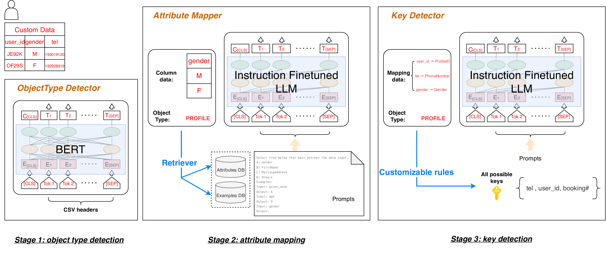
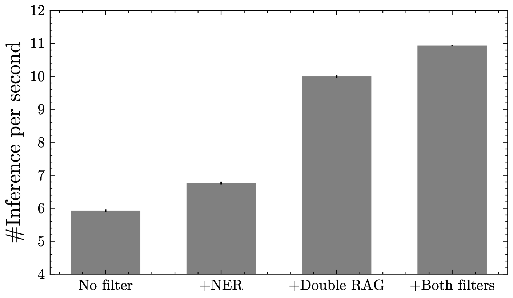
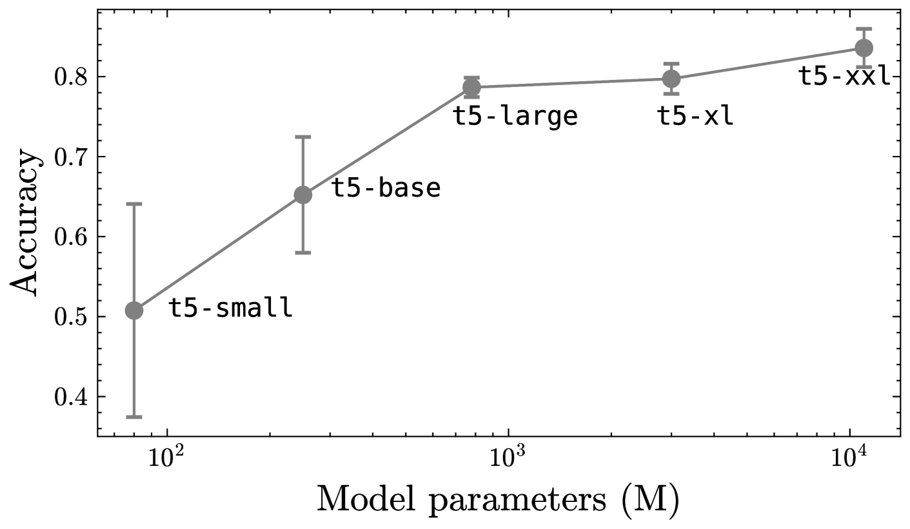
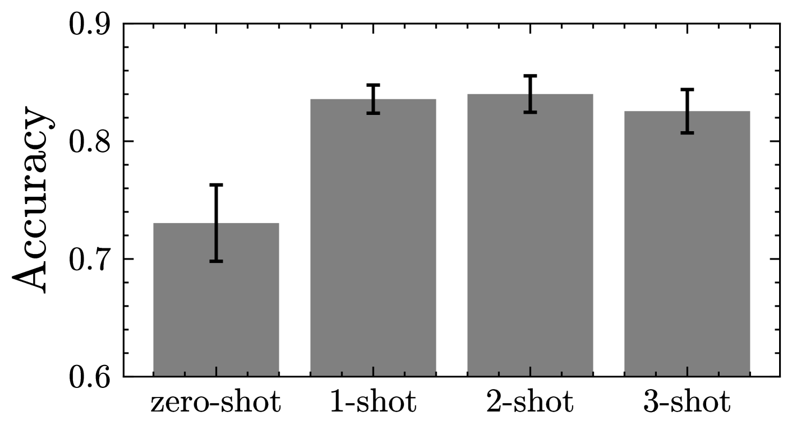
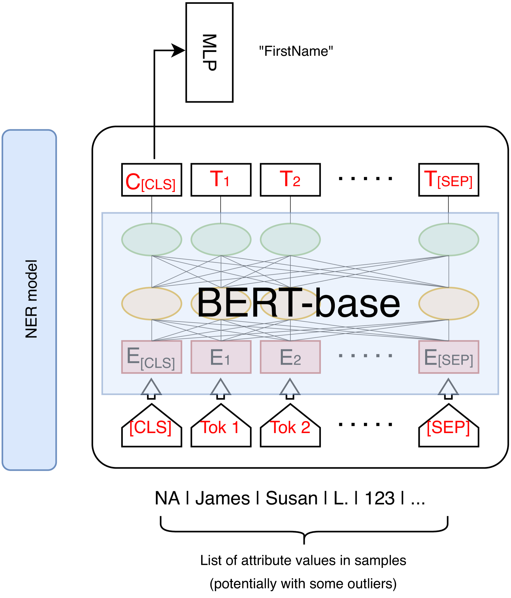

# GRAM：数据安全背景下，生成式检索增强的数据模式匹配技术

发布时间：2024年06月03日

`LLM应用

理由：这篇论文探讨了在大型语言模型（LLM）的背景下，如何利用零-shot和少-shot学习技术进行模式匹配，以保护客户数据隐私并实现数据摄取。这种方法直接应用于数据库系统中的数据分析，特别是在整合第三方数据时，强调了LLM在实际应用中的重要性。因此，这篇论文属于LLM应用类别。` `数据库系统` `数据分析`

> GRAM: Generative Retrieval Augmented Matching of Data Schemas in the Context of Data Security

# 摘要

> 模式匹配是现代数据库系统中数据摄取的关键环节，旨在发现两个不同数据表属性间的相似性。这一挑战在数据分析初期尤为突出，比如在整合第三方数据以洞察商业趋势时。鉴于其在数据库系统中的重要性，模式匹配自2000年代起便受到广泛研究。本研究在大型语言模型的背景下重新审视这一问题，并严格遵守数据安全政策，专注于零-shot和少-shot场景：模型仅需分析极少量的客户数据即可完成匹配，这与传统审查全表的方法截然不同。我们强调，零-shot或少-shot的假设对于保护客户数据隐私至关重要，即便可能影响准确性。在如此严格要求下仍能准确匹配属性的能力，使我们的研究在该领域独树一帜。

> Schema matching constitutes a pivotal phase in the data ingestion process for contemporary database systems. Its objective is to discern pairwise similarities between two sets of attributes, each associated with a distinct data table. This challenge emerges at the initial stages of data analytics, such as when incorporating a third-party table into existing databases to inform business insights. Given its significance in the realm of database systems, schema matching has been under investigation since the 2000s. This study revisits this foundational problem within the context of large language models. Adhering to increasingly stringent data security policies, our focus lies on the zero-shot and few-shot scenarios: the model should analyze only a minimal amount of customer data to execute the matching task, contrasting with the conventional approach of scrutinizing the entire data table. We emphasize that the zero-shot or few-shot assumption is imperative to safeguard the identity and privacy of customer data, even at the potential cost of accuracy. The capability to accurately match attributes under such stringent requirements distinguishes our work from previous literature in this domain.

[Arxiv](https://arxiv.org/abs/2406.01876)