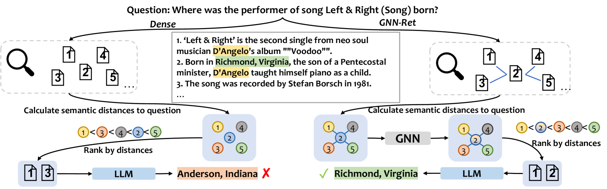
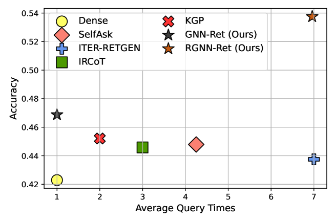
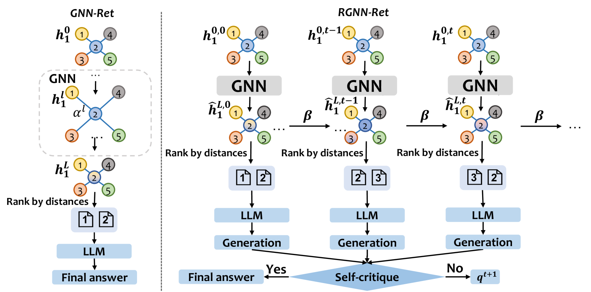
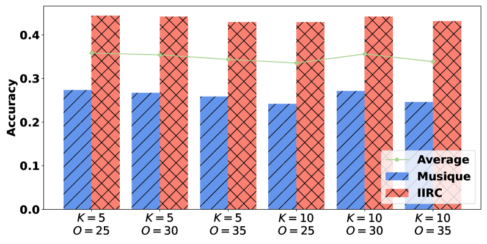
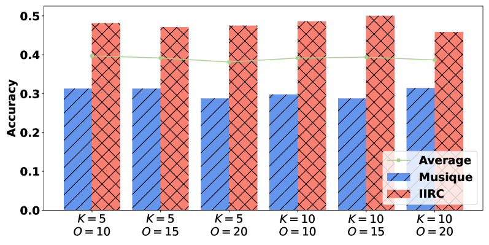
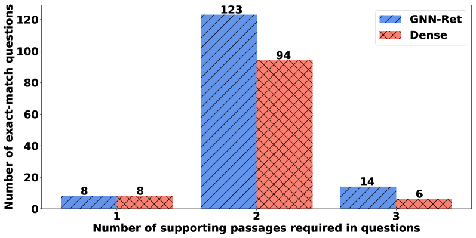
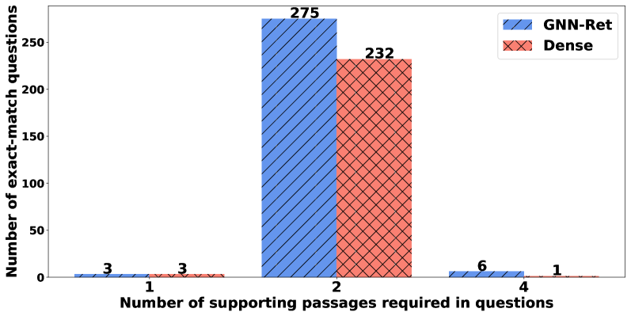

# 图神经网络优化的大型语言模型检索技术，在问题回答领域展现出卓越性能。

发布时间：2024年06月03日

`RAG

理由：这篇论文主要探讨了检索增强生成技术（RAG）在大型语言模型（LLM）中的应用，特别是在处理复杂推理问题时的改进方法。论文提出了一种基于图神经网络（GNN）的新型检索方法，以及使用循环图神经网络（RGNN）的方法来优化检索过程，这些都是在RAG框架下的创新。因此，这篇论文应归类于RAG。` `问答系统` `知识图谱`

> Graph Neural Network Enhanced Retrieval for Question Answering of LLMs

# 摘要

> 检索增强生成技术为大型语言模型（LLM）的输出带来了革命性的进步。尽管如此，它在处理复杂推理问题时，仍难以全面捕捉所需知识。现有检索方法常将文档拆分为孤立段落，忽视了它们之间的内在联系，如相邻或关键词共享的段落。因此，识别这些关联对于优化检索至关重要。本文提出了一种新颖的检索方法——GNN-Ret，它借助图神经网络（GNNs），通过考虑段落间的相关性来提升检索效率。我们首先构建了一个段落图，连接了结构和关键词相关的段落，然后运用GNN深入挖掘这些段落间的联系，以优化支持段落的检索。此外，我们还开发了RGNN-Ret，一种使用循环图神经网络（RGNN）的方法，用于处理多跳推理问题。RGNN-Ret在每一步都会整合前一步的段落图，从而进一步提升检索效果。实验结果显示，GNN-Ret在单次查询LLM的问题回答中，准确性超越了需要多次查询的强基线方法，而RGNN-Ret更是在2WikiMQA数据集上实现了高达10.4%的准确性提升，达到了业界领先水平。

> Retrieval augmented generation has revolutionized large language model (LLM) outputs by providing factual supports. Nevertheless, it struggles to capture all the necessary knowledge for complex reasoning questions. Existing retrieval methods typically divide reference documents into passages, treating them in isolation. These passages, however, are often interrelated, such as passages that are contiguous or share the same keywords. Therefore, recognizing the relatedness is crucial for enhancing the retrieval process. In this paper, we propose a novel retrieval method, called GNN-Ret, which leverages graph neural networks (GNNs) to enhance retrieval by considering the relatedness between passages. Specifically, we first construct a graph of passages by connecting passages that are structure-related and keyword-related. A graph neural network (GNN) is then leveraged to exploit the relationships between passages and improve the retrieval of supporting passages. Furthermore, we extend our method to handle multi-hop reasoning questions using a recurrent graph neural network (RGNN), named RGNN-Ret. At each step, RGNN-Ret integrates the graphs of passages from previous steps, thereby enhancing the retrieval of supporting passages. Extensive experiments on benchmark datasets demonstrate that GNN-Ret achieves higher accuracy for question answering with a single query of LLMs than strong baselines that require multiple queries, and RGNN-Ret further improves accuracy and achieves state-of-the-art performance, with up to 10.4% accuracy improvement on the 2WikiMQA dataset.

[Arxiv](https://arxiv.org/abs/2406.06572)