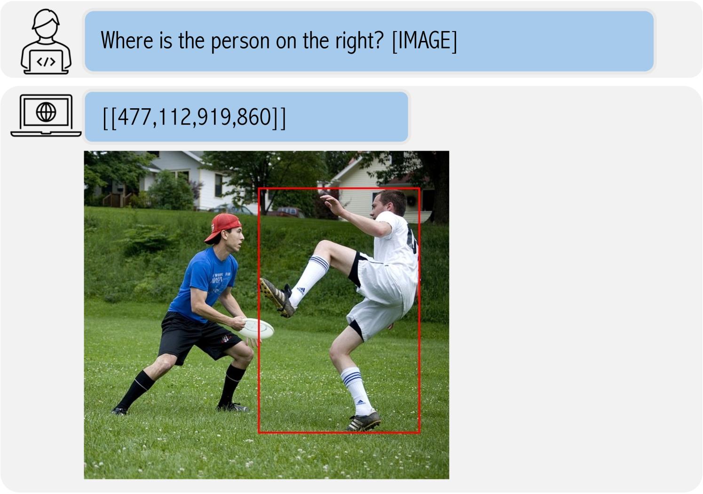
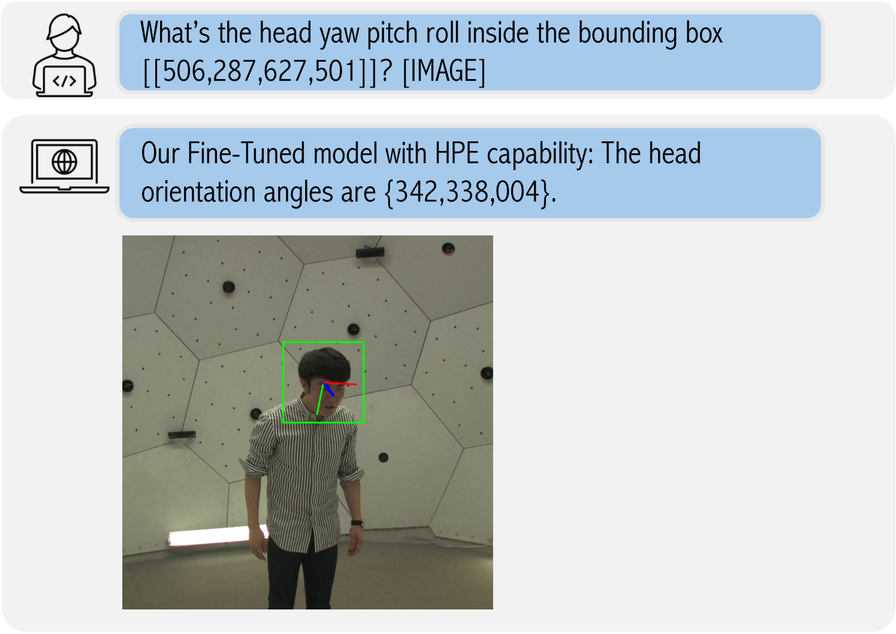
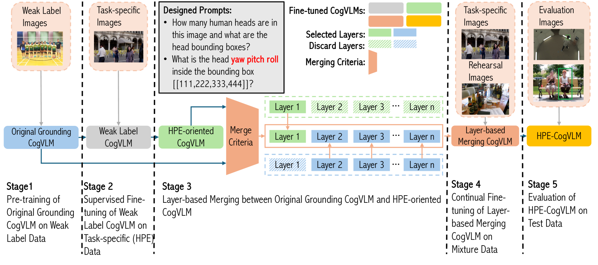
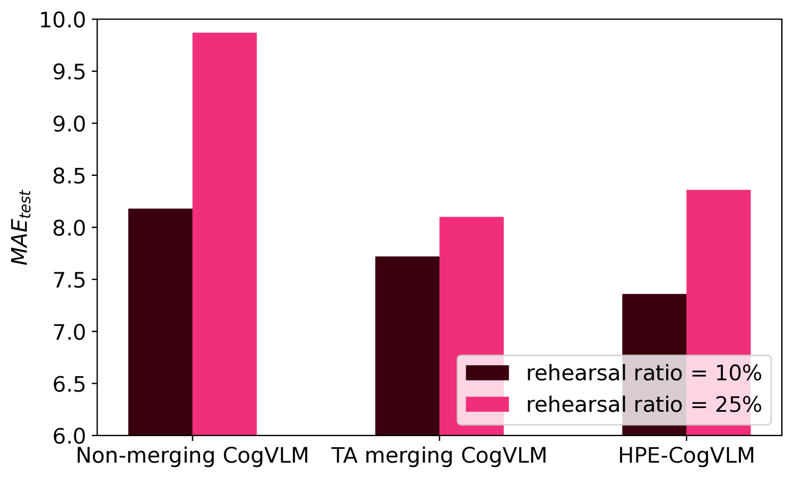
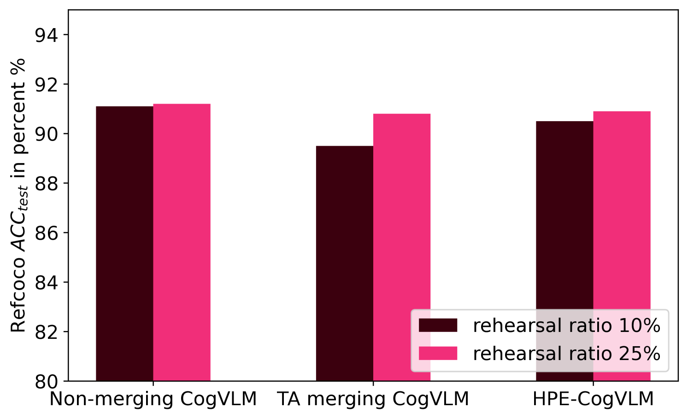
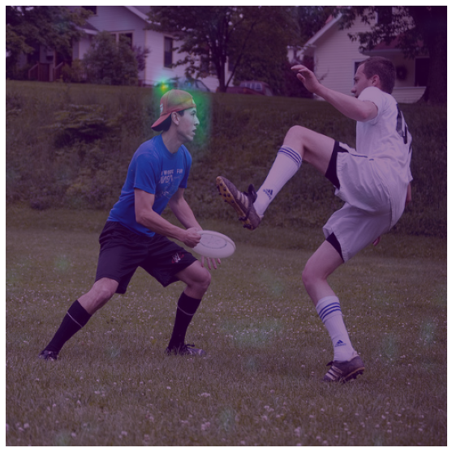
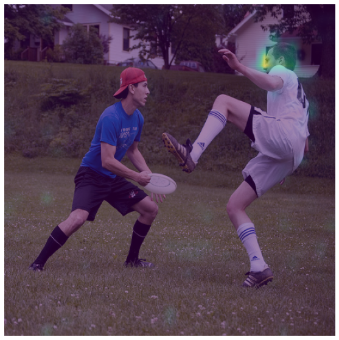

# HPE-CogVLM：探索视觉语言模型中的头部姿态接地新任务

发布时间：2024年06月03日

`Agent

理由：这篇论文主要讨论了如何利用CogVLM（一种视觉语言模型）来增强头部姿态估计（HPE）任务的性能。论文中提到的CogVLM具备预测物体边界框的能力，并且通过特定的模型合并策略和参数调整，显著提升了HPE的性能。这表明论文的核心在于开发和应用一个特定的模型（Agent）来解决具体的视觉任务，而不是探讨LLM的理论问题或应用，也不是关于RAG（Retrieval-Augmented Generation）的研究。因此，将其归类为Agent是合适的。` `计算机视觉` `人工智能`

> HPE-CogVLM: New Head Pose Grounding Task Exploration on Vision Language Model

# 摘要

> 头部姿态估计（HPE）任务要求对三维空间关系有精深理解，并准确计算出偏航、俯仰和滚动的欧拉角。传统HPE研究多依赖非大型语言模型（Non-LLMs），这些模型以裁剪自完整图像的近距离人头部为输入，实际应用中鲁棒性不足。本文创新性地利用CogVLM的视觉定位能力，提出了一种增强HPE预测的新框架。CogVLM作为具备预测物体边界框能力的视觉语言模型，使得HPE训练和预测能全面利用图像信息。为将HPE融入VLM，我们首先通过调整数据复现比率解决了大型语言模型中的灾难性遗忘问题。接着，我们提出并验证了一种基于LoRA层的模型合并策略，确保参数完整性，显著提升了HPE性能。实验表明，我们的HPE-CogVLM在跨数据集评估中，相比基于Non-LLM的顶尖技术，将平均绝对误差降低了31.5%。此外，与仅LoRA微调及其他合并方法相比，我们的框架在所有HPE指标上均展现出更优性能。

> Head pose estimation (HPE) task requires a sophisticated understanding of 3D spatial relationships and precise numerical output of yaw, pitch, and roll Euler angles. Previous HPE studies are mainly based on Non-large language models (Non-LLMs), which rely on close-up human heads cropped from the full image as inputs and lack robustness in real-world scenario. In this paper, we present a novel framework to enhance the HPE prediction task by leveraging the visual grounding capability of CogVLM. CogVLM is a vision language model (VLM) with grounding capability of predicting object bounding boxes (BBoxes), which enables HPE training and prediction using full image information input. To integrate the HPE task into the VLM, we first cop with the catastrophic forgetting problem in large language models (LLMs) by investigating the rehearsal ratio in the data rehearsal method. Then, we propose and validate a LoRA layer-based model merging method, which keeps the integrity of parameters, to enhance the HPE performance in the framework. The results show our HPE-CogVLM achieves a 31.5\% reduction in Mean Absolute Error for HPE prediction over the current Non-LLM based state-of-the-art in cross-dataset evaluation. Furthermore, we compare our LoRA layer-based model merging method with LoRA fine-tuning only and other merging methods in CogVLM. The results demonstrate our framework outperforms them in all HPE metrics.

[Arxiv](https://arxiv.org/abs/2406.01914)