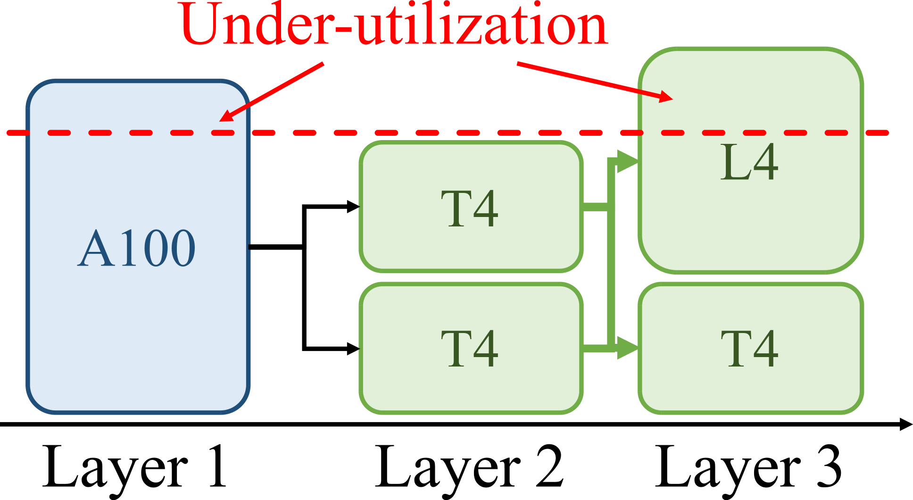
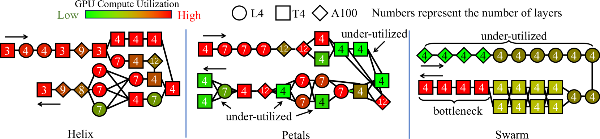

# Helix：异构GPU上最大流技术助力大型语言模型分布式服务

发布时间：2024年06月03日

`LLM应用

解析：这篇论文介绍了一个名为Helix的系统，该系统专门设计用于在异构GPU集群上高效服务大型语言模型（LLM）。论文的核心内容是关于如何优化LLM在异构环境中的推理计算，通过将问题建模为有向加权图上的最大流问题，并使用混合整数线性规划（MILP）算法来找到最优的服务策略。这种方法涉及模型部署和请求调度的优化，旨在提高吞吐量和降低延迟。因此，这篇论文属于LLM应用类别，因为它关注的是如何实际应用和优化LLM在特定硬件环境中的性能。` `云计算` `高性能计算`

> Helix: Distributed Serving of Large Language Models via Max-Flow on Heterogeneous GPUs

# 摘要

> 本文推出的Helix系统，专为异构GPU集群上的大型语言模型（LLM）服务设计，旨在实现高吞吐量与低延迟。Helix的核心理念是将LLM在异构环境中的推理计算视为有向加权图上的最大流问题，图中节点代表GPU实例，边则通过容量体现GPU与网络的异构性。通过采用混合整数线性规划（MILP）算法，Helix能够发掘出服务LLM的最优策略，同时优化模型部署与请求调度这两大紧密关联的任务。在24至42个GPU节点的异构集群环境中进行的测试显示，Helix相较于现有最佳方案，服务吞吐量提升高达2.7倍，提示与解码延迟分别降低至2.8倍与1.3倍。

> This paper introduces Helix, a distributed system for high-throughput, low-latency large language model (LLM) serving on heterogeneous GPU clusters. A key idea behind Helix is to formulate inference computation of LLMs over heterogeneous GPUs and network connections as a max-flow problem for a directed, weighted graph, whose nodes represent GPU instances and edges capture both GPU and network heterogeneity through their capacities. Helix then uses a mixed integer linear programming (MILP) algorithm to discover highly optimized strategies to serve LLMs. This approach allows Helix to jointly optimize model placement and request scheduling, two highly entangled tasks in heterogeneous LLM serving. Our evaluation on several heterogeneous cluster settings ranging from 24 to 42 GPU nodes shows that Helix improves serving throughput by up to 2.7$\times$ and reduces prompting and decoding latency by up to 2.8$\times$ and 1.3$\times$, respectively, compared to best existing approaches.

[Arxiv](https://arxiv.org/abs/2406.01566)