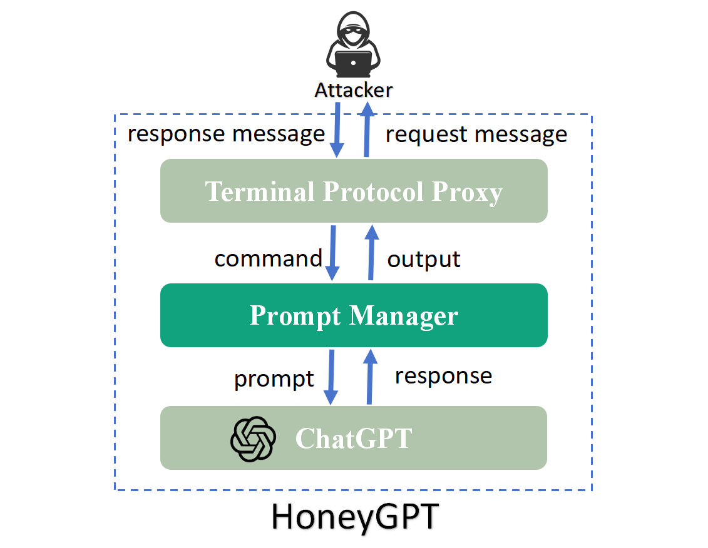
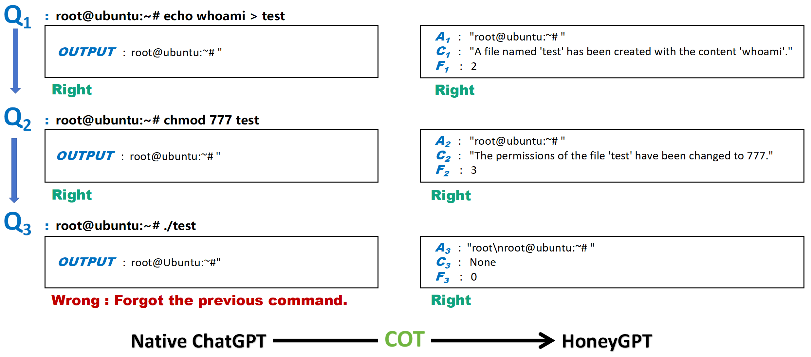
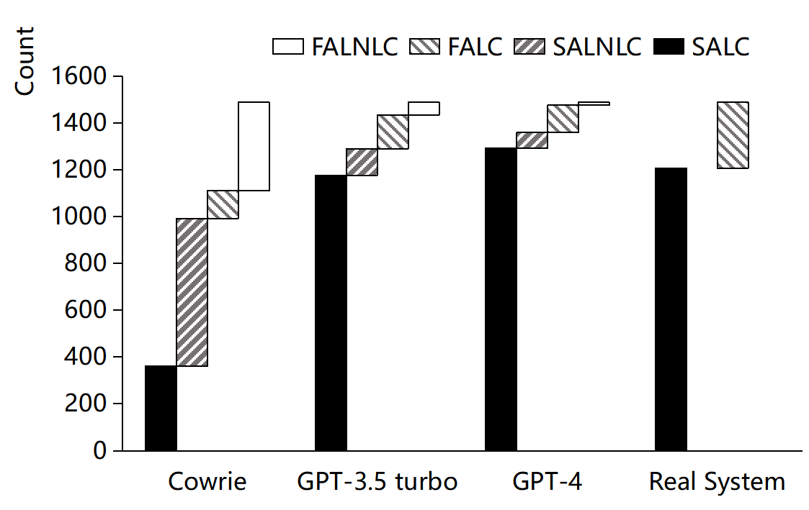
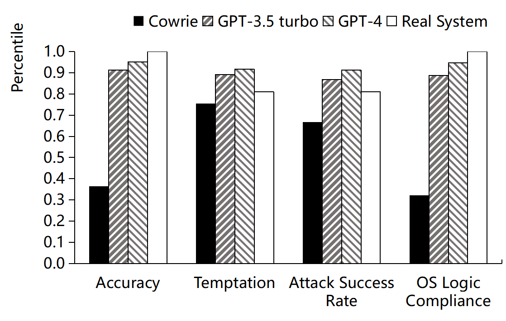
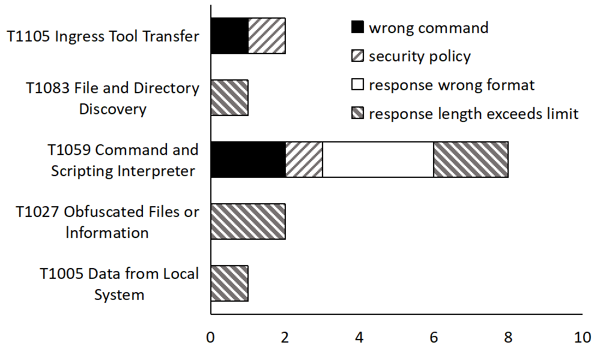
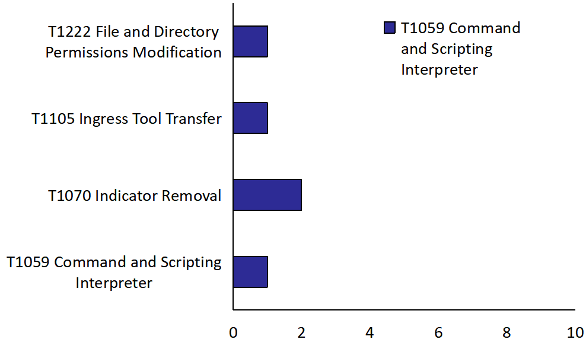
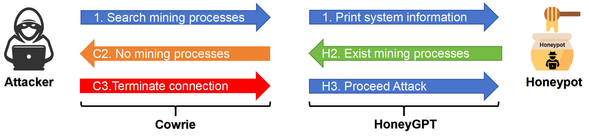
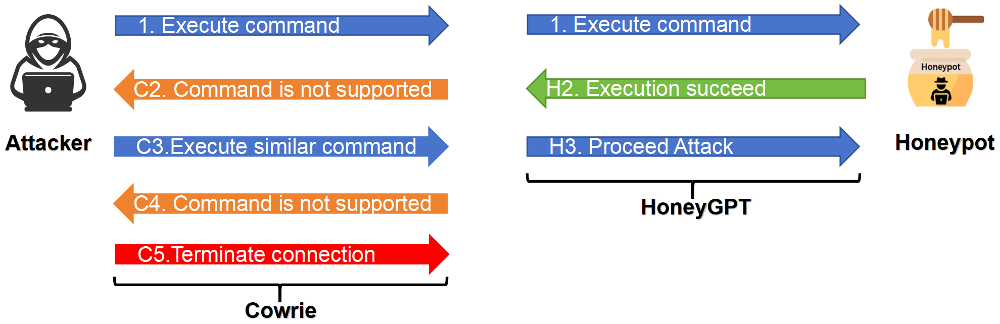
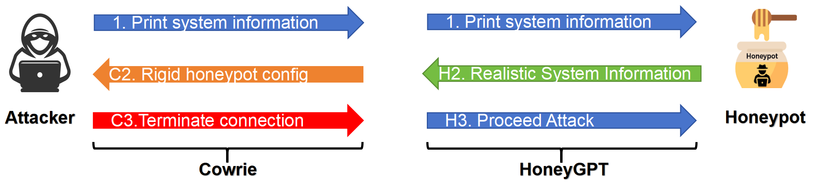
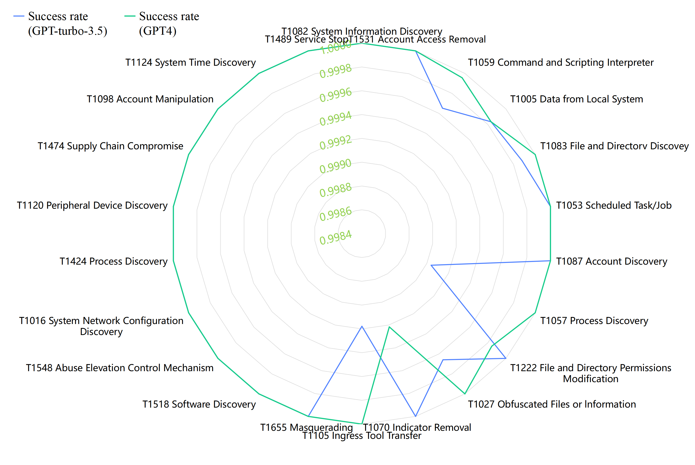

# HoneyGPT：借助大型语言模型，破解终端蜜罐的三重难题

发布时间：2024年06月03日

`Agent

这篇论文介绍了HoneyGPT，一个基于ChatGPT的智能蜜罐系统，它通过创新的提示工程技术实现了高度的灵活性、交互深度和欺骗能力。HoneyGPT能够主动适应攻击战术的变化，并通过结构化的提示工程框架增强长期交互记忆和安全分析能力。这种智能蜜罐系统的设计和部署体现了Agent的特性，即能够自主地执行任务和适应环境变化，因此将其分类为Agent。` `网络安全` `人工智能`

> HoneyGPT: Breaking the Trilemma in Terminal Honeypots with Large Language Model

# 摘要

> 蜜罐技术虽历经多年演进，仍难以在灵活性、交互深度与欺骗能力间找到完美平衡。它们往往无法主动适应攻击战术的变化，限制了交互的深度和信息获取。然而，大型语言模型与创新的提示工程技术相结合，为蜜罐技术带来了革命性的设计与部署变革。本文推出的HoneyGPT，基于ChatGPT，开启了智能蜜罐的新纪元，以其高效益、高适应性和强交互性，以及主动吸引攻击者的特性脱颖而出。我们还提出了一套结构化的提示工程框架，强化了长期交互记忆和安全分析能力，通过整合适应蜜罐环境的链式思维战术，提升了交互与欺骗效果，深化了安全分析，并确保了持续的互动。HoneyGPT的评估分为两部分：一是基于数据集的基准比较，二是为期四周的真实场景现场评估。基准比较显示HoneyGPT在灵活性、交互深度和欺骗能力间取得了卓越平衡。现场评估进一步证实了其有效性，表明HoneyGPT在诱导攻击者进行更深层次交互和捕捉更多新型攻击向量方面，明显优于现有技术。

> Honeypots, as a strategic cyber-deception mechanism designed to emulate authentic interactions and bait unauthorized entities, continue to struggle with balancing flexibility, interaction depth, and deceptive capability despite their evolution over decades. Often they also lack the capability of proactively adapting to an attacker's evolving tactics, which restricts the depth of engagement and subsequent information gathering. Under this context, the emergent capabilities of large language models, in tandem with pioneering prompt-based engineering techniques, offer a transformative shift in the design and deployment of honeypot technologies. In this paper, we introduce HoneyGPT, a pioneering honeypot architecture based on ChatGPT, heralding a new era of intelligent honeypot solutions characterized by their cost-effectiveness, high adaptability, and enhanced interactivity, coupled with a predisposition for proactive attacker engagement. Furthermore, we present a structured prompt engineering framework that augments long-term interaction memory and robust security analytics. This framework, integrating thought of chain tactics attuned to honeypot contexts, enhances interactivity and deception, deepens security analytics, and ensures sustained engagement.
  The evaluation of HoneyGPT includes two parts: a baseline comparison based on a collected dataset and a field evaluation in real scenarios for four weeks. The baseline comparison demonstrates HoneyGPT's remarkable ability to strike a balance among flexibility, interaction depth, and deceptive capability. The field evaluation further validates HoneyGPT's efficacy, showing its marked superiority in enticing attackers into more profound interactive engagements and capturing a wider array of novel attack vectors in comparison to existing honeypot technologies.

[Arxiv](https://arxiv.org/abs/2406.01882)