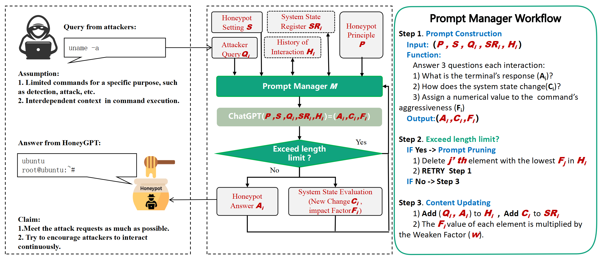

# HoneyGPT：借助大型语言模型，破解终端蜜罐的三重难题

发布时间：2024年06月03日

`Agent

理由：这篇论文介绍了一种基于大型语言模型（LLM）的智能蜜罐系统HoneyGPT，它能够主动适应攻击者的战术变化，并具有高度的交互性和欺骗能力。这种系统可以被视为一种智能代理（Agent），因为它能够自主地执行任务（如吸引攻击者、收集信息等），并在动态环境中做出决策。虽然它利用了LLM技术，但其核心在于作为一个智能系统在网络安全领域的应用，而不是对LLM理论的探讨或特定LLM应用的开发。因此，将其归类为Agent更为合适。` `网络安全` `人工智能`

> HoneyGPT: Breaking the Trilemma in Terminal Honeypots with Large Language Model

# 摘要

> 蜜罐技术虽历经多年发展，仍需在灵活性、交互深度与欺骗能力间找到平衡点。它们往往难以主动适应攻击者的战术变化，限制了交互深度与信息收集。然而，大型语言模型与基于提示的工程技术的结合，为蜜罐技术带来了革新。本文推出的HoneyGPT，基于ChatGPT，开启了智能蜜罐的新篇章，以其高效、高适应性和强交互性，以及主动吸引攻击者的特性脱颖而出。我们还提出了一套结构化的提示工程框架，强化了长期交互记忆与安全分析的稳健性，通过适应蜜罐环境的链式思维战术，提升交互与欺骗效果，深化安全分析，并维持持续的交互。HoneyGPT的评估分为两部分：基于数据集的基准对比和为期四周的真实场景现场测试。基准对比显示HoneyGPT在多方面平衡上的卓越表现。现场测试进一步证实了其有效性，相较于现有技术，HoneyGPT在吸引攻击者深入交互和捕获新型攻击向量方面展现出明显优势。

> Honeypots, as a strategic cyber-deception mechanism designed to emulate authentic interactions and bait unauthorized entities, continue to struggle with balancing flexibility, interaction depth, and deceptive capability despite their evolution over decades. Often they also lack the capability of proactively adapting to an attacker's evolving tactics, which restricts the depth of engagement and subsequent information gathering. Under this context, the emergent capabilities of large language models, in tandem with pioneering prompt-based engineering techniques, offer a transformative shift in the design and deployment of honeypot technologies. In this paper, we introduce HoneyGPT, a pioneering honeypot architecture based on ChatGPT, heralding a new era of intelligent honeypot solutions characterized by their cost-effectiveness, high adaptability, and enhanced interactivity, coupled with a predisposition for proactive attacker engagement. Furthermore, we present a structured prompt engineering framework that augments long-term interaction memory and robust security analytics. This framework, integrating thought of chain tactics attuned to honeypot contexts, enhances interactivity and deception, deepens security analytics, and ensures sustained engagement.
  The evaluation of HoneyGPT includes two parts: a baseline comparison based on a collected dataset and a field evaluation in real scenarios for four weeks. The baseline comparison demonstrates HoneyGPT's remarkable ability to strike a balance among flexibility, interaction depth, and deceptive capability. The field evaluation further validates HoneyGPT's efficacy, showing its marked superiority in enticing attackers into more profound interactive engagements and capturing a wider array of novel attack vectors in comparison to existing honeypot technologies.

[Arxiv](https://arxiv.org/abs/2406.01882)